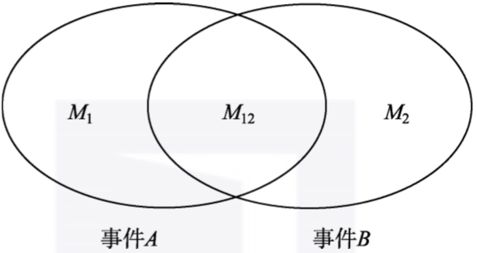

## 条件概率

事件A和事件B单独发生的概率分别M1/N和M2/N；

我们的考虑范围缩小到的M2个结果(事件B范围)，而这事件B中只有M12个结果对应事件A的发生，不难计算出条件概率P(A|B)=M12/M2；

表示在B发生的条件下A 发生的概率，

$$
P(A/B) = \frac{M_{12}}{M_2} = \frac{M_{12}/N}{M_2/N}=\frac{P(AB)}{P(B)}
$$

如果A和B独立则有，

$$
P(A|B) =\frac{P(AB)}{P(B)} \\
P(AB)=P(A|B)P(B)=P(A)P(B)
$$

## 多个条件概率

### **全概率公式**

$$
\begin{align}
P(B)= P(BΩ)&=P(BA_1+BA_2+BA_3+...+BA_n) \\
 &= P(BA_1)+P(BA_2)+P(BA_3)+...+P(BA_n) \\
 &=P(A_1)P(B|A_1)+P(A_2)P(B|A_2)+...+P(A_n)P(B|A_n)
\end{align} \tag1
$$

## 贝叶斯

$$
p(A_i|B)= \frac{P(A_i)P(B|A_i)}{P(A_1)P(B|A_1)+P(A_2)P(B|A_2)+...+P(A_n)P(B|A_n)} \tag4
$$

概率 $P(A_i)$被称为**先验概率**，指的是在没有别的前提信息情况下的概率值，这个值一般需要借助我们的经验去估计。而条件概率P(Bi|A)被称作**后验概率**，它代表了在获得“结果事件A发生”这个信息之后原因Bi出现的概率，可以说后验概率是先验概率在获取了新信息之后的一种修正。

本文从概率出发，到条件概率，再到全概率公式，最终聚焦到贝叶斯公式，主要是从概念层面进行梳理，帮助读者迅速形成以条件概率为基石的认知视角。条件概率的重要性不言而喻，它将贯穿整个概率统计课程体系。

[终于有人把条件概率和贝叶斯公式讲明白了-腾讯云开发者社区-腾讯云 (tencent.com)](https://cloud.tencent.com/developer/article/1785994)

## kalman filter

[https://www.mwrf.net/tech/basic/2023/30081.html](https://www.mwrf.net/tech/basic/2023/30081.html)

    

   

   

   

[https://jp.mathworks.com/videos/understanding-kalman-filters-part-3-optimal-state-estimator--1490710645421.html](https://jp.mathworks.com/videos/understanding-kalman-filters-part-3-optimal-state-estimator--1490710645421.html)

卡尔曼一阶滤波

[卡尔曼滤波器的深入理解与可视化 - 知乎 (zhihu.com)](https://zhuanlan.zhihu.com/p/43381962)

[α-β滤波器（一种1维稳态Kalman滤波器）详解_阿尔法贝塔滤波-CSDN博客](https://blog.csdn.net/NICAI001/article/details/124847034)

## 图像滤波

均值滤波

中值滤波  （滤去偶然性因数引起的脉冲干扰， 适用于缓慢变化的采样系统）

一阶ab滤波

卡尔曼滤波
