## 机器学习模型

**shuhuai008**

[shuhuai&#39;-哔哩哔哩_bilibili](https://search.bilibili.com/all?vt=26690326&keyword=shuhuai%27&from_source=webtop_search&spm_id_from=333.1007&search_source=5)

[Bilibili-机器学习白板系列 (yuque.com)](https://www.yuque.com/bystander-wg876/yc5f72)

[tsyw/MachineLearningNotes: My personal notes (github.com)](https://github.com/tsyw/MachineLearningNotes)

[2019ChenGong/Machine-Learning-Notes: 白板推导系列课程笔记 初版 (github.com)](https://github.com/2019ChenGong/Machine-Learning-Notes)

[zhulei227/ML_Notes: 机器学习算法的公式推导以及numpy实现 (github.com)](https://github.com/zhulei227/ML_Notes)

[机器学习推导系列 - 文集 - 简书 (jianshu.com)](https://www.jianshu.com/nb/46548929)

[朱雀学习-机器学习白板系列 (yuque.com)](https://www.yuque.com/bystander-wg876/yc5f72?)

白板学前补习班概率：[概率论与数理统计知识详解【小元老师】【考研数学】]()
白板学前补习班代数一：[-UP主汉语配音-【线性代数的本质】合集-转载于3Blue1Brown官方双语】]()
白板学前补习班代数二：[线性代数基础课程【小元老师】【超级0基础入门】【考研数学】]()

关于白板推导机器学习-[白板推导系列]()-数学基础-高斯分布-已知联合概率求边缘概率及条件概率：[【视频勘误】关于机器学习-白板推导系列-数学基础]()

## 机器学习资料

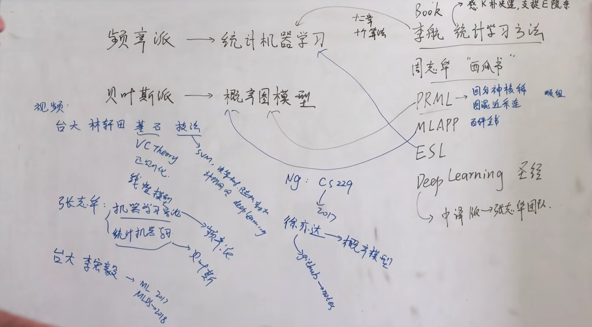

频率派和叶贝斯派

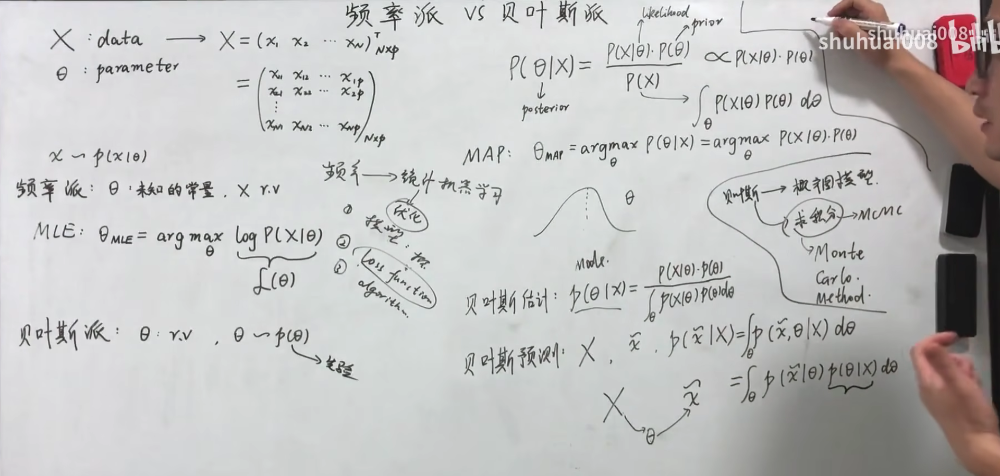

## 高斯分布 gaussian Distribution（GD）

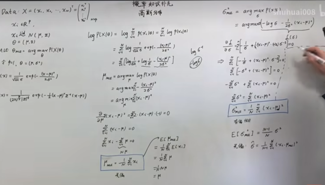

$ R^p$  表示P维的向量

高斯均值的无偏估计 和方差（Var）的有偏估计

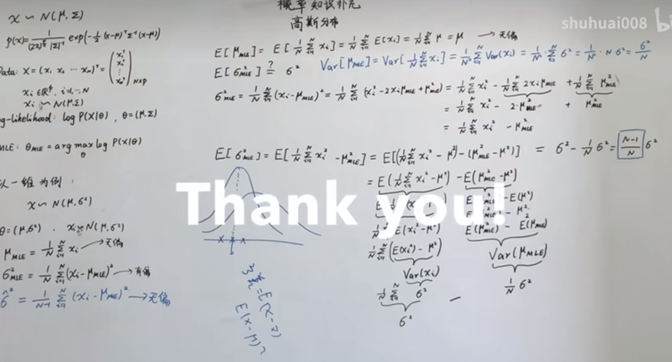

方差的估计比真实值小了；是因为方差是样本值到样本均值的方差，而不是到真实值的方差；

马氏距离和欧氏距离

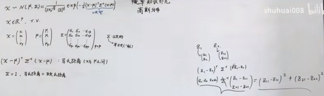

高维概率密度函数

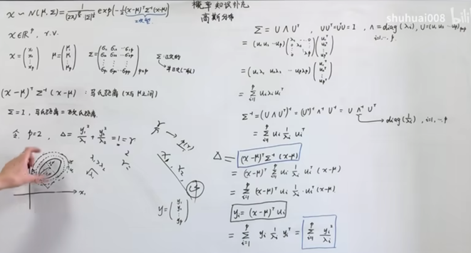

高斯分布的局限性和简化

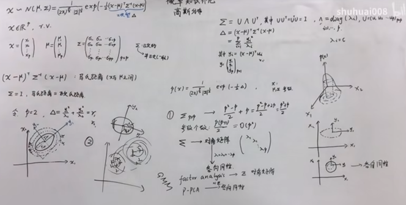

高斯边缘和条件概率 Marginal and conditional propability

$$
Marginal：P(X_a)
$$

$$

$$

高斯联合概率分布 joint probability

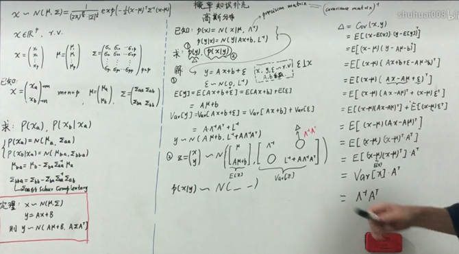

Jessen Inequal 不等式

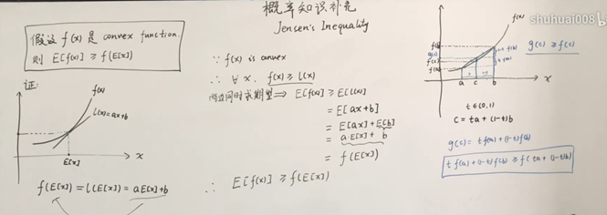

## 线性回归 linear regression

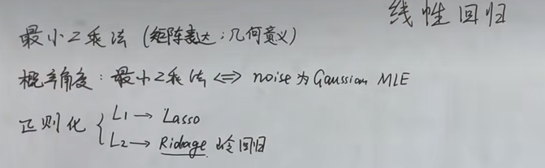

最小二乘法 least square method

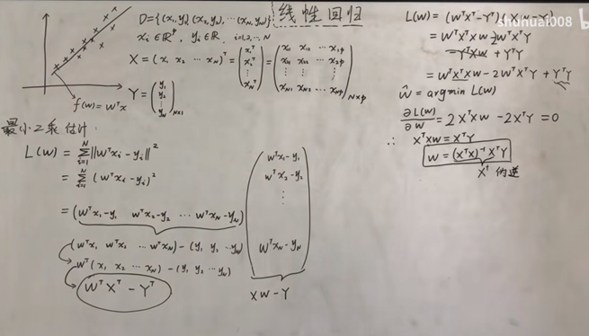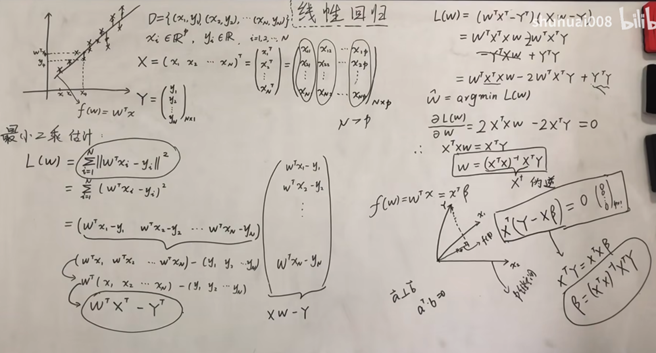

线性回归-概率视角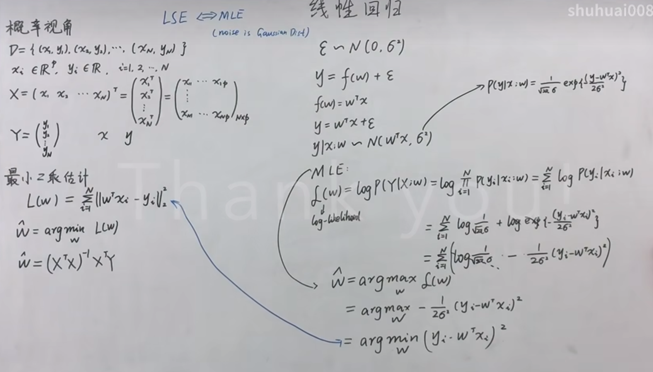
least square method  from probabilistic perspective

由推导可见，Least square method隐含了条件是噪声服从高斯分布；

频率角度看 正则化-岭回归  regulation – ridge regression frequentist

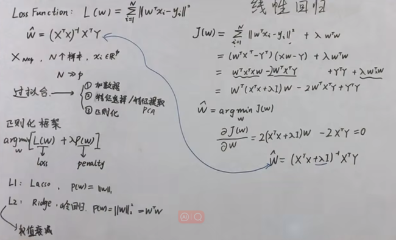

达到抑制过拟合的效果；

贝叶斯角度看 正则化-岭回归
regulation-ridge regression – Bayesian

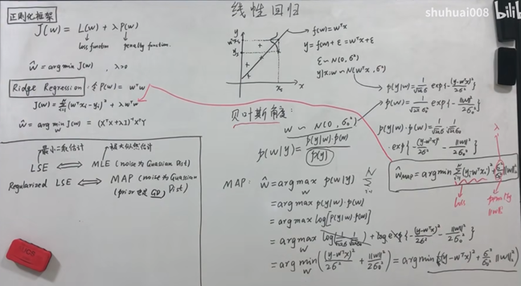

最小二乘法如果没有正则化则为最大似然估计；如果岭回归了那就是最大后验估计；

## 线性分类-Linear classification

Background

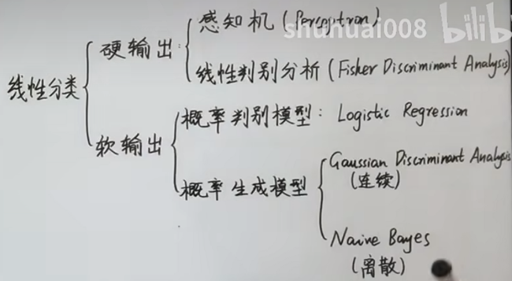

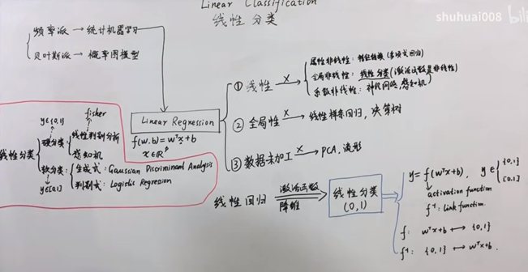

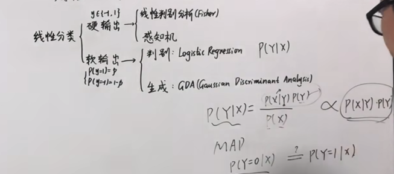

### 感知机器学习Perceptron algorithm

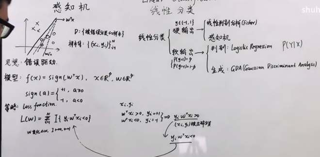

感知机 0,1 LOSS function 不合适的，尝试着把binary 的转化为连续的公式，

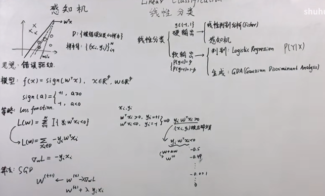

其中对于错误判决验本D，y~i~w^T^x~i~一直是小于零的，加一个负号改为正的，然后求导求最小值；

感知机还有一种升级变式，pocket algorithm

### 线性判别分析 Linear discrimination Analysis

Fisher Discrimination Analysis

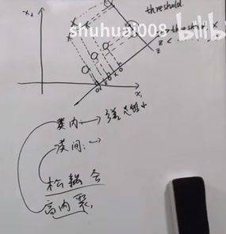            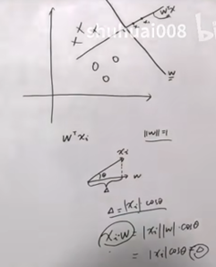

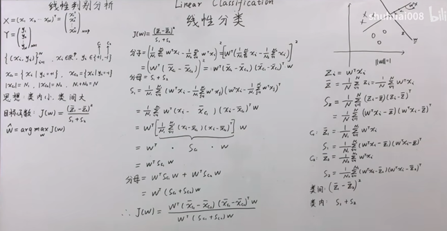

 J(W)的求解

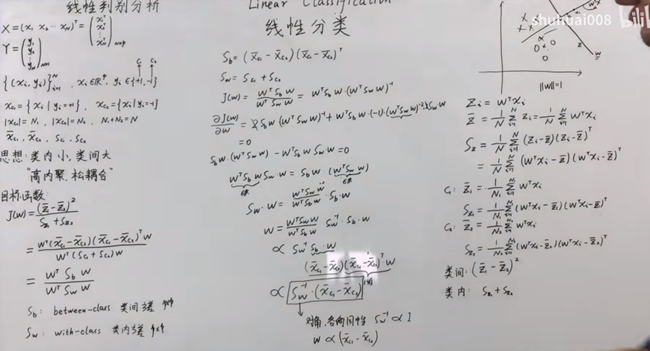

### 逻辑回归Logistic regression

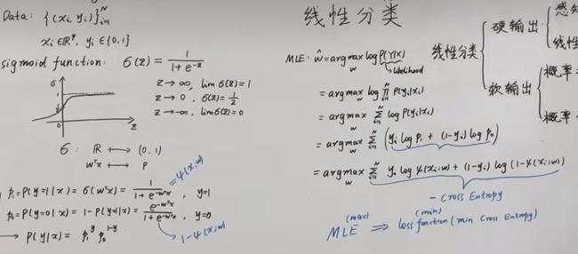

判别模型主要是为了求出 $ P（y/x）$得到 $y=0  or  1$；

### 高斯判别分析 Guassian Discrimination Analysis

生成模型是为了比较P(y=1/x)和 P(y=0/x)的大小，从而分类；借助贝叶斯定理，由于分母和y没关系；只需要比较分子。既p (y/x)正比与 $p(x/y)*p(y)$;

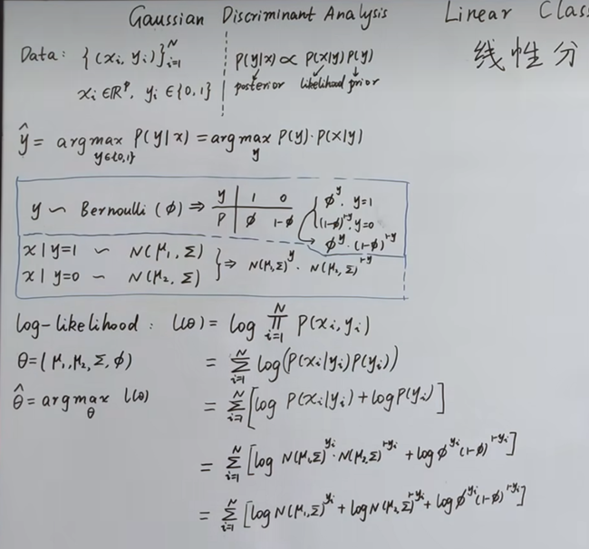

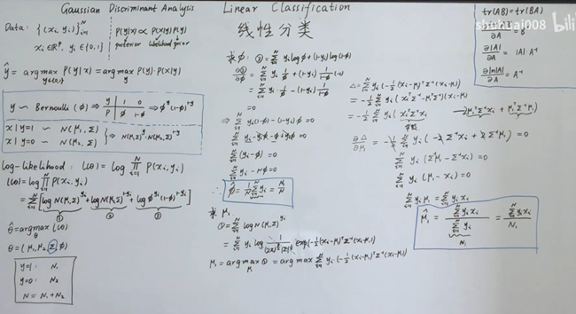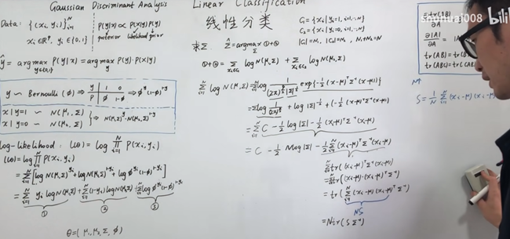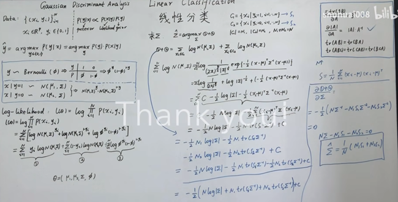

### 朴素贝叶斯 分类器 Naïve Bayes Classifier

假设

Xi和Xj 相互独立，因为他们之间被y所阻断，其中Xi和Xj 相互独立代表不同的维度0~p，而不是样本数。 这个假设的目的是简化运算和一节马尔可夫链有类似的假设；

## 降维 dimensionality reduction

[(系列五) 降维1-背景_哔哩哔哩_bilibili](https://www.bilibili.com/video/BV1aE411o7qd?p=22&spm_id_from=pageDriver&vd_source=42be38c13b36658c570c834f13b0bd84)

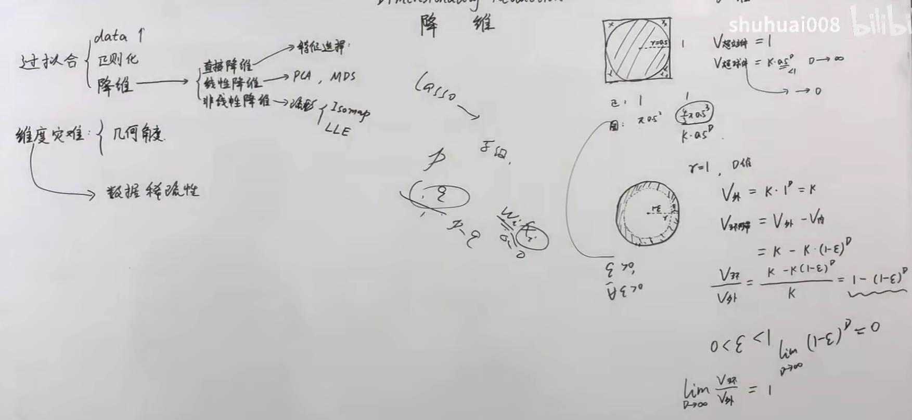

### Sample Mean & Varaince Matrix

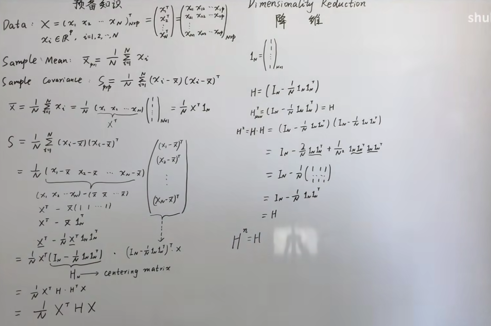

### PCA (主成分分析)- principle componnent

一个中心两个基本点,

* 一个中心: 将两个相关的变量转化为两个正交的变量,即是对原始空间的重构;
* 为了实现正交化,有两个基本点: 最大投影方差,最小重构距离(恢复成原始数据代价最小);
  * 方差越大,说明数据在投影上相关性最小;

#### 最大投影方差 (maximum variance perspective) 求最大特征值

#### 最小重构距离 (minimum error pespective)

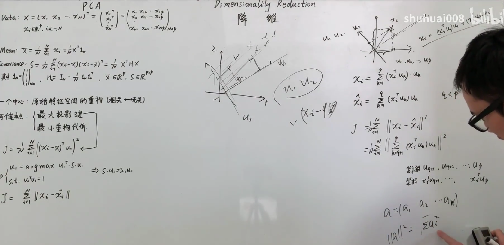

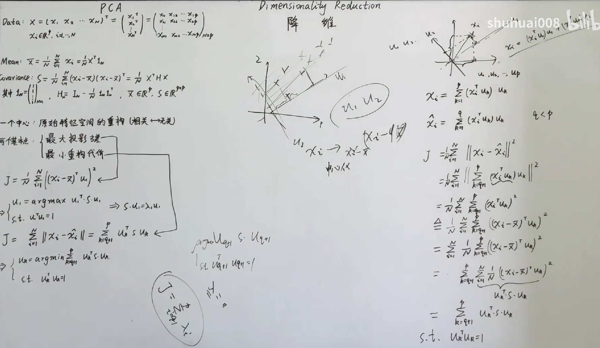

#### PCoA-SVD Perspective

奇异值分解(SVD分解)说就是特征值分解

$$
H  X=U V^T
$$

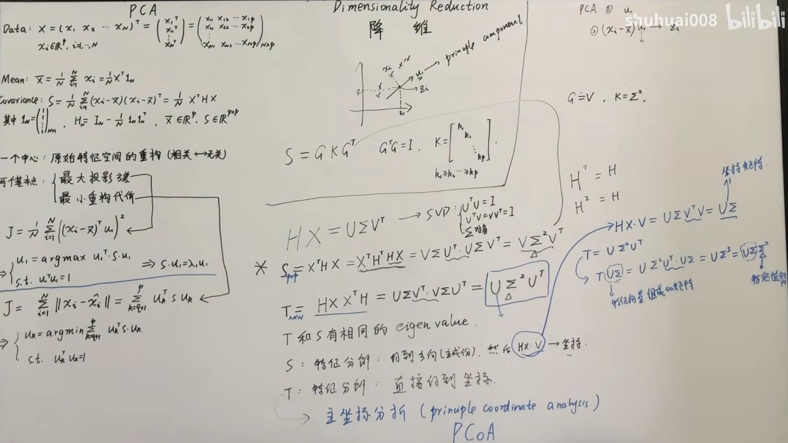

#### P-PCA(Probabilistic PCA)

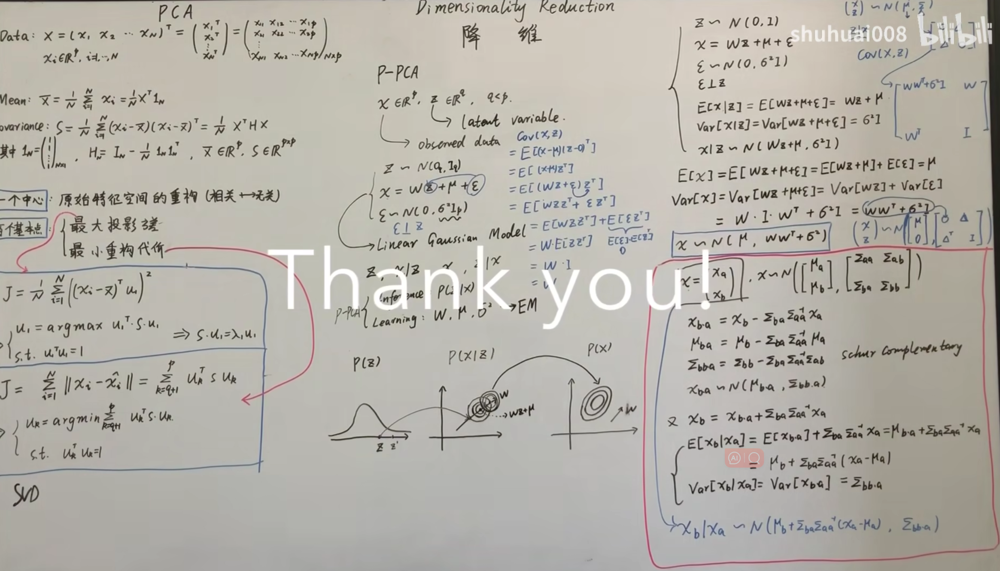
