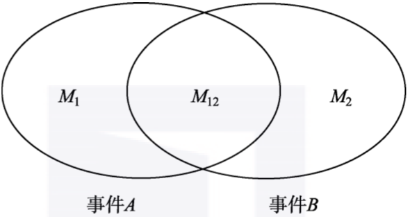
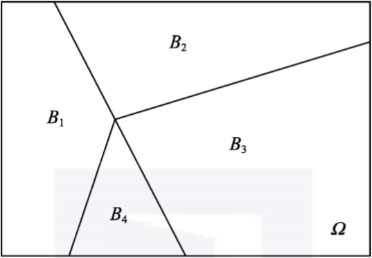
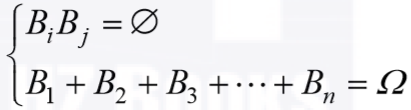
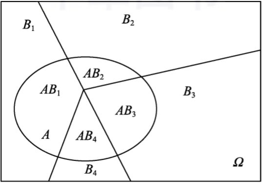
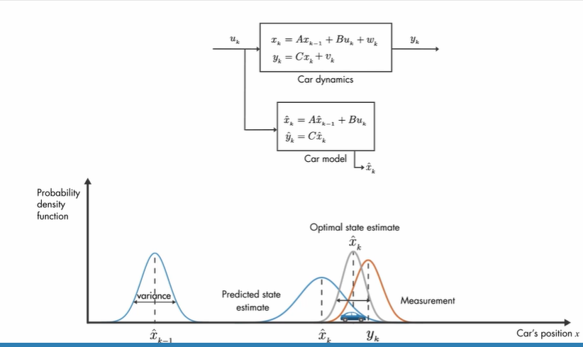
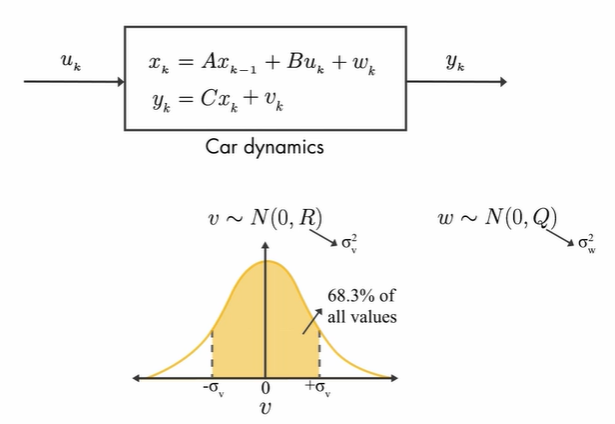
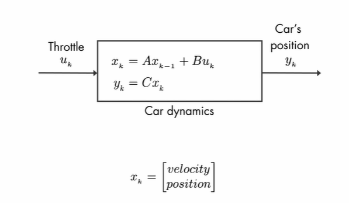
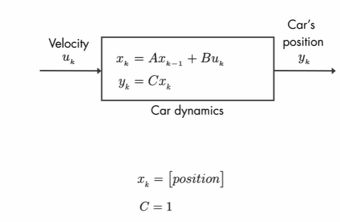
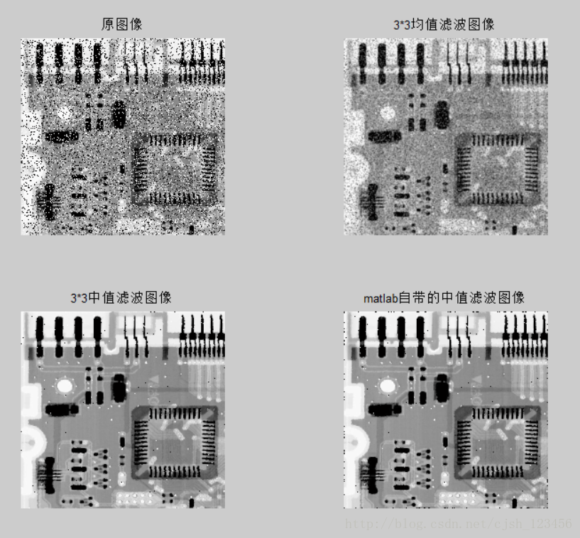

## 条件概率

事件A和事件B单独发生的概率分别M1/N和M2/N；

我们的考虑范围缩小到的M2个结果(事件B范围)，而这事件B中只有M12个结果对应事件A的发生，不难计算出条件概率P(A|B)=M12/M2；

表示在B发生的条件下A 发生的概率，

$$
P(A/B) = \frac{M_{12}}{M_2} = \frac{M_{12}/N}{M_2/N}=\frac{P(AB)}{P(B)}
$$

如果A和B独立则有，

$$
P(A|B) =\frac{P(AB)}{P(B)} \\
P(AB)=P(A|B)P(B)=P(A)P(B)
$$

## 多个条件概率

其中Bi满足如下条件，

现在我们引入另一个事件A，如图1-3所示，

就可以获得**全概率公式**

$$
\begin{align}
P(A)= P(AΩ)&=P(AB_1+AB_2+AB_3+...+AB_n) \\
 &= P(AB_1)+P(AB_2)+P(AB_3)+...+P(AB_n) \\
 &=P(B_1)P(A|B_1)+P(B_2)P(A|B_2)+...+P(B_n)P(A|B_n)
\end{align} \tag1
$$

## 贝叶斯定理

$$
\begin{align}
P(B_i|A)&=\frac{P(AB_i)}{P(A)} \\
 &= \frac{P(B_i)p(A|B_i)}{P(A)} \\
&=\frac{P(B_i)p(A|B_i)}{P(A|B_1)+P(B_2)P(A|B_2)+...+P(B_n)P(A|B_n)}
\end{align}  \tag4
$$

这就是大名鼎鼎的 **贝叶斯公式** 。

千万不要觉得它平淡无奇，只是数学公式的推导和罗列。 **实际上，这个公式里包含了全概率公式、条件概率、贝叶斯准则。** 我们来挖掘一下里面所蕴藏的重要内涵。

贝叶斯公式将条件概率P(A|B)和条件概率P(B|A)紧密地联系起来，其最根本的数学基础就是P(A|B)P(B)=P(B|A)P(A)，它们都等于P(AB)。

**本质内涵：由因到果，由果推因**

在现实中，我们可以把事件A看作结果，把事件`B1,B2,...,Bn`看作导致这个结果的各种原因。那么，我们所介绍的全概率公式

`P(A)=P(B1)P(A|B1)+P(B2)P(A|B2)+...+P(Bn)P(A|Bn)` 就是由各种原因推理出结果事件发生的概率，是 **由因到果** 。

但是，实际上还存在着一类重要的应用场景：我们在日常生活中常常是观察到某种现象，然后去反推造成这种现象的各种原因的概率。简单来说，就是 **由果推因** 。

最终求得的条件概率P(Bi|A)，就是在观察到结果事件A已经发生的情况下，推断结果事件A是由原因Bi造成的概率的大小，以支撑我们后续的判断。

概率P(Bi)被称为**先验概率**，指的是在没有别的前提信息情况下的概率值，这个值一般需要借助我们的经验去估计。而条件概率P(Bi|A)被称作**后验概率**，它代表了在获得“结果事件A发生”这个信息之后原因Bi出现的概率，可以说后验概率是先验概率在获取了新信息之后的一种修正。

本文从概率出发，到条件概率，再到全概率公式，最终聚焦到贝叶斯公式，主要是从概念层面进行梳理，帮助读者迅速形成以条件概率为基石的认知视角。条件概率的重要性不言而喻，它将贯穿整个概率统计课程体系。

[终于有人把条件概率和贝叶斯公式讲明白了-腾讯云开发者社区-腾讯云 (tencent.com)](https://cloud.tencent.com/developer/article/1785994)

## kalman filter

[https://www.mwrf.net/tech/basic/2023/30081.html](https://www.mwrf.net/tech/basic/2023/30081.html)

    

   

   

   

[https://jp.mathworks.com/videos/understanding-kalman-filters-part-3-optimal-state-estimator--1490710645421.html](https://jp.mathworks.com/videos/understanding-kalman-filters-part-3-optimal-state-estimator--1490710645421.html)

卡尔曼一阶滤波

[卡尔曼滤波器的深入理解与可视化 - 知乎 (zhihu.com)](https://zhuanlan.zhihu.com/p/43381962)

[α-β滤波器（一种1维稳态Kalman滤波器）详解_阿尔法贝塔滤波-CSDN博客](https://blog.csdn.net/NICAI001/article/details/124847034)

## 图像滤波

均值滤波

中值滤波  （滤去偶然性因数引起的脉冲干扰， 适用于缓慢变化的采样系统）

一阶ab滤波

卡尔曼滤波
