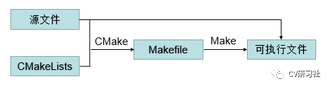
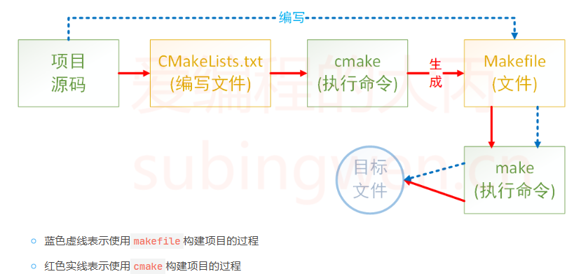
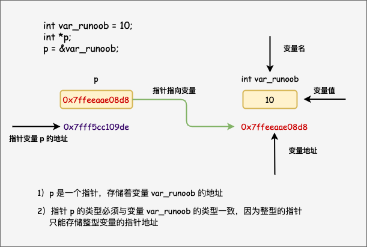
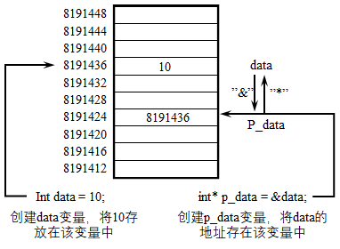
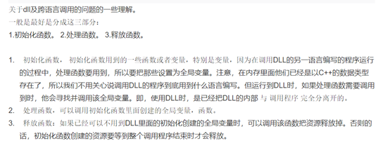
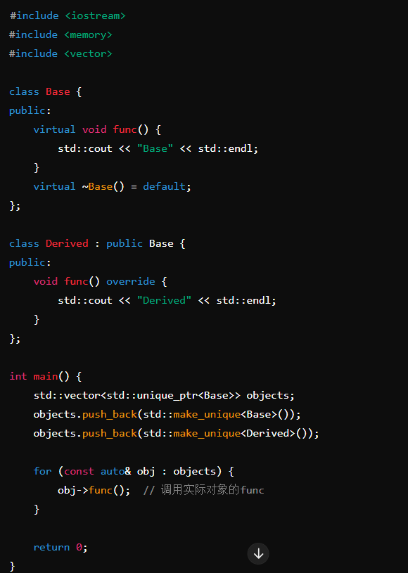
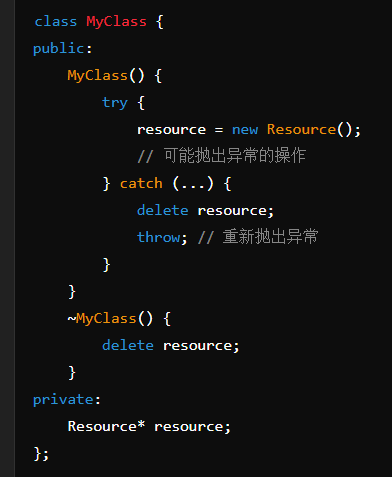

## CMAKE





## 指针





## dllimport / dllexport

在Windows上进行开发程序通常会使用到dll, 微软希望通过dll机制加强软件的模块化设计，使得各模块之间能够松散的组合，重用以及升级。那么接下内容会介绍Windows C++中如何生成以及使用dll。

在生成dll的时候我们希望将我们的符号导出（符号就是程序中定义的变量或者方法），在使用dll时则时希望导入符号。通常由两种方式来实现符号表的导入导出。

1. _*declspec(dllimport) * *和 * __declspec(dllexport)

__declspec关键字可以用来修饰某个函数或者时变量，以及c++中的某个类，如果作用于某个class上则表示将class中的所有方法以及static data member 会被导出。

通常如果你要导出一个class，
你需要下面一段代码, 并且你需要在你的dll 工程中定义宏DLLEXPORT

#ifdef DLLEXPORT #define _DLL_DECLARE_
declspec(dllexport) #else #define _DLL_DECLARE_ declspec(dllimport) class
_DLL_DECLARE_ Math { public: double Add(double a, double b); double Sub(double
a, double b); };

如果你需要导出一个全局的函数那么你需要在dll的工程中显示的指出导出某个符号,例如下面的代码我们需要导出函数myFunc

__declspec(dllexport) double
myFunc(double a, double b);

在对应的使用该方法的地方需要显示的导入该方法才可以使用

__declspec(dllimport) double
myFunc(double a, double b);使用.def文件

2. ".def"文件是类似于ld连接器的连接脚本文件，可以被当作link连接器的输入文件，用域控制链接过程。“.def”文件中的IMPORT或者EXPORTS段可以用来声明导入导出符号。

[C++导入导出符号（dllimport/dllexport） - 知乎 (zhihu.com)](https://zhuanlan.zhihu.com/p/407291193)

[C++编程笔记：dll的生成与使用_c++ dll 使用-CSDN博客](https://blog.csdn.net/elaine_bao/article/details/51784864)

dll 分三个模块；



[为什么动态链接.dll和.lib都需要(详解静、动态链接库)_windows的动态链接库为什么多个lib文件-CSDN博客](https://blog.csdn.net/weixin_43744293/article/details/117283686)

## Design pattern 设计模式

当涉及到 C++ 中的设计模式时，有很多种不同的设计模式可以考虑。以下是一些常见的设计模式列表，它们可以帮助你更好地组织和理解代码：

1. 创建型模式（Creational Patterns）：

* 工厂模式（Factory Pattern）
* 抽象工厂模式（Abstract Factory Pattern）
* 建造者模式（Builder Pattern）
* 原型模式（Prototype Pattern）
* 单例模式（Singleton Pattern）

2. 结构型模式（Structural Patterns）：

* 适配器模式（Adapter Pattern）
* 桥接模式（Bridge Pattern）
* 组合模式（Composite Pattern）
* 装饰器模式（Decorator Pattern）
* 外观模式（Facade Pattern）
* 享元模式（Flyweight Pattern）
* 代理模式（Proxy Pattern）

3. 行为型模式（Behavioral Patterns）：

* 责任链模式（Chain of Responsibility Pattern）
* 命令模式（Command Pattern）
* 解释器模式（Interpreter Pattern）
* 迭代器模式（Iterator Pattern）
* 中介者模式（Mediator Pattern）
* 备忘录模式（Memento Pattern）
* 观察者模式（Observer Pattern）
* 状态模式（State Pattern）
* 策略模式（Strategy Pattern）
* 模板方法模式（Template Method Pattern）
* 访问者模式（Visitor Pattern）

## effective C++ 35 items

#### item 3 不要对数组使用多态；

数组名可以被看作指向其第一个元素的指针。然而，指针本身并不能支持多态，因为指针类型在编译时是固定的。

数组中的对象在内存中是连续存放的。不同类型的对象（如基类和派生类）在内存中的布局可能不同。如果直接在数组中存放多态对象，可能会导致内存对齐和对象大小的问题。

解决方案：

为了解决上述问题，通常会使用指针或智能指针来存储对象，这样可以保持多态性。



在这个例子中，使用了 std::unique_ptr 来存储 Base 类型的对象，并在运行时决定调用哪个 func 函数。这保持了多态性，同时避免了数组的类型限制问题。

总结起来，C++ 中数组不能直接使用多态是由于数组类型在编译时固定、指针和数组的关系、对象内存布局不同等原因。为了实现多态，通常会使用指针或智能指针来存储对象

#### Item M4：避免无用的缺省构造函数

在《Effective C++》中，Scott Meyers 提出了一条重要的建议：避免无用的缺省构造函数（Item 4: Avoid unnecessary default constructors）。下面是这一建议的详细解释：

**背景**

缺省构造函数是指没有参数的构造函数。编译器会在没有定义任何构造函数的情况下，自动生成一个缺省构造函数。对于许多类来说，自动生成的缺省构造函数可能是无用的，甚至是有害的。

**问题**

1. 资源浪费

：缺省构造函数通常不会进行任何初始化操作，只是简单地分配内存。如果类的对象必须通过特定的参数进行初始化，那么这个缺省构造函数的存在就显得多余，而且还会浪费资源。

2. 增加代码复杂度

：提供一个无用的缺省构造函数可能会使代码变得复杂，难以维护。如果其他程序员误用了这个构造函数，可能会导致逻辑错误或未初始化的对象。

3. 增加出错概率

：如果缺省构造函数创建的对象没有初始化，那么在使用这些对象时，可能会遇到未定义的行为。这会增加程序出错的概率，并且难以调试。

4. 违背设计意图

：有些类需要通过参数初始化，例如那些依赖于外部资源（如文件、数据库连接等）的类。定义一个缺省构造函数违背了类设计的初衷。

**建议**

**避免定义无用的缺省构造函数，**特别是在以下情况下：

* 类的对象在创建时必须初始化。
* 类依赖于外部资源或特定的参数来正确工作。
* 类的默认构造函数无法保证对象的有效状态

#### Item M5：谨慎定义类型转换函数

* 隐式转换

：类型转换函数可能会被隐式调用，从而在不经意间将一个对象转换为另一种类型。这种隐式转换可能导致代码行为出乎意料，增加了调试和维护的难度。

* 歧义和优先级问题

：在重载解析（overload resolution）过程中，隐式转换可能会引发歧义，特别是当多个转换路径存在时，编译器需要在多种转换方案中做出选择，可能导致编译错误或者选择了不合适的转换路径。

* 性能问题

：不必要的类型转换会增加运行时的开销，影响程序性能。尤其是在频繁调用的代码路径中，隐式转换可能引入不可忽视的性能损耗。

* 设计上的不一致

：过度使用类型转换函数可能使类的设计变得不清晰，导致类接口的不一致性，破坏代码的可读性和可维护性。

为避免这种情况，可以使用  explicit 关键字，强制要求显式转换

```cpp
double amount = static_cast(c);  // 必须显式转换
```

#### Item M6：自增(increment)、自减(decrement)操作符前缀形式与后缀形式的区别

* 前缀形式

（prefix form）：操作符放在变量前面，例如 ++i 或 --i。

* 执行顺序：先进行自增/自减操作，再返回操作后的值。
* 语法定义：T& operator++(); 和 T& operator--();
* 后缀形式

（postfix form）：操作符放在变量后面，例如 i++ 或 i--。

* 执行顺序：先返回变量的值，然后再进行自增/自减操作。
* 语法定义：T operator++(int); 和 T operator--(int);，其中 int 参数是一个哑参数，用来区分前缀和后缀形式。

性能差异

* 前缀形式：通常比后缀形式更高效。原因是前缀形式直接返回操作后的值，不需要创建临时对象。
* 后缀形式：因为需要先保存变量的当前值，再进行自增/自减操作，然后返回保存的临时值，所以可能涉及创建临时对象，尤其是对于自定义类型，这会增加额外的开销。

```cpp
classMyClass {
    public:    MyClass& operator++() {  
        // 前缀形式，直接自增并返回当前对象  
        ++value;  
        return *this;  
    }

    MyClass operator++(int) {  
        // 后缀形式，需要创建临时对象保存当前值  
        MyClass temp = *this;   
        ++value;  
        return temp;  
    }
private:  
    int value;
};
```

在这种情况下，使用后缀形式  obj++ 会创建一个临时的 MyClass 对象 temp，这会带来额外的开销。而前缀形式 ++obj 则直接修改并返回当前对象，没有临时对象的创建。

### Item M7：不要重载“&&”,“||”, 或“,”

### Item M10：在构造函数中防止资源泄漏

* 使用 RAII（资源获取即初始化）：在 C++ 中，RAII 是一种常用的技术。它的核心思想是在对象的生命周期内管理资源的分配和释放。通过在构造函数中分配资源，在析构函数中释放资源，可以确保资源不会泄漏。即使在构造函数中发生异常，析构函数也会被调用，从而释放资源。
* 使用智能指针：智能指针（如 std::unique_ptr 和 std::shared_ptr）在 C++ 中是管理资源的好工具。它们能够自动管理资源的生命周期，并确保资源在不再使用时被释放。

如果你用对应的auto_ptr对象替代指针成员变量，就可以防止构造函数在存在异常时发生资源泄漏，你也不用手工在析构函数中释放资源，并且你还能象以前使用非const 指针一样使用const指针，给其赋值。 在对象构造中，处理各种抛出异常的可能，是一个棘手的问题，但是auto_ptr(或者类似于auto_ptr 的类)能化繁为简。它不仅把令人不好理解的代码隐藏起来，而且使得程序在面对异常的情况下也能保持正常运行。

* try-catch 此外，还可以使用 try-catch 块来捕获异常并释放资源。

  

[https://www.mwrf.net/tech/basic/2023/30081.html](https://www.mwrf.net/tech/basic/2023/30081.html)
