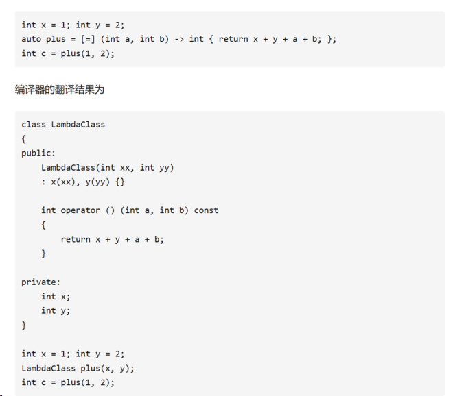
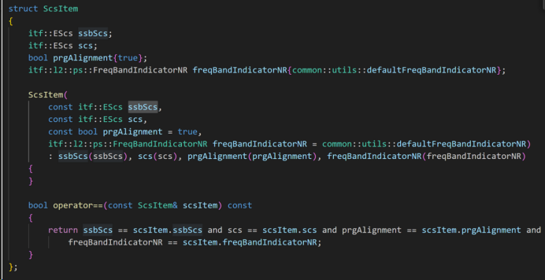
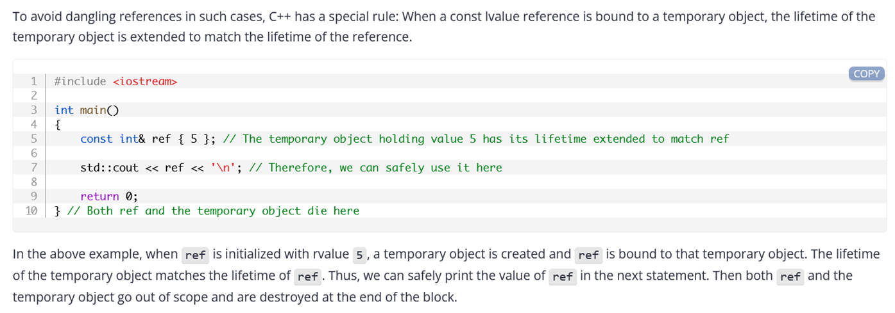

## C++ Syntax


## C++ OOP


## Encapsulation封装：


## C++ Inheritance Access


## C++ Files


The type of a literal


## Literal suffixes


## C++ operator


```cpp

bool isOk = false;
int i = 1;
if (i < 2 and i > 0)
    isOk = true;if (not isOk) {
    printf("OK");
}
```

使用mingw7.3.0编译器可以通过，而使用MSVC2017则编译不通过，需要设置编译器选项/Za以支持替代关键字

## Constexpr


[C++11 constexpr：验证是否为常量表达式（长篇神文） (biancheng.net)](https://c.biancheng.net/view/7781.html)

## C++ Exceptions


## Lambdas  functions


=>

we defined a lambdaright where it was needed. This use of a lambda is sometimes called a function literal (看起来像函数但是没有函数名).


### Lamada 四种表达式


调用的时候编译器会生成一个Lambda的对象，并调用opeartor()函数。（备注：这里的编译的翻译结果并不和真正的结果完全一致，只是把最主要的部分体现出来，其他的像类到函数指针的转换函数均省略）



这里注意， 由于所有的都是传值，所以函数是const的，里面的值是不可以被修改的。如果需要被修改则需要用keyword  mutable或者 用引用&传值，


[C++ Lambda表达式的完整介绍 - 知乎 (zhihu.com)](https://zhuanlan.zhihu.com/p/384314474)

## Struct 和函数，构造函数

在C语言中，结构体不能包含函数。C语言中的结构体只能描述一个对象的状态，不能描述一个对象的行为。
在C++中，考虑到C语言到C++语言过渡的连续性，对结构体进行了扩展，C++的结构体可以包含函数，这样，C++的结构体也具有类的功能，与class不同的是，结构体包含的函数默认为public，而不是private


[c++中struct构造函数_struct 构造函数-CSDN博客](https://blog.csdn.net/a_forever_dream/article/details/88867801)



## Keyword


Compound type（复合类型）


## #define

define (定义函数)


 可以改为 `# define RESULT(x) ((x)*(x))`

## Inherit


Virtual Class


## 虚函数和纯虚函数

虚函数是实现多态（polymorphism）的机制，其核心理念就是通过基类访问派生类定义的函数。多态性使得程序调用的函数是在运行时动态确定的，而不是在编译时静态确定的。使用一个基类类型的指针来指向子类对象，进而调用由子类复写的个性化的虚函数，这是C++实现多态性的一个最经典的场景。
虚函数，在类成员方法的声明语句前加**“virtual"**,  如 virtual void func(). 对于虚函数，子类可以（也*可以不*）重新定义基类的虚函数，该行为称之为复写Override。子类如果不提供虚函数的实现，将会自动调用基类的缺省虚函数实现

**纯虚函数**，在虚函数后加**“=0”**，如 virtual void func()=0. 对于纯虚函数，子类必须提供纯虚函数的个性化实现。 子类如果不提供虚函数的实现，将会自动调用基类的**缺省**虚函数实现. 纯虚函数在基类中的实现跟多态性无关，它只是提供了一种语法上的便利，在变化多端的应用场景中留有后路。

## Lvalue and Rvalue


[基础篇：lvalue，rvalue和move - 知乎 (zhihu.com)](https://zhuanlan.zhihu.com/p/138210501)

## & and * for point

*            ****是取值运算符，对地址使用可以获得地址中储存的数值。 对于指针a，*a表示取a中的值****
* ****            &是地址运算符，对变量使用可以获得该变量的地址。     对于变量b，&b表示取b的地址****

**在定义时，* 是一个标识符，声明该变量是一个指针，比如说int *p; 那p就是一个指向int型的指针；**

在C/C++中，*和&有很多用法，具体的使用要根据代码内容来确定。
**C中*****的用法**
（d）    指针的声明：int *p 或 int* p; 读法：p是指向一个整数类型的指针。
（e）   复合指针： int **p; 或 int** p; 读法 p是一个指向一个指向整数类型的指针的指针。（同样道理， int***p等等）
（f）    解引用： x=*p 把指针p指向的值赋值给x;

**&在C语言中的用法**
（a）    求地址运算符：p=&x; 读法：把x的地址赋给p（指针）
  (b)     引用， int& r =i;  r 定义为i的引用；(C++中&的补充用法)

#### example


Array 是地址， array+3 表示地址+3； * 表示取值；


```cpp
一个栈的入栈序列是A，B，C，D，E，则栈的不可能的输出序列是（ C ）A. EDCBA；  
B. DECBA；    
C. DCEAB；  
D. ABCDE


写个函数交换两个指针。
void ex(char **a,char **b)
{
char *c;
c=*a;
*a=*b;
*b=c;
}
```

## ifndef/define/endif

头文件中的ifndef/define/endif 干什么用？
在一个大的软件工程里面，可能会有多个文件同时包含一个头文件，当这些文件编译链接成一个可执行文件时，就会出现大量重定义的错误。在头文件中实用#ifndef #define #endif能避免头文件的重定义。

## C++ / C 内存分配

说一说C与C++的内存分配方式？
（1）从静态存储区域分配。内存在程序编译的时候就已经分配好，这块内存在程序的整个运行期间都存在，如全局变量，static变量。

（2）在栈上创建。在执行函数时，函数内局部变量的存储单元都可以在栈上创建，函数执行结束时这些存储单元自动被释放。栈内存分配运算内置于处理器的指令集中，效率很高，但是分配的内存容量有限。

（3）从堆上分配（动态内存分配）程序在运行的时候用malloc或new申请任意多少的内存，程序员负责在何时用free或delete释放内存。动态内存的生存期自己决定，使用非常灵活。

## static 关键字

5. 关键字static的作用是什么？
   这个简单的问题很少有人能回答完全。在C语言中，关键字static有三个明显的作用：

（1）在函数体，一个被声明为静态的变量在这一函数被调用过程中维持其值不变。

（2）在模块内（但在函数体外），一个被声明为静态的变量可以被模块内所用函数访问，但不能被模块外其它函数访问。它是一个本地的全局变量。

（3）在模块内，一个被声明为静态的函数只可被这一模块内的其它函数调用。那就是，这个函数被限制在声明它的模块的本地范围内使用。

大多数应试者能正确回答第一部分，一部分能正确回答第二部分，同是很少的人能懂得第三部分。这是一个应试者的严重的缺点，因为他显然不懂得本地化数据和代码范围的好处和重要性。

## 重载（overload)和重写(overried）

8. 重载（overload)和重写(overried，有的书也叫做“覆盖”）的区别？
   答：从定义上来说：

重载：是指允许存在多个同名函数，而这些函数的参数表不同（或许参数个数不同，或许参数类型不同，或许两者都不同）。

重写：是指子类重新定义复类虚函数的方法。

## 数值与零的比较


## 链表


Lvalue Reference （Alias）


In the above example, refis an alias for x,so we are able to change the value of xthrough either x or ref.


Because ref acts as an alias for x, whenever we use ref, the program will go to memory address 140 to access the value. Again the compilertakes care of the addressing


改变初始的identifier，可以改变constant reference， as below


Reference是一个别名/借名，reference不能用reference实例化，  



Constantreference 可以扩展temporary objects

## Pass by reference


如果你不想做改变那就传输进入parameter，而不是reference,除非copy代价比较大;


An object of type T is cheap to copy if sizeof(T) <= 2 * sizeof(void*)and has no additional setup costs


## The address-of operator (&)


## dereference  operator (*)


这里dereference 不应该认为是剥离地址,而更应该认为是一种新的操作, 只是命名为了 Operator *;这样就比较好理解了.

Much like the type of a **referencehas to match the type of object being referred to,** the type of the pointerhas to match the type of the object being pointed to:


Ptr =… 这里没没有*, 这赋值就是改变地址;
*Ptr =… 这里是改变地址.

Int x; int& ref; int* ptr; 这里通过三个方式改变数值,x, ref, *ptr;


## NullPtr

Much like thekeywords true and false represent Boolean literal values, the nullptr keywordrepresents a null pointer literal. We can use nullptr to explicitly initialize or assign a pointera null value.


## Pointer to a const value ( const int* ptr)


## const Pointer (int* const ptr)


## Pass reference to function and return


## std::string_view

[C++17剖析：string_view的实现，以及性能 - 知乎 (zhihu.com)](https://zhuanlan.zhihu.com/p/166359481)


##   Type deduction auto keyword


##  Type deduction for functions

Auto 不能用于function input parameter,可以用function template 代替.


## Template and Overload


 Function overloading

The return type of afunction is not considered for differentiation

Function template

max<>只考虑template情况;

在有多个函数和函数模板名字相同的情况下，编译器如下规则处理一条函数调用语句：

1. 先找参数完全匹配的普通函数（非由模板实例化而得的函数）；
2. 再找参数完全匹配的模板函数；
3. 再找实参数经过自动类型转换后能够匹配的普通函数；
4. 上面的都找不到，则报错。

Class template

C++ 模板常见特性（函数模板、类模板） - 知乎 (zhihu.com)

Non-type template parameters
10.17— Non-type template parameters – Learn C++ (learncpp.com)

Static Keyword in C++

Static Variables: Variables ina function, Variables in a class
Static Members of Class: Classobjects and Functions in a class

 

Static variables in class
Static variables in a class: As the variables declared as staticare initialized only once as they are allocated space in separate staticstorage so, the static variables in a class are shared by theobjects. There can not be multiple copies of the samestatic variables for different objects. Also because of this reason staticvariables can not be initialized using constructors. 
由于static 只能被初始化一次,他们被分布在 static storage, 所以static 参数被各个object shared,不能在实例化的类中重复;

注意这里不能用 obj.i=1 来初始化I;
Class member of Class

这里面函数先结束然后 static GFG 才被释放; 如果这个class 不是static,那么在if 之后, GFG Obj 就会被释放了,  “”End of Main”会被打印在最后的.
Static function in class
s

Static function 不依赖于 object; 虽然可以通过obj.printMsg()  但是推荐用GFG::printMsg()来invoke;
Static function (C 语言)

C++ hpp /cpp
在C++中就要分出了头(.h)文件和实现(.cpp)文件，就是Package的概念
一个Package就是由同名的.h和.cpp文件组成。当然可以少其中任意一个文件：只有.h文件的Package可以是接口或模板(template)的定义；只有.cpp文件的Package可以是一个程序的入口。

C++的头文件和实现文件分别写什么 - Ider - 博客园(cnblogs.com)

This pointer
The this pointeris a pointer accessible only within the non-static member functions of a class, struct, or union type. It points to the object for whichthe member function is called. Static member functions don't have a this pointer.

C++的this指针【定义、用法、本质、特点】_c++this指针本质-CSDN博客
Thethis pointer | Microsoft Learn

Static inline

注意: 将被inline修饰的函数以内联的方式嵌入到调用这个函数的地方, 内联函数由于被复制多次,所有内存开销比较大, 但是运行快;

详解static inline关键字 - 知乎 (zhihu.com)

staticinline对函数的作用_inline static函数-CSDN博客

union keyword

Init函数
Init函数来初始化类的私有成员变量
因为有时候需要在构造函数之外对对象进行初始化，例如，在对象的生命周期内，可能需要重新初始化一些成员变量。此时可以定义一个Init函数，这样就可以在需要的时候调用它来重新初始化对象。

Init函数是一种用于初始化类成员变量或执行其他初始化操作的方法，它可以在构造函数之外定义，并且可以在需要的时候被调用

Vector

Vector 遍历方式
            //第一种遍历方式，下标访问
            for (int i= 0; i<m_testPoint.size(); ++i)
"第二种遍历方式，迭代器访问"
            for(vector `<Point>`::iterator iter = m_testPoint.begin(); iter !=m_testPoint.end(); iter++)
            //第三种遍历方式，auto关键字
            for (autoiter = m_testPoint.begin(); iter != m_testPoint.end(); iter++)
"C++11,第四种遍历方式，auto关键字"
            for(auto i : m_testPoint)
————————————————
版权声明：本文为CSDN博主「小桥流水人家_」的原创文章，遵循CC 4.0 BY-SA版权协议，转载请附上原文出处链接及本声明。
原文链接：https://blog.csdn.net/qq_28351609/article/details/108740451

Vector and array.

std::array确实不是原生数组，但它也类似于原生数组，内存也是在栈上，如果不是使用at()访问，那它和普通数组基本上就是一个东西。
再讨论std::array和std::vector的区别，就是普通数组与动态数组之间的差别，一个不可扩容，一个可扩容，如果你提前给vector做一次resize，不对vector做push_back emplace_back操作，那它俩没有太大区别。
而在vector即将超过capacity，要扩容，这时会重新拿到更大的内存，再做一次移动或者拷贝操作，这时候会更耗一些性能。
所以结论是：
如果你提前知道了数组长度，可以使用array，也可以使用vector.resize(N)，然后当作普通数组使用，它俩基本性能相同，区别在于一个在栈上，一个在堆上。
如果长度不固定，那你肯定用不了array，肯定会使用vector。
所以个人认为vector大多数情况下可以替代array。但个人还是习惯小内存使用栈。
作者：程序喵大人链接：https://www.zhihu.com/question/475070301/answer/2260994058来源：知乎

Array find
find() 函数是一个 泛型算法，可以用于操作所有STL容器。它用于在数组或标准库容器（如vector，map）中查找指定元素，查找成功则返回一个指向指定元素的迭代器，查找失败则返回end迭代器。（注意不是返回 true orfalse）

C++ 泛型算法 std::find() ，用于在数组或标准库容器中查找指定元素_ctrlA_ctrl C_ctrl V的博客-CSDN博客
内置数组和array的比较
数组初始化不能直接使用拷贝和赋值!!!数组的传递只能是遍历的形式来拷贝；
和数组不同的是，array可以使用拷贝和赋值的形式进行初始化

array<int,10> ial1={0,1,2,3};
array<int,10> Ial2=ial1;//只要保证两者的类型一致就可以（包括元素类型和大小

Std:Pair
C++ pair的基本用法总结（整理） - 知乎 (zhihu.com)

Code need to be clarify
typedef ::multi::StaticVariableSizedArray<DrbToBeSetupItem, uint32_t, default_configuration::_NbMaxDrbs, 0>
    __drbsToBeSetupList;

Std:Map
map是STL的一个关联容器，它提供一对一的hash。

第一个可以称为关键字(key)，每个关键字只能在map中出现一次；
第二个可能称为该关键字的值(value)；
map以模板(泛型)方式实现，可以存储任意类型的数据，包括使用者自定义的数据类型。Map主要用于资料一对一映射(one-to-one)的情況，map內部的实现自建一颗红黑树，这颗树具有对数据自动排序的功能。在map内部所有的数据都是有序的，后边我们会见识到有序的好处。比如一个班级中，每个学生的学号跟他的姓名就存在著一对一映射的关系。

原文链接：https://blog.csdn.net/sevenjoin/article/details/81943864
 

pair与map怎样联系起来：
map可以当做一个容器（装载具有一定格式的数据）；pair可以理解为元素（放入到容器的的每个个体），pair并没有单独行动的典型用法，正常都是配合map来使用（即把pair这个元素插入到map这个容器里面）。

通过map的insert()可以把一个pair对象作为map 的参数，如map1.insert(pair1<id,grade>);
Map 排序

Python 中的字典类型,

C++ 11  keyword =default, =delete
class EventAdapter
{
public:
    EventAdapter() = default;
    virtual ~EventAdapter() = default;
    EventAdapter(const EventAdapter&) = delete;
    EventAdapter(EventAdapter&&) = delete;
    EventAdapter& operator=(const EventAdapter&) = delete;
    EventAdapter& operator=(EventAdapter&&) = delete;

    virtual em_event_t create(size_t size, const TAaSysComMsgId msgId) const;
    virtual void send(em_event_t event, em_queue_t queue) const;
    virtual void* getPayload(em_event_t event) const;
};

选择题
int a[3][2]={3,2,1}; 则表达式“a[0][0]/a[0][1]/a[0][2]”的值是（1）： int 直接省略小数位

以下三条输出语句分别输出什么 _____
char str1[] = "abc";
char str2[] = "abc";

const char str3[] = "abc";
const char str4[] = "abc";
const char* str5 = "abc";
const char* str6 = "abc";
cout << boolalpha << ( str1==str2 ) << endl; // 输出什么？
cout << boolalpha << ( str3==str4 ) << endl; // 输出什么？
cout << boolalpha << ( str5==str6 ) << endl; // 输出什么？
答：分别输出false,false,true。str1和str2都是字符数组，每个都有其自己的存储区，它们的值则是各存储区首地址，不等；str3和str4同上，只是按const语义，它们所指向的数据区不能修改。str5和str6并非数组而是字符指针，并不分配存储区，其后的“abc”以常量形式存于静态数据区，而它们自己仅是指向该区首地址的指针，相等。

《Effective C++》55条款详读以及示例代码

阿里题集:
两束之和
class Solution {
public:
    vector `<int>` twoSum(vector `<int>`& nums, int target) {
        unordered_map<int, int> hashtable;
        for (int i = 0; i < nums.size(); ++i) {
            auto it = hashtable.find(target - nums[i]);
            if (it != hashtable.end()) {
                return {it->second, i};
            }
            hashtable[nums[i]] = i;
        }
        return {};
一、C语言内存分区
1 内存模型
在C语言中，内存可分用五个部分：
BSS段（Block Started by Symbol): 用来存放程序中未初始化的全局变量的内存区域。
数据段（data segment): 用来存放程序中已初始化的全局变量的内存区域。
代码段（text segment): 用来存放程序执行代码的内存区域。
堆（heap）：用来存放进程运行中被动态分配的内存段，它的大小并不固定，可动态扩张或缩减。当进程调用malloc分配内存时，新分配的内存就被动态添加到堆上，当进程调用free释放内存时，会从堆中剔除。
栈（stack）：存放程序中的局部变量（但不包括static声明的变量，static变量放在数据段中）。同时，在函数被调用时，栈用来传递参数和返回值。由于栈先进先出特点。所以栈特别方便用来保存/恢复调用现场。
————————————————
版权声明：本文为CSDN博主「second60」的原创文章，遵循CC 4.0 BY-SA版权协议，转载请附上原文出处链接及本声明。
原文链接：https://blog.csdn.net/second60/article/details/79946310

C语言内存分区示意图如下：

栈区stack
栈区介绍
栈区由编译器自动分配释放，由操作系统自动管理，无须手动管理。
栈区上的内容只在函数范围内存在，当函数运行结束，这些内容也会自动被销毁。
栈区按内存地址由高到低方向生长，其最大大小由编译时确定，速度快，但自由性差，最大空间不大。
栈区是先进后出原则，即先进去的被堵在屋里的最里面，后进去的在门口，释放的时候门口的先出去。
存放内容
临时创建的局部变量和const定义的局部变量存放在栈区。
函数调用和返回时，其入口参数和返回值存放在栈区。
堆区 heap
堆区介绍
堆区由程序员分配内存和释放。
堆区按内存地址由低到高方向生长，其大小由系统内存/虚拟内存上限决定，速度较慢，但自由性大，可用空间大。
调用函数
用malloc等函数实现动态分布内存。

全局(静态)区
全局(静态)区介绍
通常是用于那些在编译期间就能确定存储大小的变量的存储区，但它用于的是在整个程序运行期间都可见的全局变量和静态变量。
全局区有 .bss段 和 .data段组成，可读可写。
.bss段
未初始化(或初始化为0)的全局变量/静态变量存放在.bss段。
.bss段不占用可执行文件空间，其内容由操作系统初始化。
.data段
已初始化的全局变量/静态变量存放在.data段。
————————————————
版权声明：本文为CSDN博主「根号五」的原创文章，遵循CC 4.0 BY-SA版权协议，转载请附上原文出处链接及本声明。
原文链接：https://blog.csdn.net/MQ0522/article/details/114823770
————————————————
版权声明：本文为CSDN博主「根号五」的原创文章，遵循CC 4.0 BY-SA版权协议，转载请附上原文出处链接及本声明。
原文链接：https://blog.csdn.net/MQ0522/article/details/114823770

全局变量 /静态变量/ 局部变量
全局变量简介
在所有函数外部定义的变量称为全局变量（Global Variable），它的作用域默认是从定义变量的位置到本源文件结束都有效。

全局变量 x ，y 能在三个函数中直接使用，并没有和局部变量一样需要声明；
如果需要使用全局变量，最好是定义在该文件的最顶部，这样该文件中的所有函数都可以直接使用！

局部变量：
每次调用时，在进入函数func1后都会创造一个新的变量i，并且给它赋初值1，然后i++时加到2，
然后func1本次调用结束，结束时同时杀死本次创造的这个i。这就是局部变量i的整个生命周期。
下次再调用该函数func1时，又会重新创造一个i，经历整个程序运算，

静态局部变量(static) 静态局部变量定义时前面加static关键字。静态局部变量所在的函数在多调用多次时，只有第一次才经历变量定义和初始化，以后多次在调用时不再定义和初始化，而是维持之前上一次调用时执行后这个变量的值。本次接着来使用。
2、静态局部变量在函数退出时它不死亡，而是保持其值等待函数下一次被调用。下次调用时不再重新创造和初始化该变量，而是直接用上一次留下的值为基础来进行操作。
3、静态局部变量的这种特性，和全局变量非常类似。它们的相同点是都创造和初始化一次，以后调用时值保持上次的不变。不同点在于作用域不同

全局变量 定义在函数外面的变量，就叫全局变量。

普通全局变量 普通全局变量就是平时使用的，定义前不加任何修饰词。普通全局变量可以在各个文件中使 用，可以在项目内别的.c文件中被看到，所以要确保不能重名。
静态全局变量 静态全局变量就是用来解决重名问题的。静态全局变量定义时在定义前加static关键字， 告诉编译器这个变量只在当前本文件内使用，在别的文件中绝对不会使用。这样就不用担心重名问题。所以静态的全局变量就用在我定义这个全局变量并不是为了给别的文件使用，本来就是给我这个文件自己使用的。
跨文件引用全局变量(extern) 就是说，你在一个程序的多个.c源文件中，可以在一个.c文件中定义全局变量g_a,并且可以在别的另一个.c文件中引用该变量g_a（引用前要声明）
函数和全局变量在C语言中可以跨文件引用，也就是说他们的连接范围是全局的，具有文件连接属性，总之意思就是全局变量和函数是可以跨文件看到的（直接影响就是，我在a.c和b.c中各自定义了一个函数func，名字相同但是内容不同，编译报错。）。

局部变量和全局变量的对比：
1、定义同时没有初始化，则局部变量的值是随机的，而全局变量的值是默认为0.
2、使用范围上：全局变量具有文件作用域，而局部变量只有代码块作用域。
3、生命周期上：全局变量是在程序开始运行之前的初始化阶段就诞生，到整个程序结束退出的时候才死亡；而局部变量在进入局部变量所在的代码块时诞生，在该代码块退出的时候死亡。
4、变量分配位置：全局变量分配在数据段上，而局部变量分配在栈上

const基本介绍
const是constant的简写，用来定义常量，它限定一个变量不允许被改变，产生静态作用。const最开始推出的目的是为了取代预编译指令，取长补短。
与define的对比
define是预编译指令，定义的宏是在预处理阶段展开的，而const是普通变量的定义，是只读变量，且是在编译运行阶段使用的。
define定义的是常量，define定义的宏在编译后消失了，它不占用内存，而const定义的常变量本质上仍然是一个变量，具有变量的基本属性，有类型、占用存储单元，除了不能作为数组的长度，用const定义的常变量具有宏的优点，而且使用更方便。
define定义的对象没有数据类型，编译器只能机械地进行字符替换，没有类型安全检查，即会出现“  边际问题 、括号问题
下面我们从几个方面来说一下const的用法：
修饰局部变量
const int num=5;
int const num=5;
这两种写法是一样的，都是表示变量num的值不能被改变，用const修饰变量时，一定要初始化，否则之后就不能再进行赋值了（后面会讲到一种特殊情况）。
接下来看看const用于修饰常量静态字符串，例如：
const char* str="techdreamer";
如果没有const的修饰，我们可能会在后不经意间的修改代码，比如str[4]=’D’，这样会导致对只读内存区域的赋值，使程序异常终止。
而加上const修饰之后，这个错误就能在程序被编译的时候立即被检查出来，让逻辑错误在编译期被发现，避免我们在后续中继续debug。
修饰全局变量
全局变量的作用域是整个文件，且全局变量的生存周期为程序运行的整个过程，所以我们应该尽量避免使用全局变量，一旦某个函数改变了全局变量的值，会影响到其他引用这个变量的函数，是一个很隐蔽的操作。
如果一定要用全局变量，应该尽量的使用const进行修饰，防止不必要的人为修改，使用 const 修饰过的局部变量就有了静态特性，它的生存周期也是程序运行的整个过程，虽然有了静态特性，但并不是说它变成了静态变量。
修饰常量指针与指针常量
常量指针
常量指针是指针指向的内容是常量，可以有以下两种定义方式。
const int * num;
int const * num;
常量指针说的是不能通过这个指针改变变量的值，但可以通过其他的引用来改变变量的值。
int cnt=5;
const int* num=&cnt;
cnt=6;
常量指针指向的值不能改变，但这并不意味着指针本身不能改变，常量指针可以指向其他的地址。
int cnt=5;
int tmp=6;
const int* num=&cnt;
num=&tmp;
指针常量
指针常量是指指针本身是个常量，不能再指向其他的地址，写法如下：
int *const num;
需要注意的是，指针常量指向的地址不能改变，但是地址中保存的数值是可以改变的，可以通过其他指向改地址的指针来修改。
int cnt=5;
int *tmp=&cnt;
int* const num=&cnt;
*tmp=6;
区分常量指针和指针常量的关键就在于星号的位置，我们以星号为分界线。
如果const在星号的左边，则为常量指针
如果const在星号的右边则为指针常量
如果我们将星号读作‘指针’，将const读作‘常量’的话，内容正好符合。
int const * num；
int *const num；
指向常量的常指针
还有一种情况是指向常量的常指针，这相当于是常量指针与指针常量的结合，指针指向的位置不能改变并且也不能通过这个指针改变变量的值，例如
const int* const num;
这个代表num所指向的对象的值以及它的地址本身都不能被改变
修饰函数的形参
根据常量指针与指针常量，const修饰函数的参数也是分为三种情况
防止修改指针指向的内容
void FUN(char *destin, const char *source);
其中 source 是输入参数，destin 是输出参数。给 source 加上 const 修饰后，如果函数体内的语句试图改动 source 的内容，编译器将报错，但反过来是可以的，编译器允许将char *类型的数据赋值给const char *类型的变量。
防止修改指针指向的地址
void FUN ( int * const p1 , int * const p2 )
指针p1和指针p2指向的地址都不能修改。

在C语言标准库中，有很多函数的形参都被 const 限制了，下面是部分函数的原型：
size_t strlen ( const char * str );
int strcmp ( const char * str1, const char * str2 );
char * strcat ( char * destination, const char * source );
char * strcpy ( char * destination, const char * source );
int system (const char* command);
int puts ( const char * str );
int printf ( const char * format, ... );
修饰函数的返回值
如果给以“指针传递”方式的函数返回值加 const 修饰，那么函数返回值（即指针）的内容不能被修改，该返回值只能被赋给加const 修饰的同类型指针，例如
const char * FUN(void);
如下语句将出现编译错误：
char *str = FUN();
正确的用法是
const char *str = FUN();
const定义函数
  C语言： 不可以定义const函数
  C++：可以定义const函数
C与C++中的const用法有什么区别？
const定义函数
  C语言： 不可以定义const函数
   C++：可以定义const函数*
*

```cpp
**#include <stdio.h>
int main(){
const int a = 5;
int* p = (int*)&a;
printf("a = %d\n",a);
*p = 10;
printf("a = %d\n",a);
return 0;
}
```

在C语言中的const
在C语言中，用const修饰的变量，其本质上还是个变量，只是它不允许作为左值存在，也就是不允许对该变量进行直接赋值修改该变量，但是可以通过指针修改变量。

```cpp
#include <stdio.h>
int main(){
const int a = 5;
int* p = (int*)&a;
printf("a = %d\n",a);
*p = 10;
printf("a = %d\n",a);
return 0;
}
```

用gcc （C语言）编译器编译执行后得到的结果是：
a = 5  a = 10

用g++编译器编译执行后得到的结果是：
a = 5   a = 5

在C语言中，C编译器会为const修饰的变量分配空间，所以能打印地址和修改值大家都理解；
在C++中，编译器不会为const变量分配空间，只会将其对应起来存到符号表中，用到变量名的时候，直接将值替换。但是在碰到int* p = (int*)&a; 这条语句的时候，在碰到 &a 时，这个时候会为 a 分配存储空间，这个时候 p 和 a 的地址相同，但是通过指针来修改a的值在C++中还是无法成功的，因为在碰到 printf(“a = %d\n”,a); 时，编译器还是会直接用 5 将 a 替换，而不会去分配的存储空间的取值。
其实在C++中，const修饰的变量，在编译的时候如果前面有extern和取地址符 & 时，会为变量分配存储空间是为了兼容C语言，但是在C++中，用const修饰的变量就真的无法修改它的值，可以说是常量。但是在C语言中，const修饰的变量本质上还是变量而不是常量。这在C语言中其实也是矛盾的，因为我们想要用const定义一个常量，但又可以通过指针来改变该常量的值。而C++为了兼容C语言，所以保留了这个特性，但是却不法修改它的值，这就是const在C语言和C++中的区别。
————————————————
版权声明：本文为CSDN博主「Mr.LeoLu」的原创文章，遵循CC 4.0 BY-SA版权协议，转载请附上原文出处链接及本声明。
原文链接：https://blog.csdn.net/bendanfly/article/details/95492816

关于C++ new和malloc的区别！

文章来源：https://www.cnblogs.com/lcgbk/p/14118782.html
二、new和malloc两者的区别
2.1 属性的区别
new/delete：这两个是C++中的关键字，若要使用，需要编译器支持；
malloc/free：这两个是库函数，若要使用则需要引入相应的头文件才可以正常使用。
2.2 使用上的区别
malloc：申请空间需要显式填入申请内存的大小；
new：无需显式填入申请的内存大小，new会根据new的类型分配内存。
实例：
/** malloc/free用例 **/int*ma = (int*)malloc(4)；free(ma)；
/** new/delete用例 **/int*ne =new int(0);
2.3 内存位置的区别
new：此操作符分配的内存空间是在自由存储区；
malloc：申请的内存是在堆空间。
C/C++的内存通常分为：堆、栈、自由存储区、全局/静态存储区、常量存储区。可能除了自由存储区，其他的内存分布大家应该都比较熟悉。
堆 是C语言和操作系统的术语，堆是操作系统所维护的一块特殊内存，它提供了动态分配的功能，当运行程序调用malloc()时就会从中分配，调用free()归还内存。那什么是自由存储区呢？
自由存储区 是C++中动态分配和释放对象的一个概念，通过new分配的内存区域可以称为自由存储区，通过delete释放归还内存。自由存储区可以是堆、全局/静态存储区等，具体是在哪个区，主要还是要看new的实现以及C++编译器默认new申请的内存是在哪里。但是基本上，很多C++编译器默认使用堆来实现自由存储，运算符new和delete内部默认是使用malloc和free的方式来被实现，说它在堆上也对，说它在自由存储区上也正确。因为在C++中new和delete符号是可以重载的，我们可以重新实现new的实现代码，可以让其分配的内存位置在静态存储区等。而malloc和free是C里的库函数，无法对其进行重载。
2.4 返回类型的区别
new操作符内存分配成功时，返回的是对象类型的指针，类型严格与对象匹配，无须进行类型转换，故new是符合类型安全性的操作符。而malloc内存分配成功则是返回void * ，需要通过强制类型转换将void*指针转换成我们需要的类型。所以在C++程序中使用new会比malloc安全可靠。
2.5 分配失败情况的区别
malloc分配内存失败时返回NULL，我们可以通过判断返回值可以得知是否分配成功；
new内存分配失败时，会抛出bac_alloc异常，它不会返回NULL，分配失败时如果不捕捉异常，那么程序就会异常退出，我们可以通过异常捕捉的方式获取该异常。
2.6 定义对象系统调度过程的区别
使用new操作符来分配对象内存时会经历三个步骤：
调用operator new 函数（对于数组是operator new[]）分配一块足够的内存空间（通常底层默认使用malloc实现，除非程序员重载new符号）以便存储特定类型的对象；
编译器运行相应的构造函数以构造对象，并为其传入初值。
对象构造完成后，返回一个指向该对象的指针。
使用delete操作符来释放对象内存时会经历两个步骤：
调用对象的析构函数。
编译器调用operator delete(或operator delete[])函数释放内存空间（通常底层默认使用free实现，除非程序员重载delete符号）。
自己可以通过实例去验证下，此处就不展开例程了。
2.7 扩张内存大小的区别
malloc：使用malloc分配内存后，发现内存不够用，那我们可以通过realloc函数来扩张内存大小，realloc会先判断当前申请的内存后面是否还有足够的内存空间进行扩张，如果有足够的空间，那么就会往后面继续申请空间，并返回原来的地址指针；否则realloc会在另外有足够大小的内存申请一块空间，并将当前内存空间里的内容拷贝到新的内存空间里，最后返回新的地址指针。
new：new没有扩张内存的机制。
三、总结

malloc和new之间的区别 。 区别很简单：
malloc 分配内存 ，而new 分配内存并调用要为其分配内存的对象的构造函数 。
因此，除非限于C语言，否则永远不要使用malloc，尤其是在处理C ++对象时。 那将是破坏程序的秘诀。
另外free和delete之间的区别是相同的。 区别在于， delete除了释放内存外，还将调用对象的析构函数。
new可以认为是malloc加构造函数的执行。
new出来的指针是直接带类型信息的。
而malloc返回的都是void指针。

运行效率： 数组>动态数组（new）>预先reverse的vector>vector

malloc与calloc
对于用malloc分配的内存区间， 如果这部分内存空间曾经被分配、释放和重新分配，则其中可能遗留各种各样的数据。也就是说， 使用malloc()函数的程序开始时(内存空间还没有被重新分配)能正常运行，但经过一段时间后(内 存空间已被重新分配)可能会出现问题，因此在使用它之前必须先进行初始化（可用memset函数 对其初始化为0），
calloc()函数分配到的空间在分配时就已经被初始化为0了。
函数原型	返 回	功能说明
void *malloc(unsigned int size);	成功：返回所开辟 空间首地址 　失败：返回空指针	向系统申请 size字节的 堆空间
void *calloc(unsigned int num, 　unsigned int size);	成功：返回所开辟 空间首地址 　失败：返回空指针	按类型申请 num个size字 节的堆空间
void free(void *p);	无返回值	释放p指向 的堆空间
void *realloc(void *p,unsigned int 　size);	成功：返回新开辟 空间首地址 　失败：返回空指针	将p指向的 堆空间变为 size
(1）规定为 void * 类型，返回一段存储区的首址，该 地址的类型为void(无类型或类型不确定），其具体类型无法确定，只有使用时根据各个域值数据再确定。可以用强制转换的方法将其转换为别的类型。例如：
double *pd=NULL; pd=(double *)calloc(10,sizeof(double)); 　
表示将向系统申请10个连续的 double类型的存储空间，并用指针pd指向这个连续的空间的首地址。并且用(double)对calloc( ) 的返回类型进行转换，以便把double类型数据的地址赋值给指针pd。
（2）使用sizeof的目的是用来计算一种类型的占有的字节数，以便适合不同的编译器。
（3）由于动态分配不一定成功，为此要附加一段异常处理程序，不致程序运行停止，使用户 不知所措。通常采用这样的异常处理程序段： if(p==NULL) /* 或者if（!p）*/ { printf("动态申请内存失败！\n"); exit(1); //异 常退出 }
（5）分配的堆空间是没有名字的 只能通过返回的指针找到它。
（6）绝不能对非动态分配存储块使用free。也不能对同一块内存区同时用free释放两次。 如：free(p);free(p);
（7）调用 free() 时, 传入指针指向的内存被释放, 但调用函数的指针值可能保持不变, 因 为p是作为形参而传递给了函数。严格的讲, 被释放的指针值是无效的, 因为它已不再指向所申请 的内存区。这时对它的任何使用便可能会可带来问题。

智能指针的好处是不用再关心对象的内存申请和释放。而传统的指针需要手动申请和释放内存，否则会造成内存泄漏(memory leak)。
// 传统指针
Foo* p = new Foo(5);  // 申请内存
delete p;             // 释放内存

// 智能指针
std::unique_ptr `<Object>` smart_ptr(new Object());  // 不需要手动释放内存
智能指针
智能指针共有3种类型std::unique_ptr ,std::shared_ptr ,std::weak_ptr
std::unique_ptr
unique_ptr指针确保指向单一对象，不能被共享和复制。当你确保只需要单一对象的时候使用unique_ptr。
std::unique_ptr `<Object>` smart_ptr(new Object());
当你试图复制unique_ptr的时候，编译器会报错。
std::unique_ptr `<int>` smart_ptr1(new int(1));
std::unique_ptr `<int>` smart_ptr2;
smart_ptr2 = smart_ptr1;  // error

注意：当unique_ptr已经指向一个对象的时候，重新让它指向新的对象，则之前的对象会被释放，然后unique_ptr指向新的对象。
std::unique_ptr `<int>` valuePtr(new int(1));
valuePtr.reset(new int(47));  // 释放int(1)，重新指向int(47)

std::shared_ptr
多个shared_ptr指针可以指向同一个对象，内部采用引用计数的方式，每当一个shared_ptr指向该对象，则引用计数增加1，每当一个shared_ptr释放，则引用计数减1，当计数清零，也就是没有任何shared_ptr指向该对象的时候，就释放内存。
std::shared_ptr `<Foo>` smart_ptr1 = std::make_shared `<Foo>`();
std::shared_ptr `<Foo>` smart_ptr2;
smart_ptr2 = smart_ptr1;  // 指向同一对象

共享指针

std::weak_ptr
weak_ptr指针是弱指针，指向对象的时候，不增加引用计数。它主要是为了避免shared_ptr循环引用的问题。当shared_ptr循环引用的时候，计数不能清零，因此内存不能被正确释放。
struct Owner {
   std::shared_ptr `<Owner>` other;
};

std::shared_ptr `<Owner>` p1 (new Owner());
std::shared_ptr `<Owner>` p2 (new Owner());
p1->other = p2; // p1 引用 p2
p2->other = p1; // p2 引用 p1

共享指针循环引用
而weak_ptr指针可以解决上述循环引用的问题，当出现循环引用的时候，把其中一个shared_ptr换成weak_ptr。

通过weak_ptr消除循环引用
总结
智能指针可以帮助我们管理内存，特别是在异常处理，和提前退出的情况下，手动释放内存会非常繁琐。因此推荐尽可能的使用智能指针。

C++11 新特性

这篇文章基本上涵盖了c++11的所有新特性，并有详细代码介绍其用法，对关键知识点做了深入分析，对重要的知识点我单独写了相关文章并附上了相关链接，我还准备了完整版c++新特性脑图，有需要可以去我的gz号回复 “新特性” 下载，见文章最后。
auto & decltype
关于C++11新特性，最先提到的肯定是类型推导，C++11引入了auto和decltype关键字，使用他们可以在编译期就推导出变量或者表达式的类型，方便开发者编码也简化了代码。
auto：让编译器在编译器就推导出变量的类型，可以通过=右边的类型推导出变量的类型。
auto a = 10; // 10是int型，可以自动推导出a是int
decltype：相对于auto用于推导变量类型，而decltype则用于推导表达式类型，这里只用于编译器分析表达式的类型，表达式实际不会进行运算。
cont int &i = 1;
int a = 2;
decltype(i) b = 2; // b是const int&
关于auto和decltype的详细介绍请看：C++11的类型推导详解
左值右值
众所周知C++11新增了右值引用，这里涉及到很多概念：
左值：可以取地址并且有名字的东西就是左值。
右值：不能取地址的没有名字的东西就是右值。
纯右值：运算表达式产生的临时变量、不和对象关联的原始字面量、非引用返回的临时变量、lambda表达式等都是纯右值。
将亡值：可以理解为即将要销毁的值。
左值引用：对左值进行引用的类型。
右值引用：对右值进行引用的类型。
移动语义：转移资源所有权，类似于转让或者资源窃取的意思，对于那块资源，转为自己所拥有，别人不再拥有也不会再使用。
完美转发：可以写一个接受任意实参的函数模板，并转发到其它函数，目标函数会收到与转发函数完全相同的实参。
返回值优化：当函数需要返回一个对象实例时候，就会创建一个临时对象并通过复制构造函数将目标对象复制到临时对象，这里有复制构造函数和析构函数会被多余的调用到，有代价，而通过返回值优化，C++标准允许省略调用这些复制构造函数。
这里的详细介绍请看：左值引用、右值引用、移动语义、完美转发，你知道的不知道的都在这里
列表初始化
在C++11中可以直接在变量名后面加上初始化列表来进行对象的初始化，详细介绍一定要看这篇文章：c++11新特性之列表初始化
std::function & std::bind & lambda表达式
c++11新增了std::function、std::bind、lambda表达式等封装使函数调用更加方便，详细介绍请看：c++11新特性之std::function和lambda表达式
模板的改进
C++11关于模板有一些细节的改进：
模板的右尖括号
模板的别名
函数模板的默认模板参数
详细介绍请看：c++11新特性之模板的改进
并发
c++11关于并发引入了好多好东西，有：
std::thread相关
std::mutex相关
std::lock相关
std::atomic相关
std::call_once相关
volatile相关
std::condition_variable相关
std::future相关
async相关
详细介绍请看：c++11新特性之线程相关所有知识点
智能指针
很多人谈到c++，说它特别难，可能有一部分就是因为c++的内存管理吧，不像java那样有虚拟机动态的管理内存，在程序运行过程中可能就会出现内存泄漏，然而这种问题其实都可以通过c++11引入的智能指针来解决，相反我还认为这种内存管理还是c++语言的优势，因为尽在掌握。
c++11引入了三种智能指针：
std::shared_ptr
std::weak_ptr
std::unique_ptr
详细介绍请看：c++11新特性之智能指针
基于范围的for循环
直接看代码

```cpp
vector `<int>` vec;

for (auto iter = vec.begin(); iter != vec.end(); iter++) { // before c++11
    cout << *iter << endl;
}

for (int i : vec) { // c++11基于范围的for循环
    cout << "i" << endl;
}
```

委托构造函数
委托构造函数允许在同一个类中一个构造函数调用另外一个构造函数，可以在变量初始化时简化操作，通过代码来感受下委托构造函数的妙处吧：
不使用委托构造函数：

```cpp
struct A {
    A(){}
    A(int a) { a_ = a; }

    A(int a, int b) { // 好麻烦
        a_ = a;
        b_ = b;
    }

    A(int a, int b, int c) { // 好麻烦
        a_ = a;
        b_ = b;
        c_ = c;
    }

    int a_;
    int b_;
    int c_;
};
```

使用委托构造函数：

```cpp
struct A {
    A(){}
    A(int a) { a_ = a; }

    A(int a, int b) : A(a) { b_ = b; }

    A(int a, int b, int c) : A(a, b) { c_ = c; }

    int a_;
    int b_;
    int c_;
};
```

初始化变量是不是方便了许多。
继承构造函数
继承构造函数可以让派生类直接使用基类的构造函数，如果有一个派生类，我们希望派生类采用和基类一样的构造方式，可以直接使用基类的构造函数，而不是再重新写一遍构造函数，老规矩，看代码：
不使用继承构造函数：

```cpp
struct Base {
    Base() {}
    Base(int a) { a_ = a; }

    Base(int a, int b) : Base(a) { b_ = b; }

    Base(int a, int b, int c) : Base(a, b) { c_ = c; }

    int a_;
    int b_;
    int c_;
};

struct Derived : Base {
    Derived() {}
    Derived(int a) : Base(a) {} // 好麻烦
    Derived(int a, int b) : Base(a, b) {} // 好麻烦
    Derived(int a, int b, int c) : Base(a, b, c) {} // 好麻烦
};
int main() {
    Derived a(1, 2, 3);
    return 0;
}
```

使用继承构造函数：

```cpp
struct Base {
    Base() {}
    Base(int a) { a_ = a; }  
    Base(int a, int b) : Base(a) { b_ = b; }  
    Base(int a, int b, int c) : Base(a, b) { c_ = c; }    int a_;
    int b_;
    int c_;
};struct Derived : Base {
    using Base::Base;
};
int main() {
    Derived a(1, 2, 3);
    return 0;
}
```


只需要使用using Base::Base继承构造函数，就免去了很多重写代码的麻烦。
nullptr
nullptr是c++11用来表示空指针新引入的常量值，在c++中如果表示空指针语义时建议使用nullptr而不要使用NULL，因为NULL本质上是个int型的0，其实不是个指针。举例：

```cpp
void func(void *ptr) {
    cout << "func ptr" << endl;
}
void func(int i) {
    cout << "func i" << endl;
}
int main() {
    func(NULL); // 编译失败，会产生二义性
    func(nullptr); // 输出func ptr
    return 0;
}
```


final & override
c++11关于继承新增了两个关键字，final用于修饰一个类，表示禁止该类进一步派生和虚函数的进一步重载，override用于修饰派生类中的成员函数，标明该函数重写了基类函数，如果一个函数声明了override但父类却没有这个虚函数，编译报错，使用override关键字可以避免开发者在重写基类函数时无意产生的错误。
示例代码1：

```cpp
struct Base {
    virtual void func() {
        cout << "base" << endl;
    }
};
struct Derived : public Base{
    void func() override { // 确保func被重写
        cout << "derived" << endl;
    }    void fu() override { // error，基类没有fu()，不可以被重写    }
};
```


示例代码2：

```cpp
struct Base final {
    virtual void func() {
        cout << "base" << endl;
    }
};
struct Derived : public Base{ // 编译失败，final修饰的类不可以被继承
    void func() override {
        cout << "derived" << endl;
    }};
```


default
c++11引入default特性，多数时候用于声明构造函数为默认构造函数，如果类中有了自定义的构造函数，编译器就不会隐式生成默认构造函数，如下代码：

```cpp
struct A {
    int a;
    A(int i) { a = i; }
};
int main() {
    A a; // 编译出错
    return 0;
}
```


上面代码编译出错，因为没有匹配的构造函数，因为编译器没有生成默认构造函数，而通过default，程序员只需在函数声明后加上“=default;”，就可将该函数声明为 defaulted 函数，编译器将为显式声明的 defaulted 函数自动生成函数体，如下：

```cpp
struct A {
    A() = default;
    int a;
    A(int i) { a = i; }
};
int main() {
    A a;
    return 0;
}
```


编译通过。
delete
c++中，如果开发人员没有定义特殊成员函数，那么编译器在需要特殊成员函数时候会隐式自动生成一个默认的特殊成员函数，例如拷贝构造函数或者拷贝赋值操作符，如下代码：
struct A {

```cpp
    A() = default;
    int a;
    A(int i) { a = i; }
};
int main() {
    A a1;
    A a2 = a1;  // 正确，调用编译器隐式生成的默认拷贝构造函数
    A a3;
    a3 = a1;  // 正确，调用编译器隐式生成的默认拷贝赋值操作符
}
```


而我们有时候想禁止对象的拷贝与赋值，可以使用delete修饰，如下：

```cpp
struct A {
    A() = default;
    A(const A&) = delete;
    A& operator=(const A&) = delete;
    int a;
    A(int i) { a = i; }
};
int main() {
    A a1;
    A a2 = a1;  // 错误，拷贝构造函数被禁用
    A a3;
    a3 = a1;  // 错误，拷贝赋值操作符被禁用
}
```


delele函数在c++11中很常用，std::unique_ptr就是通过delete修饰来禁止对象的拷贝的。
explicit
explicit专用于修饰构造函数，表示只能显式构造，不可以被隐式转换，根据代码看explicit的作用：
不用explicit：
struct A {
    A(int value) { // 没有explicit关键字
        cout << "value" << endl;
    }
};

int main() {
    A a = 1; // 可以隐式转换
    return 0;
}
使用explicit:

```cpp
struct A {
    explicit A(int value) {
        cout << "value" << endl;
    }
};
int main() {
    A a = 1; // error，不可以隐式转换
    A aa(2); // ok
    return 0;
}
```


const
因为要讲后面的constexpr，所以这里简单介绍下const。
const字面意思为只读，可用于定义变量，表示变量是只读的，不可以更改，如果更改，编译期间就会报错。
主要用法如下：
用于定义常量，const的修饰的变量不可更改。
const int value = 5;
指针也可以使用const，这里有个小技巧，从右向左读，即可知道const究竟修饰的是指针还是指针所指向的内容。
char *const ptr; // 指针本身是常量
const char* ptr; // 指针指向的变量为常量
在函数参数中使用const，一般会传递类对象时会传递一个const的引用或者指针，这样可以避免对象的拷贝，也可以防止对象被修改。
class A{};
void func(const A& a);
const修饰类的成员变量，表示是成员常量，不能被修改，可以在初始化列表中被赋值。

```cpp
class A {
    const int value = 5;
};
class B {
    const int value;
    B(int v) : value(v){}
};
```

修饰类成员函数，表示在该函数内不可以修改该类的成员变量。
class A{
    void func() const;
};
修饰类对象，类对象只能调用该对象的const成员函数。
class A {
    void func() const;
};
const A a;
a.func();
constexpr
constexpr是c++11新引入的关键字，用于编译时的常量和常量函数，这里直接介绍constexpr和const的区别：
两者都代表可读，const只表示read only的语义，只保证了运行时不可以被修改，但它修饰的仍然有可能是个动态变量，而constexpr修饰的才是真正的常量，它会在编译期间就会被计算出来，整个运行过程中都不可以被改变，constexpr可以用于修饰函数，这个函数的返回值会尽可能在编译期间被计算出来当作一个常量，但是如果编译期间此函数不能被计算出来，那它就会当作一个普通函数被处理。如下代码：

```cpp
#include <iostream>
using namespace std;

constexpr int func(int i) {
    return i + 1;
}

int main() {
    int i = 2;
    func(i);// 普通函数
    func(2);// 编译期间就会被计算出来
}
```

enum class
c++11新增有作用域的枚举类型，看代码
不带作用域的枚举代码：

```cpp
enum AColor {
    kRed,
    kGreen,
    kBlue
};
enum BColor {
    kWhite,
    kBlack,
    kYellow
};
int main() {
    if (kRed == kWhite) {
        cout << "red == white" << endl;
    }
    return 0;
}
```


如上代码，不带作用域的枚举类型可以自动转换成整形，且不同的枚举可以相互比较，代码中的红色居然可以和白色比较，这都是潜在的难以调试的bug，而这种完全可以通过有作用域的枚举来规避。
有作用域的枚举代码：

```cpp
enum class AColor {
    kRed,
    kGreen,
    kBlue
};
enum class BColor {
    kWhite,
    kBlack,
    kYellow
};
int main() {
    if (AColor::kRed == BColor::kWhite) { // 编译失败
        cout << "red == white" << endl;
    }
    return 0;
}
```


使用带有作用域的枚举类型后，对不同的枚举进行比较会导致编译失败，消除潜在bug，同时带作用域的枚举类型可以选择底层类型，默认是int，可以改成char等别的类型。
enum class AColor : char {
    kRed,
    kGreen,
    kBlue
};
我们平时编程过程中使用枚举，一定要使用有作用域的枚举取代传统的枚举。
非受限联合体
c++11之前union中数据成员的类型不允许有非POD类型，而这个限制在c++11被取消，允许数据成员类型有非POD类型，看代码：

```cpp
struct A {
    int a;
    int *b;
};
union U {
    A a; // 非POD类型 c++11之前不可以这样定义联合体
    int b;
};
```


对于什么是POD类型，大家可以自行查下资料，大体上可以理解为对象可以直接memcpy的类型。
sizeof
c++11中sizeof可以用的类的数据成员上，看代码：
c++11前：

```cpp
struct A {
    int data[10];
    int a;
};
int main() {
    A a;
    cout << "size " << sizeof(a.data) << endl;
    return 0;
}
```

c++11后：

```cpp
struct A {
    int data[10];
    int a;
};
int main() {
    cout << "size " << sizeof(A::data) << endl;
    return 0;
}
```


想知道类中数据成员的大小在c++11中是不是方便了许多，而不需要定义一个对象，在计算对象的成员大小。
assertion
static_assert(true/false, message);
c++11引入static_assert声明，用于在编译期间检查，如果第一个参数值为false，则打印message，编译失败。
自定义字面量
c++11可以自定义字面量，我们平时c++中都或多或少使用过chrono中的时间，例如：
std::this_thread::sleep_for(std::chrono::milliseconds(100)); // 100ms
std::this_thread::sleep_for(std::chrono::seconds(100)); // 100s
其实没必要这么麻烦，也可以这么写：
std::this_thread::sleep_for(100ms); // c++14里可以这么使用，这里只是举个自定义字面量使用的例子
std::this_thread::sleep_for(100s);
这就是自定义字面量的使用，示例如下：
struct mytype {
    unsigned long long value;
};
constexpr mytype operator"" _mytype ( unsigned long long n ) {
    return mytype{n};
}
mytype mm = 123_mytype;
cout << mm.value << endl;
关于自定义字面量，可以看下chrono的源代码，相信大家会有很大收获，需要源码分析chrono的话，可以留言给我。
内存对齐
什么是内存对齐
理论上计算机对于任何变量的访问都可以从任意位置开始，然而实际上系统会对这些变量的存放地址有限制，通常将变量首地址设为某个数N的倍数，这就是内存对齐。
为什么要内存对齐
硬件平台限制，内存以字节为单位，不同硬件平台不一定支持任何内存地址的存取，一般可能以双字节、4字节等为单位存取内存，为了保证处理器正确存取数据，需要进行内存对齐。
提高CPU内存访问速度，一般处理器的内存存取粒度都是N的整数倍，假如访问N大小的数据，没有进行内存对齐，有可能就需要两次访问才可以读取出数据，而进行内存对齐可以一次性把数据全部读取出来，提高效率。
在c++11之前如果想创建内存对齐需要：
void align_cpp11_before()
{
    static char data[sizeof(void *) + sizeof(A)];
    const uintptr_t kAlign = sizeof(void *) - 1;
    char *align_ptr =
        reinterpret_cast<char *>(reinterpret_cast<uintptr_t>(data + kAlign) & ~kAlign);
    A *attr = new (align_ptr) A;
}
c++11关于内存对齐新增了一些函数：
void align_cpp11_after()
{
    static std::aligned_storage<sizeof(A),
                                alignof(A)>::type data;
    A *attr = new (&data) A;
}
还有：alignof()、std::alignment_of()、alignas()，关于内存对齐详情可以看这篇文章：内存对齐
thread_local
c++11引入thread_local，用thread_local修饰的变量具有thread周期，每一个线程都拥有并只拥有一个该变量的独立实例，一般用于需要保证线程安全的函数中。

```cpp
#include <iostream>
#include <thread>

class A {
   public:
    A() {}
    ~A() {}

    void test(const std::string &name) {
        thread_local int count = 0;
        ++count;
        std::cout << name << ": " << count << std::endl;
    }
};

void func(const std::string &name) {
    A a1;
    a1.test(name);
    a1.test(name);
    A a2;
    a2.test(name);
    a2.test(name);
}

int main() {
    std::thread(func, "thread1").join();
    std::thread(func, "thread2").join();
    return 0;
}
```

输出：

```cpp
thread1: 1
thread1: 2
thread1: 3
thread1: 4
thread2: 1
thread2: 2
thread2: 3
thread2: 4
```

验证上述说法，对于一个线程私有变量，一个线程拥有且只拥有一个该实例，类似于static。
基础数值类型
c++11新增了几种数据类型：long long、char16_t、char32_t等
随机数功能
c++11关于随机数功能则较之前丰富了很多，典型的可以选择概率分布类型，先看如下代码：

```cpp
#include <time.h>

#include <iostream>
#include <random>

using namespace std;

int main() {
    std::default_random_engine random(time(nullptr));

    std::uniform_int_distribution`<int>` int_dis(0, 100); // 整数均匀分布
    std::uniform_real_distribution `<float>` real_dis(0.0, 1.0); // 浮点数均匀分布

    for (int i = 0; i < 10; ++i) {
        cout << int_dis(random) << ' ';
    }
    cout << endl;

    for (int i = 0; i < 10; ++i) {
        cout << real_dis(random) << ' ';
    }
    cout << endl;

    return 0;
}
```

输出：

```cpp
38 100 93 7 66 0 68 99 41 7
0.232202 0.617716 0.959241 0.970859 0.230406 0.430682 0.477359 0.971858 0.0171148 0.64863
```

代码中举例的是整数均匀分布和浮点数均匀分布，c++11提供的概率分布类型还有好多，例如伯努利分布、正态分布等，具体可以见最后的参考资料。
正则表达式
c++11引入了regex库更好的支持正则表达式，见代码：

```cpp
#include <iostream>
#include <iterator>
#include <regex>
#include <string>

int main() {
    std::string s = "I know, I'll use2 regular expressions.";
    // 忽略大小写
    std::regex self_regex("REGULAR EXPRESSIONS", std::regex_constants::icase);
    if (std::regex_search(s, self_regex)) {
        std::cout << "Text contains the phrase 'regular expressions'\n";
    }

    std::regex word_regex("(\\w+)");  // 匹配字母数字等字符
    auto words_begin = std::sregex_iterator(s.begin(), s.end(), word_regex);
    auto words_end = std::sregex_iterator();

    std::cout << "Found " << std::distance(words_begin, words_end) << " words\n";

    const int N = 6;
    std::cout << "Words longer than " << N << " characters:\n";
    for (std::sregex_iterator i = words_begin; i != words_end; ++i) {
        std::smatch match = *i;
        std::string match_str = match.str();
        if (match_str.size() > N) {
            std::cout << "  " << match_str << '\n';
        }
    }

    std::regex long_word_regex("(\\w{7,})");
    // 超过7个字符的单词用[]包围
    std::string new_s = std::regex_replace(s, long_word_regex, "[$&]");
    std::cout << new_s << '\n';
}
```

chrono
c++11关于时间引入了chrono库，源于boost，功能强大，chrono主要有三个点：
duration
time_point
clocks
duration
std::chrono::duration表示一段时间，常见的单位有s、ms等，示例代码：
// 拿休眠一段时间举例，这里表示休眠100ms
std::this_thread::sleep_for(std::chrono::milliseconds(100));
sleep_for里面其实就是std::chrono::duration，表示一段时间，实际是这样：
typedef duration<int64_t, milli> milliseconds;
typedef duration<int64_t> seconds;
duration具体模板如下：
1 template <class Rep, class Period = ratio<1> > class duration;
Rep表示一种数值类型，用来表示Period的数量，比如int、float、double，Period是ratio类型，用来表示【用秒表示的时间单位】比如second，常用的duration<Rep, Period>已经定义好了，在std::chrono::duration下：
ratio<3600, 1>：hours
ratio<60, 1>：minutes
ratio<1, 1>：seconds
ratio<1, 1000>：microseconds
ratio<1, 1000000>：microseconds
ratio<1, 1000000000>：nanosecons
ratio的具体模板如下：
template <intmax_t N, intmax_t D = 1> class ratio;
N代表分子，D代表分母，所以ratio表示一个分数，我们可以自定义Period，比如ratio<2, 1>表示单位时间是2秒。
time_point
表示一个具体时间点，如2020年5月10日10点10分10秒，拿获取当前时间举例：
std::chrono::time_point[std::chrono::high_resolution_clock](std::chrono::high_resolution_clock) Now() {
    return std::chrono::high_resolution_clock::now();
}
// std::chrono::high_resolution_clock为高精度时钟，下面会提到
clocks
时钟，chrono里面提供了三种时钟：
steady_clock
system_clock
high_resolution_clock
steady_clock
稳定的时间间隔，表示相对时间，相对于系统开机启动的时间，无论系统时间如何被更改，后一次调用now()肯定比前一次调用now()的数值大，可用于计时。
system_clock
表示当前的系统时钟，可以用于获取当前时间：
更多介绍请看：RAII妙用之计算函数耗时

```cpp
int main() {
    using std::chrono::system_clock;
    system_clock::time_point today = system_clock::now();

    std::time_t tt = system_clock::to_time_t(today);
    std::cout << "today is: " << ctime(&tt);

    return 0;
}
// today is: Sun May 10 09:48:36 2020
high_resolution_clock
high_resolution_clock表示系统可用的最高精度的时钟，实际上就是system_clock或者steady_clock其中一种的定义，官方没有说明具体是哪个，不同系统可能不一样，我之前看gcc chrono源码中high_resolution_clock是steady_clock的typedef。
新增数据结构
std::forward_list：单向链表，只可以前进，在特定场景下使用，相比于std::list节省了内存，提高了性能
std::forward_list`<int>` fl = {1, 2, 3, 4, 5};
for (const auto &elem : fl) {
    cout << elem;
}
```

std::unordered_set：基于hash表实现的set，内部不会排序，使用方法和set类似
std::unordered_map：基于hash表实现的map，内部不会排序，使用方法和set类似
std::array：数组，在越界访问时抛出异常，建议使用std::array替代普通的数组
std::tuple：元组类型，类似pair，但比pair扩展性好
typedef std::tuple<int, double, int, double> Mytuple;
Mytuple t(0, 1, 2, 3);
std::cout << "0 " << std::get<0>(t);
std::cout << "1 " << std::get<1>(t);
std::cout << "2 " << std::get<2>(t);
std::cout << "3 " << std::get<3>(t);
新增算法
all_of：检测表达式是否对范围[first, last)中所有元素都返回true，如果都满足，则返回true
std::vector `<int>` v(10, 2);
if (std::all_of(v.cbegin(), v.cend(), [](int i) { return i % 2 == 0; })) {
  std::cout << "All numbers are even\n";
}
any_of：检测表达式是否对范围[first, last)中至少一个元素返回true，如果满足，则返回true，否则返回false，用法和上面一样
none_of：检测表达式是否对范围[first, last)中所有元素都不返回true，如果都不满足，则返回true，否则返回false，用法和上面一样
find_if_not：找到第一个不符合要求的元素迭代器，和find_if相反
copy_if：复制满足条件的元素
itoa：对容器内的元素按序递增
std::vector `<int>` l(10);
std::iota(l.begin(), l.end(), 19); // 19为初始值
for (auto n : l) std::cout << n << ' ';
// 19 20 21 22 23 24 25 26 27 28
minmax_element：返回容器内最大元素和最小元素位置
int main() {
    std::vector `<int>` v = {3, 9, 1, 4, 2, 5, 9};

    auto result = std::minmax_element(v.begin(), v.end());
    std::cout << "min element at: " << *(result.first) << '\n';
    std::cout << "max element at: " << *(result.second) << '\n';
    return 0;
}
// min element at: 1
// max element at: 9
is_sorted、is_sorted_until：返回容器内元素是否已经排好序。
关于c++11的新特性基本上就是这些，相信各位看完一定会有所收获。
参考资料
https://zh.cppreference.com/w/cpp/language/range-for
https://juejin.im/post/5dcaa857e51d457f7675360b
https://zhuanlan.zhihu.com/p/21930436
https://zh.wikipedia.org/wiki/Nullptr
https://zh.wikipedia.org/wiki/Constexpr
https://zh.cppreference.com/w/cpp/language/enum
https://kheresy.wordpress.com/2019/03/27/using-enum-class/
https://zh.cppreference.com/w/cpp/language/union
http://c.biancheng.net/view/7165.html
https://zhuanlan.zhihu.com/p/77585472
http://www.cplusplus.com/reference/random/
https://zh.cppreference.com/w/cpp/regex
https://www.cnblogs.com/jwk000/p/3560086.html
https://zh.cppreference.com/w/cpp/algorithm/all_any_none_of

memmove、memcpy和memccpy

memmove、memcpy和memccpy三个函数都是内存的拷贝，从一个缓冲区拷贝到另一个缓冲区。
memmove(void *dest,void*src,intcount)
memcpy(void *dest,void *src,intcount)
memccpy(void*dest,void*src,int ch,intcount)
 
表头文件: #include <string.h>
定义函数: void *memcpy(void *dest, const void *src,size_t n)
函数说明: memcpy()用来拷贝src所指的内存内容前n个字节到dest所指的内存地址上。与strcpy()不同的是,memcpy()会完整的复制n个字节,不会因为遇到字符串结束'\0'而结束
返回值:   返回指向dest的指针
 
表头文件: #include <string.h>
定义函数: void *memccpy(void *dest, const void *src,int c, size_t n);
函数说明: memccpy()用来拷贝src所指的内存内容前n个字节到dest所指的地址上。与memcpy()不同的是,memccpy()如果在src中遇到某个特定值(int c)立即停止复制。
返回值:   返回指向dest中值为c的下一个字节指针。返回值为0表示在src所指内存前n个字节中没有值为c的字节。
 
表头文件: #include <string.h>
定义函数: void *memmove(void *dest, const void *src,size_t n);
函数说明:memmove()是从一个缓冲区移动到另一个缓冲区中。 
返回值:   返回指向dest指针。 
来自 [http://www.cppblog.com/kang/archive/2009/04/05/78984.html](http://www.cppblog.com/kang/archive/2009/04/05/78984.html)

memcpy和memmove（）都是C语言中的库函数，作用是拷贝一定长度的内存的内容，原型分别如下：
void*memcpy(void *dst, const void *src, size_t count);
 
void*memmove(void *dst, const void *src, size_t count); 
 
他们的作用是一样的，唯一的区别是，当内存发生局部重叠的时候，memmove保证拷贝的结果是正确的，memcpy不保证拷贝的结果的正确。
 
memcpy只是memmove的一个子集，但memcopy比memmove的速度要快一些，
对于库函数来说，由于没有办法知道传递给他的内存区域的情况，所以应该使用memmove()函数。通过这个函数，可以保证不会出现任何内存块重叠问题。而对于应用程序来说，因为代码“知道”两个内存块不会重叠，所以可以安全地使用memcpy()函数。
 
来自 [http://blog.chinaunix.net/uid-22780578-id-3346391.html](http://blog.chinaunix.net/uid-22780578-id-3346391.html)

&，&&和|，||
| ： 会检查每一个 条件的真伪，再做“或”运算
||： 按照条件写的顺序，直到一个为true时，后面的条件则不再检查，直接进入条件 
& ： 会检查每一个 条件的真伪，再做“与”运算  
&&： 按照条件写的顺序，直到一个为false时，后面的条件则不再检查，直接跳出
&是位运算符，表示按位与运算。&&是逻辑运算符，会短路 
来自 [http://yyys8517750.iteye.com/blog/1258457](http://yyys8517750.iteye.com/blog/1258457)

对于整形数据&&只判断真假（0或非0），两边的数据必须都为真或任一方为假；(&) 为整型和 bool 类型预定义了两种运算规则。对于整型，& 计算操作数的按位“与”；对于 bool 操作数，& 计算操作数的逻辑“与”；
也就是说对于bool类型 & 和&&的if判断结果是相同的。
对于整形数据&两边的数据则进行按位与运算，并返回计算结果让if判断这个值
&&逻辑（AND）： true && false ： false
&按位（AND）： 1001 0110& 1111 1111 ： 1001 0110 （二进制位）
 
来自 [http://blog.csdn.net/zhouxicai/article/details/8172802](http://blog.csdn.net/zhouxicai/article/details/8172802)

C++ 字体： 字体：Conslas

C++ 编译
Linux下详解gcc编译过程（含代码示例）&& gcc使用教程_gcc编译命令-CSDN博客

简化过程 —— gcc
上述过程可以简化为：
#gcc test.c （源文件） -o test（可执行文件）

C++  编程风格
内容目录 — Google 开源项目风格指南 (zh-google-styleguide.readthedocs.io)

Vector and array
一个array和一个vector的运行时间差异是个很小很小的常数，也就是vector在构造析构时分配内存、以及访问时额外读取一个指针。
常数说明只有数组长度足够短才能体现出差异，否则主要的时间都花在各种 O(N)O\left(N\right)O\left(N\right) 复杂度的操作上。很小说明只有大量积累起来才可能产生可感知的差异。
换言之，只有一种情况需要考虑性能差异：在一个程序运行过程中存在大量的短数组，那么array性能更好。例如，std::vector<std::array<T, N>>  a;   // N很小
用来表示二维数组的情况下，里面那层array换成vector就会带来明显的性能损失。leetcode为了接口标准化就干了这种事，哈哈。其它情况基本不影响。

作者：D Flip Flop
链接：https://www.zhihu.com/question/475070301/answer/2261789124
来源：知乎
著作权归作者所有。商业转载请联系作者获得授权，非商业转载请注明出处。

https://codeforces.com/blog/entry/61219?#comment-451708
assert
Defined in header
<assert.h>
#ifdef NDEBUG#define assert(condition) ((void)0)#else#define assert(condition) /*implementation defined*/#endif

The definition of the macro assert depends on another macro, NDEBUG, which is not defined by the standard library.
If NDEBUG is defined as a macro name at the point in the source code where <assert.h> is included, then assert does nothing.
If NDEBUG is not defined, then assert checks if its argument (which must have scalar type) compares equal to zero. If it does, assert outputs implementation-specific diagnostic information on the standard error output and calls abort(). The diagnostic information is required to include the text of expression, as well as the values of the predefined variable __func__ and of(since C99) the predefined macros __FILE__ and __LINE__.
Notes
There is no standardized interface to add an additional message to assert errors. A portable way to include one is to use a comma operator:
assert(("There are five lights", 2 + 2 == 5));
The implementation of assert in Microsoft CRT does not conform to C99 and later revisions, because its underlying function (_wassert) takes neither __func__ nor an equivalent replacement.

类数组长度定义为const为什么报错？C++ 非静态成员引用必须与特定对象相对

c++ - 类种数组长度定义为常量为什么报错？C++ 非静态成员引用必须与特定对象相对 - SegmentFault 思否
C++如何判断一个浮点数为0?
在  `<cfloat>`  头文件里头，定义了几个变量
FLT_EPSILON      1E-5 or smaller
DBL_EPSILON     1E-9 or smaller
LDBL_EPSILON   1E-9 or smaller
精确的0，在浮点数的标识范围内。
不那么精确的0，可以以上面3个变量为参照比较参照值。

float是32位，double是64位。float32位中，有1位符号位，8位指数位，23位尾数位。double64位中，1位符号位，11位指数位，52位尾数位。
一般float型只能精确到小数到后六位即1e-6,将float型的数a的绝对值abs（a）与1e-6比较，如果abs（a）比1e-6还要小的话就可以认为a的值为零，因为小数六位以后是不精确的，是没有意义的。
比如数0.0000001虽然确实不等于零，但是第七位小数1是没有意义的就可以认为这个数等于0。
float，double分别遵循R32-24,R64-53的标准。所以float的精度误差在1e-6；double精度误差在1e-15，所以要判断一个单精度浮点数：则是if( abs(f) <= 1e-6)；要判断一个双精度浮点数：则是if( abs(f) <= 1e-15 )；若小于，为0，大于，不为0 。
代码如下：

```cpp
#include <stdio.h>
#include <stdlib.h>
#include <math.h>  //必须加这个头文件
int main()
{
float a = 0;
if(fabs(a) < 1e-6)
{
printf("%f\n",fabs(a));
printf("float Equal 0!\n");
}
```

gcc - std：：complex 乘法非常慢 - 堆栈溢出 (stackoverflow.com)

 结构体初始化

数组位置：
1）固定数组在函数体内声明------》栈
2）固定数组为全局变量-----》堆
3) 固定数组在类中声明------》堆
4）动态数组 -------》堆
来源:https://blog.csdn.net/Phil0624/

存放在哪个地方取决于它是什么变量，变量基本分三种：局部变量、成员变量、静态变量。
对于引用类型的变量，不管是局部、成员还是静态，它的对象实例都存放在堆内存中。

引用类型的引用和基本类型的值存储的地方相同。
当变量为局部变量时，引用类型的引用和基本类型的值存储在栈内存中。
当变量为成员变量时，引用类型的引用和基本类型的值存储在堆内存中。
当变量为静态变量时，引用类型的引用和基本类型的值存储在方法区中。

作者：Long
链接：https://www.zhihu.com/question/279612933/answer/410200526
来源：知乎
著作权归作者所有。商业转载请联系作者获得授权，非商业转载请注明出处。
C++内存
【笔记】C++的内存管理:堆和栈 - 知乎 (zhihu.com)

->  运算符，
https://c.biancheng.net/view/293.html

operator 非成员运算符重载时出现问题

出现了这种状况，VS中会显示"非成员运算符要求类类型或枚举类型的参数"。
所以，参数里面要有一个自己创建的类，而不是系统自带的类（int，double等）。但是要注意，指针在系统眼里不算类，即使你用的是自创类的指针也会报错。所以此时要把指针改为引用。可以参考上图。
————————————————
版权声明：本文为CSDN博主「Huonzy」的原创文章，遵循CC 4.0 BY-SA版权协议，转载请附上原文出处链接及本声明。
原文链接：https://blog.csdn.net/m0_71273766/article/details/127348753


## C++ 类实例化


C++类实例化的两种方式：new和不new的区别[](https://www.zhihu.com/people/Zopen)

```cpp
A a;  // a存在栈上
A* a = new a();  // a存在堆中
```

以上两种方式皆可实现类的实例化，有无new的区别在于：

* 前者在栈中分配内存，后者在堆中分配内存
* 动态内存分配会使对象的可控性增强
* 大程序用new，小程序不加new，直接申请
* new必须delete删除，不用new系统会自动回收内存

**一 new创建类对象与不用new区别**

下面是总结的一些关于new创建类对象特点：

* new创建类对象需要指针接收，一处初始化，多处使用
* new创建类对象使用完需delete销毁
* new创建对象直接使用堆空间，而局部不用new定义类对象则使用栈空间
* new对象指针用途广泛，比如作为函数返回值、函数参数等
* 频繁调用场合并不适合new，就像new申请和释放内存一样


**二 new创建类对象实例**

**1、new创建类对象例子：**

```cpp
CTest* pTest = new CTest();
delete pTest;
```

pTest用来接收类对象指针。

new申请的对象，则只有调用到delete时再会执行析构函数，如果程序退出而没有执行delete则会造成内存泄漏。


**2、只定义类指针**

这跟不用new声明对象有很大区别，类指针可以先行定义，但类指针只是个通用指针，在new之前该类对象分配任何内存空间。比如：

CTest* pTest = NULL;

但使用普通方式创建的类对象（CTest pTest;），在创建之初就已经分配了内存空间。而类指针，如果未经过对象初始化，则不需要delete释放。

3、new对象指针作为函数参数和返回值

主要示意一下类指针对象作为返回值和参数使用。

```cpp

class CTest {  public:   int a;  };
class CBest {  public:   int b;  };

CTest* fun(CBest* pBest) {    CTest* pTest = new CTest();
    pTest->a = pBest->b;   return pTest;
}

int main(){
    CBest* pBest = new CBest();
    CTest* pRes= fun(pBest);
    if(pBest!=NULL)
    delete pBest;
    if(pRes!=NULL)
    delete pRes ;
    return 0;
}
```


**三 不用new创建类对象实例**

不用new，直接使用类定义声明：

CTest mTest;

此种创建方式，使用完后不需要手动释放，该类析构函数会自动执行。

[C++ 对象和实例的区别，以及用new和不用new创建类对象区别blog.csdn.net/tham_/article/details/44906571#](https://link.zhihu.com/?target=https%3A//blog.csdn.net/tham_/article/details/44906571%23)

[发布](https://mp.csdn.net/edit)

## C++代码里增加调试打印消息

1.在头文件里加入以下宏定义代码

```cpp
#ifdef _DEBUG
#include <stdio.h>
    #define xPrintf(...) printf(__VA_ARGS__)
#else
    #define xPrintf(...)
#endif //_DEBUG
```

在需要输出调试信息的代码块增加打印消息，注意return语句的上方，如下所示

```cpp
void* MemoryAlloc::allocMem(size_t nSize)
{
    if (!_pBuf)
    {
        initMemory();
    }
    MemoryBlock* pReturn = nullptr;
    //当前内存不足的情况
    if (nullptr == _pHeader)
    {
        pReturn = (MemoryBlock*)malloc(nSize + sizeof(MemoryBlock));

        pReturn->bPool = false;
        pReturn->nID = -1;
        pReturn->nRef = 0;
        pReturn->pAlloc = nullptr;
        pReturn->pNext = nullptr;
    }
    else
    {
        pReturn = _pHeader;
        _pHeader = _pHeader->pNext;
        assert(0 == pReturn->nRef);
        pReturn->nRef = 1;
    }
    xPrintf("allocMem:%lx, id = %d, size = %d\n", pReturn, pReturn->nID, nSize);
    return ((char*)pReturn + sizeof(MemoryBlock));
}
```


**3.结果：**当编译器切换至Debug模式运行时，每次分配内存时会打印该内存分配信息，当切换至Release模式运行时则不会打印。

    知识补充：1.关于__VA_ARGS____VA_ARGS__它是一个可变参数的宏，就是将左边宏中“…” 的内容原样抄写在右边 VA_ARGS 所在的位置。…缺省号代表一个可以变化的参数表。使用保留名 VA_ARGS 把参数传递给宏。当宏的调用展开时，实际的参数就传递给 printf()了。


## std::chrono 程序运行时间

```cpp
#include <iostream>
#include <string>
#include <chrono>
void Run()
{
    for (int i = 0; i < 1000000000; ++i)
    {
  
    }
int main()
{
    auto beforeTime = std::chrono::steady_clock::now();
    Run();
  
    auto afterTime = std::chrono::steady_clock::now();
  
    std::cout << "总耗时:" << std::endl;
    //秒
    double duration_second = std::chrono::duration<double>(afterTime - beforeTime).count();
    std::cout << duration_second << "秒" << std::endl;
  
    //毫秒级
    double duration_millsecond = std::chrono::duration<double, std::milli>(afterTime - beforeTime).count();
    std::cout << duration_millsecond << "毫秒" << std::endl;
  
    //微妙级
    double duration_microsecond = std::chrono::duration<double, std::micro>(afterTime - beforeTime).count();
    std::cout << duration_microsecond << "微秒" << std::endl;
  
    //纳秒级
    double duration_nanosecond = std::chrono::duration<double, std::nano>(afterTime - beforeTime).count();
    std::cout << duration_nanosecond << "纳秒" << std::endl;
  
    getchar();
    return 0;
}
```


**使用 `<chrono>`**

适用于： Linux和Windows，但需要C ++ 11或更高版本。

测量：挂墙时间。

这可能是当今测量墙壁时间的最佳，最便捷的方法，但仅在C ++ 11和更高版本上可用。如果您的项目/编译器不支持C ++ 11，则需要本文列出的其他选项之一。

该库可以访问您机器中的几个不同的时钟，每个时钟都有不同的用途和特性。如果需要，您可以在此处获取有关每种时钟的更多详细信息。但是，除非您确实需要其他时钟，否则我建议只使用high_resolution_clock。该时钟使用的是最高分辨率的时钟，因此对大多数人来说可能就足够了。使用方法如下：

```cpp
#include <stdio.h>
#include <chrono>

int main () {
    double sum = 0;
    double add = 1;

    // Start measuring time
    auto begin = std::chrono::high_resolution_clock::now();
  
    int iterations = 1000*1000*1000;
    for (int i=0; i<iterations; i++) {
        sum += add;
        add /= 2.0;
    }
  
    // Stop measuring time and calculate the elapsed time
    auto end = std::chrono::high_resolution_clock::now();
    auto elapsed = std::chrono::duration_cast<std::chrono::nanoseconds>(end - begin);
  
    printf("Result: %.20f\n", sum);
  
    printf("Time measured: %.3f seconds.\n", elapsed.count() * 1e-9);
  
    return 0;
}
```


正如您在第19行看到的那样，我们选择将测得的时间转换为纳秒（尽管稍后将其转换为秒）。如果你愿意，你可以修改代码以使用您选择的其他单元，使用`chrono::hours，chrono::minutes，chrono::seconds，chrono::milliseconds，或chrono::microseconds`。

注意：我见过有人提到，与其他C / C ++方法相比，使用此库衡量执行时间可能会增加可观的开销，尤其是在循环中多次使用时。老实说，我自己还没有测试或经历过，所以我对此不多说。如果您发现这对您来说是个问题，也许您应该考虑使用以下其他选项之一。


## [C++ 拷贝文件最简洁、高效的做法](https://www.cnblogs.com/tengzijian/p/16476823.html)


原帖地址：[https://stackoverflow.com/questions/10195343/copy-a-file-in-a-sane-safe-and-efficient-way](https://stackoverflow.com/questions/10195343/copy-a-file-in-a-sane-safe-and-efficient-way)

这是我在 StackOverflow 上见过的非常高质量的提问了：作者自己提出了很多种解法，并且做了性能测试。

综合考虑代码的简洁性和性能，贴一个我个人比较喜欢的解决方案（和 [“4 行代码实现将文件读到 C++ string”](https://www.cnblogs.com/tengzijian/p/15205559.html) 如出一辙）：


```cpp

#include <fstream>

int main()
{
    std::ifstream  src("from.ogv", std::ios::binary);
    std::ofstream  dst("to.ogv",   std::ios::binary);

    dst << src.rdbuf();
}
```

### std::copy 简介

函数原型：

```cpp
template<class InputIterator, class OutputIterator>
OutputIterator copy (InputIterator first, InputIterator last, OutputIterator result)
{
while (first!=last) {
*result = *first;
++result; ++first;
}
return result;
}
```


上面这是标准库里写的，可见其形式参数是两个输入迭代器和一个输出迭代器！这两个输入迭代器决定了我们要拷贝的范围，那个输出迭代器明确了我们要拷贝到哪里去！

但是有一点需要注意：我们需要保证目的容器的空间足够大以至于能放下拷贝过来的内容。如果你的目的容器是一个空的容器，那么可以使用back_inserter(container)来创建一个插入迭代器作为输出迭代器！

————————————————

版权声明：本文为CSDN博主「Mitch Hong」的原创文章，遵循CC 4.0 BY-SA版权协议，转载请附上原文出处链接及本声明。

原文链接：[https://blog.csdn.net/MitchHong/article/details/108068207](https://blog.csdn.net/MitchHong/article/details/108068207)

[C++“读取“大量数据时--快读_快读和scanf谁更快-CSDN博客](https://blog.csdn.net/low5252/article/details/109083632#:~:text=%E9%80%9A%E8%BF%87%20fread,%E6%88%96%E8%80%85%20mmap%20%E5%8F%AF%E4%BB%A5%E5%AE%9E%E7%8E%B0%E6%9B%B4%E5%BF%AB%E7%9A%84%E8%AF%BB%E5%85%A5%E3%80%82)


### 如何高效复制文件

0. 缓冲区对效率的影响

缓冲区的大小对效率的影响是巨大的。频繁的对文件进行操作会大大减缓速度，因此，如果使用单字符方式（如一边get单字符一边put单字符）进行读写将会非常缓慢。需要设置合理的缓冲区大小，才能提高读写效率。

  当然，缓冲区也不是越大越好（这些可能涉及到硬件层面）。可以把复制文件理解为搬家：一次多搬些东西（缓冲区大）一定比一次少搬些东西（缓冲区小）快。但是你的力气是有限的，一次搬的东西不能太多（缓冲区不是越大越好）。常用的缓冲区大小有 64kb、128kb等等（可以多测试几个缓冲区大小并选取最快的）。

1. C方式：fread/fwrite

这两个函数是C方式的文件操作函数，在头文件  中。C++方式下也可以使用。下面为参考代码：

  关键：注意缓冲区大小。本代码中设为1M。

```cpp
int file_xcopy_stod(const char* source_dir, const char* destination_dir)

{

FILE* infile = fopen(source_dir, "rb");//二进制形式打开

if (infile == NULL) {//出错处理

cout << "文件" << source_dir << "打开失败" << endl;

return -1;

}

FILE* outfile = fopen(destination_dir, "wb");//二进制形式打开

if (outfile == NULL) {//出错处理

cout << "文件" << destination_dir << "打开失败" << endl;

fclose(infile);//记得关闭

return -1;

}

//开始读写

const int FLUSH_NUM = 1024 * 1024;//缓冲区大小设置为1M

char* ch = new(nothrow)char[FLUSH_NUM];

if (ch == NULL) {//出错处理

cout << "动态申请内存失败" << endl;

fclose(infile);//记得关闭

fclose(outfile);//记得关闭

return -1;

}

int ret; //按块读写

while (!feof(infile)) {

ret = fread(ch, 1, FLUSH_NUM, infile);

fwrite(ch, 1, ret, outfile); //写入成功读入的块数

}

delete[]ch;//记得释放

fclose(infile);//记得关闭

fclose(outfile);//记得关闭

return 0;

}

——
```

——————————————

版权声明：本文为CSDN博主「Leeequeue」的原创文章，遵循CC 4.0 BY-SA版权协议，转载请附上原文出处链接及本声明。

原文链接：[https://blog.csdn.net/weixin_45618073/article/details/105679330](https://blog.csdn.net/weixin_45618073/article/details/105679330)

读入、输出的时间也吃运行耗时。快读可以给算法部分节省时间，帮助暴力，或者占时间优势冲刺 rank1！

快读大概有多快……


| 读入方式     | 读入内容         | 平均耗时   |
| ------------ | ---------------- | ---------- |
| C++ fread()  | 1~1000万整数排列 | 328.883ms  |
| C++ 普通快读 | 1~1000万整数排列 | 894.201ms  |
| C++ scanf()  | 1~1000万整数排列 | 1074.278ms |

某 NOIlinux 测试，多于两千组，clock() 计时的，不加优化。

[IO学习--源码分析fread函数 - ZikH26 - 博客园 (cnblogs.com)](https://www.cnblogs.com/ZIKH26/articles/16575066.html)

### 不适用std::copy却适用memcpy的场景

虽然std::copy和memcpy都可以用于内存块的复制，但是有一些情况下，可能更适合使用memcpy而不是std::copy：

对于简单类型（如char、int、float），使用memcpy通常比std::copy更快。

当源和目标内存区域没有重叠时，使用memcpy比std::copy更高效。因为在这种情况下，memcpy可以直接进行位拷贝，而不会涉及到元素迭代器和复制构造函数等操作。

当涉及到指针数组或者字符数组时，使用memcpy可能更方便，因为它不需要处理迭代器和元素复制构造函数等类型安全性问题。

当需要处理非平凡类型（如具有析构函数、虚函数等）时，使用memcpy可能会导致未定义行为，因此应该使用std::copy来确保处理正确的生命周期。

总之，当你确信要复制的内存区域是平凡类型，且源和目标内存区域没有重叠时，使用memcpy可能更加高效。但是在复杂情况下，还是推荐使用std::copy以确保正确的类型安全和生命周期处理。

————————————————

版权声明：本文为CSDN博主「拾牙慧者」的原创文章，遵循CC 4.0 BY-SA版权协议，转载请附上原文出处链接及本声明。

原文链接：[https://blog.csdn.net/qq_42604176/article/details/129479559](https://blog.csdn.net/qq_42604176/article/details/129479559)

### explicit


