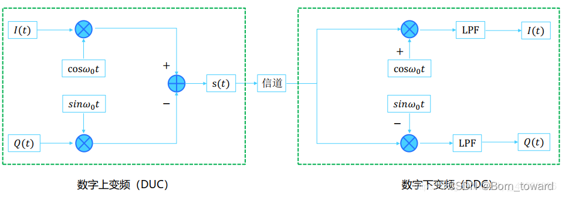
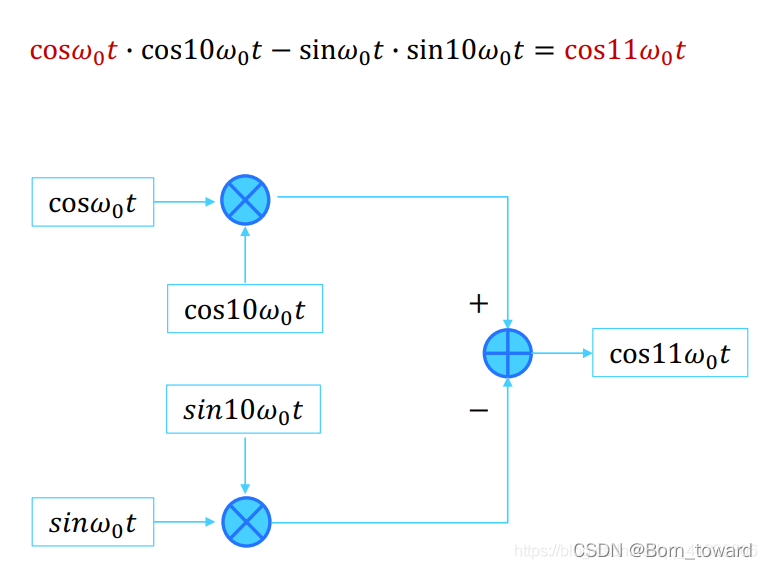
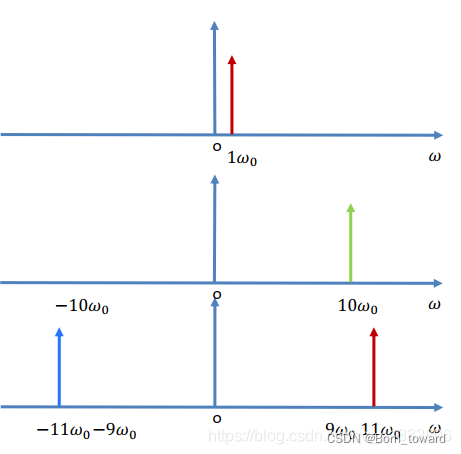
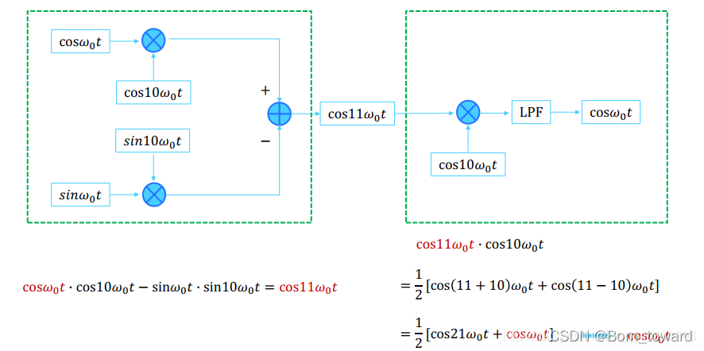
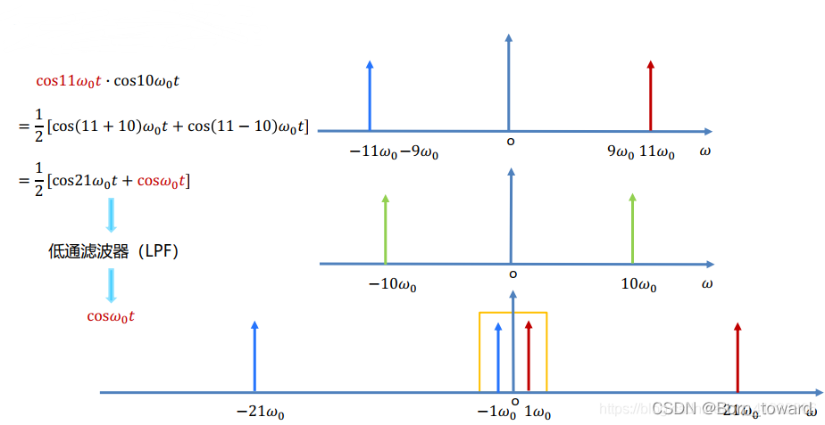
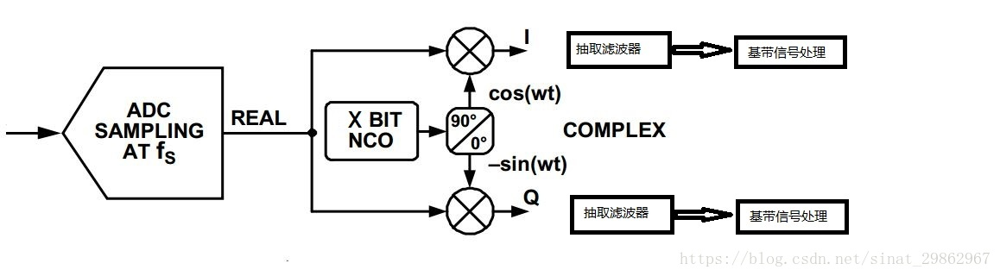
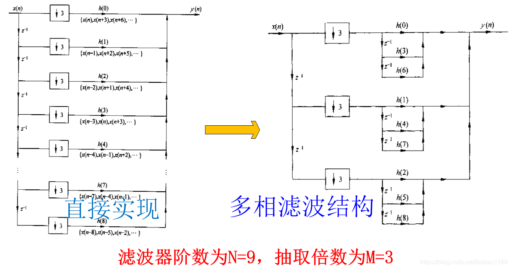
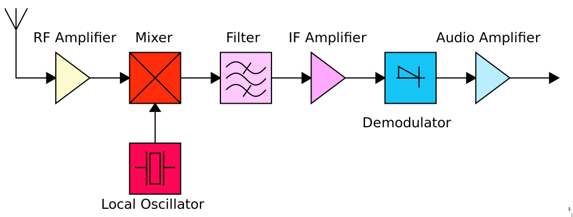

## DUC and DDC



## 数字上变频 digital up conversion （DUC）





```matlab
%% 清空一切
clc;clear all;close all;

%% 信号参数设置
FS = 1500;
TS = 1/FS;
N  = 4096;
f  = 300;
t  = (0:N-1)*TS;


N_X2  = N*2;
FS_2  = FS/2;
FS_X2 = FS*2;
t_x2 = (0:N_X2-1)*TS;

SIG_AMP = 100;
COEF_WIDTH = 16;

%%
SIM_SEL = 2;

%% 生成IQ信号
sig_i = cos(2*pi*f*t);
sig_q = sin(2*pi*f*t);
figure;
subplot(211);
freq = (0:N-1)/N*FS;
plot(freq,20*log10(abs(fft(sig_i + 1i*sig_q))));
title('IQ信号频谱图(ffthift之前)');
subplot(212);
freq = (0:N-1)/N*FS-FS/2;
plot(freq,20*log10(abs(fftshift(fft(sig_i + 1i*sig_q)))));
title('IQ信号频谱图(ffthift之后)');

%% 设计半带滤波器(一半系数为0,便于节省硬件资源)
load filter_coef.mat;  
h = floor(2^(COEF_WIDTH-1)*0.9*filter_coef);
% fvtool(h);

% ===============================================================
% 
% ===============================================================
if SIM_SEL == 2
    % part_1 2倍插值
    sig_i_m2 = zeros(1,N_X2);
    sig_q_m2 = zeros(1,N_X2);
    sig_i_m2(1,1:2:end) = sig_i;
    sig_q_m2(1,1:2:end) = sig_q;
    figure;
    subplot(211);
    freq = (0:N_X2-1)/N_X2*FS_X2;
    plot(freq,20*log10(abs(fft(sig_i_m2+1i*sig_q_m2))));
    title('插值 后的频谱图(ffthift之前)');
    subplot(212);
    freq = (0:N_X2-1)/N_X2*FS_X2-FS;
    plot(freq,20*log10(abs(fftshift(fft(sig_i_m2+1i*sig_q_m2)))));
    title('插值 后的频谱图(ffthift之后)');
  
    % part_2 低通滤波  
    sig_i_lpf = conv(h,sig_i_m2);
    sig_i_lpf = sig_i_lpf(1,1:N_X2);
    sig_q_lpf = conv(h,sig_q_m2);
    sig_q_lpf = sig_q_lpf(1,1:N_X2);
    figure;
    subplot(211);
    freq = (0:N_X2-1)/N_X2*FS_X2;
    plot(freq,20*log10(abs(fft(sig_i_lpf+1i*sig_q_lpf))));
    title('插值-滤波 后的频谱图(ffthift之前)');
    subplot(212);
    freq = (0:N_X2-1)/N_X2*FS_X2-FS;
    plot(freq,20*log10(abs(fftshift(fft(sig_i_lpf+1i*sig_q_lpf)))));
    title('插值-滤波 后的频谱图(ffthift之前)');
  
     % part_3 使用0.25*FS_X2进行混频
    NCO_i     = cos(2*pi*FS_2*t_x2);
    NCO_q     = -sin(2*pi*FS_2*t_x2);
    sig_i_mif = sig_i_lpf.*NCO_i;
    sig_q_mif = sig_q_lpf.*NCO_q;
 
    figure;
    subplot(211);
    freq = (0:N_X2-1)/N_X2*FS_X2;
    plot(freq,20*log10(abs(fft(sig_i_mif+1i*sig_q_mif))));
    title('混频 后的频谱图(ffthift之前)');
    subplot(212);
    freq = (0:N_X2-1)/N_X2*FS_X2-FS;
    plot(freq,20*log10(abs(fftshift(fft(sig_i_mif+1i*sig_q_mif)))));
    title('混频 后的频谱图(ffthift之后)');
end

% 原文链接：https://blog.csdn.net/linbian1168/article/details/105420849
```


## 数字下变频 direct digital controller （DDC）

#### 简单示例





基本原理




Digital Down Converters ，DDC的主要目的是经过数字混频将AD采集的中频（IF）数字信号频谱下变频到基带信号，然后完成抽取滤波恢复原始信号，数字下变频时采用数字信号技术来实现下变频的，它包含数字滤波、正交变换、采样、抽取等算法。主要的电路模块由四部分组成：数字控制振荡器（NCO） 、混频器（mixer） 、采样抽取、滤波器（filter）。

DDC是将中频信号与数字控制振荡器产生的载波信号进行混频 ,再经过低通滤波器得到基带信号 ,实现了下变频功能.

数字下变频的基本原理同模拟下变频一样, 就是把输入信号与本地振荡信号相乘, 将射频信号通过混频, 搬移到中频段, 再进行 ADC采样。
DDC的核心是将中频 A /D 采样信号与 DDC中的数字控制振荡器 (NCO )产生的本地数字中频载波信号进行混频 ,将中频信号下变频到基带。


混频数学公式：

$ cosαcosβ= \frac{cos（α+β)+cos（α-β）}{2} $


#### FIR并行滤波

在下图中，由于滤波器的位置已经放在抽取之后了（这意味着无法获得因为抽取而导致的数据率下降的优势），而直接实现结构和多相滤波结构滤波器阶数并没有发生变化，因此两种设计方式的资源消耗量是一样的。
不过，考虑到多相滤波结构能够将一个大的滤波器分解成多个小的滤波器，比较适合模块复用。



`一般多相滤波用在多速率转换的场合，能够减小数据率。对于下采样而言，一般是先抽取再滤波；对于上采样而言，一般是先滤波后插值。`


# 超外差




 Red parts are those that handle the incoming radio frequency (RF) signal; 

purple are parts that operate at the intermediate frequency (IF), while

blue parts operate at the modulation (audio) frequency. The dotted line indicates that the local oscillator and RF filter must be tuned in tandem.
