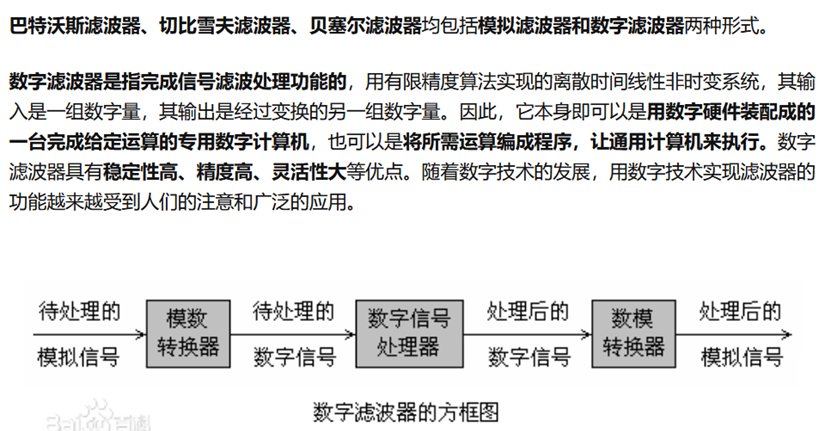
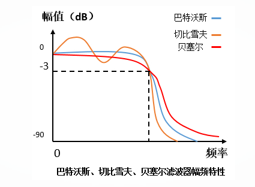
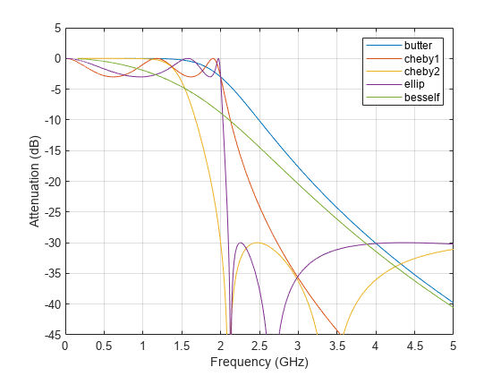
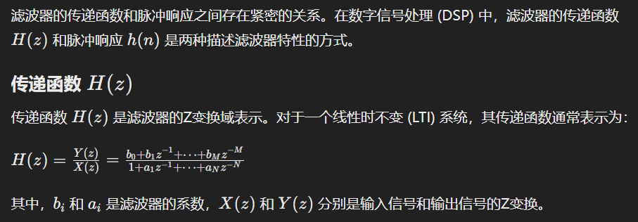
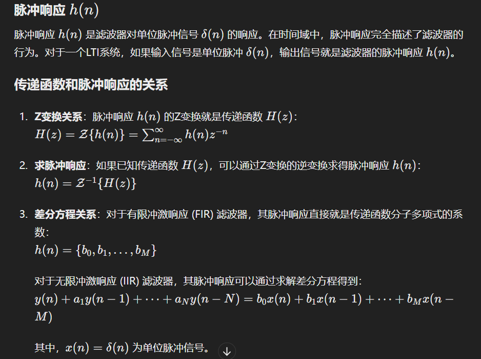
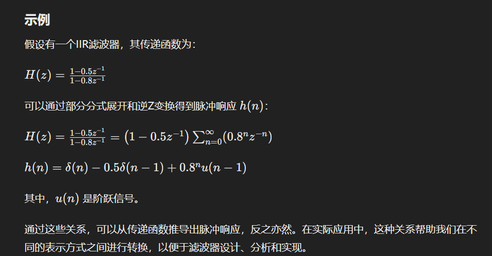
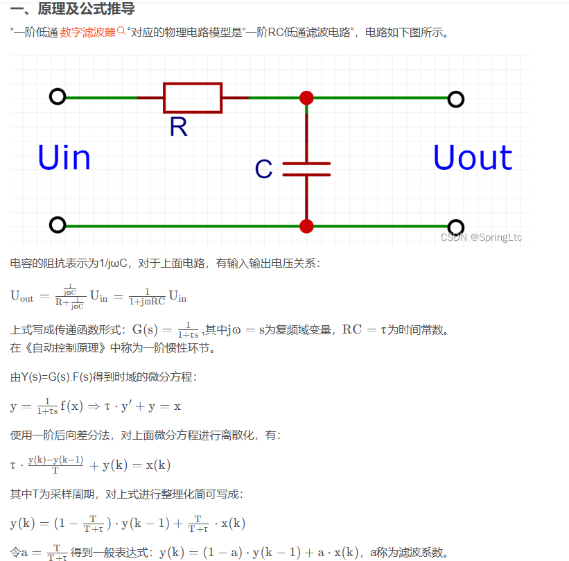

常用的模拟滤波器

* 巴特沃斯滤波器--具有单调下降的幅频特性，在通带内没有波纹特性
* 切比雪夫滤波器--在通带或者阻带具有等波纹特性
* 椭圆滤波器--选择性最好，但是通带内均呈现等波纹特性
* 贝塞尔滤波器--在通带内具有线性相位特性，不会发生相位畸变



**巴特沃斯滤波器**的特点是通频带内的频率响应曲线最大限度平坦，没有起伏，而在阻频带则逐渐下降为零。在振幅的对数对角频率的波特图上,从某一边界角频率开始,振幅随着角频率的增加而逐步减少,趋向负无穷大。巴特沃斯滤波器的频率特性曲线，无论在通带内还是阻带内都是频率的单调函数。因此，当通带的边界处满足指标要求时，通带内肯定会有裕量。所以，更有效的设计方法应该是将精确度均匀的分布在整个通带或阻带内，或者同时分布在两者之内。这样就可用较低阶数的系统满足要求。这可通过选择具有等波纹特性的逼近函数来达到。

**贝赛尔(Bessel)滤波器**是具有最大平坦的群延迟（线性相位响应）的线性过滤器。贝赛尔滤波器常用在音频天桥系统中。模拟贝赛尔滤波器描绘为几乎横跨整个通频带的恒定的群延迟，因而在通频带上保持了被过滤的信号波形。贝塞尔(Bessel)滤波器具有最平坦的幅度和相位响应。带通（通常为用户关注区域）的相位响应近乎呈线性。Bessel滤波器可用于减少所有IIR滤波器固有的非线性相位失真。

**切比雪夫滤波器**是在通带或阻带上频率响应幅度等波纹波动的滤波器，振幅特性在通带内是等波纹。在阻带内是单调的称为切比雪夫I型滤波器；振幅特性在通带内是单调的，在阻带内是等波纹的称为切比雪夫II型滤波器。采用何种形式的切比雪夫滤波器取决于实际用途。




巴特沃斯滤波器通带最平坦，阻带下降慢。

切比雪夫滤波器通带等纹波，阻带下降较快。

贝塞尔滤波器通带等纹波，阻带下降慢。也就是说幅频特性的选频特性最差。但是，贝塞尔滤波器具有最佳的线性相位特性。

此外，还有椭圆滤波器，椭圆滤波器在通带等纹波（阻带平坦或等纹波），阻带下降最快。


[几种滤波器的比较（巴特沃斯、切比雪夫、贝塞尔滤波器） - Kroner - 博客园 (cnblogs.com)](https://www.cnblogs.com/Kroner/p/6760010.html)





巴特沃斯和切比雪夫 II 型滤波器具有平坦的通带和宽过渡带。

切比雪夫 I 型和椭圆滤波器转降更快，但有通带波纹。

切比雪夫 II 型设计函数的频率输入设置阻带的起点，而不是通带的终点。

贝塞尔滤波器沿通带具有大致恒定的群延迟

[巴特沃斯滤波器设计 - MATLAB butter - MathWorks 中国](https://ww2.mathworks.cn/help/signal/ref/butter.html)


## [滤波器系数、单位脉冲响应、频率响](https://www.cnblogs.com/keepthinking-go/p/13984818.html)


**单位脉冲响应：** 单位脉冲和滤波器系数的卷积。对于FIR滤波器来说，单位脉冲响应就是滤波器系数。对于IIR滤波器，应该是需要用matlab中的filter函数，得到单位脉冲响应。

**频率响应**：幅度和相位随频率的变化关系。具体地，幅度随频率的变化关系称为幅频响应；相位随频率的变化关系称为相频相应。单位脉冲响应经过FFT变换后会得到频率和对应的h(z)，h(z)是一个复数值，其中绝对值为幅度，角度为相位。










[“一阶数字低通滤波器”原理推导（含仿真和代码实现）_csdn 数字一阶低通滤波器-CSDN博客](https://blog.csdn.net/weixin_42887190/article/details/125749509)

[巴特沃斯、切比雪夫、椭圆、贝塞尔滤波器------（1）知识概要_切比雪夫滤波器-CSDN博客](https://blog.csdn.net/weixin_44710960/article/details/115406494)

## decimate

y= decimate(x,r)reduces the sample rate of input signal x by a factor of r. The decimated signal y is shortened by a factorof r so that length(y) = ceil(length(x)/r).By default, decimateuses a lowpass Chebyshev Type I infinite impulse response (IIR) filter of order 8

```
= decimate(x,r,n) Chebyshev filter of order n
y= decimate(x,r,"fir")a finite impulse response(FIR) filter
y= decimate(x,r,n,"fir")FIR filter of order n
```
