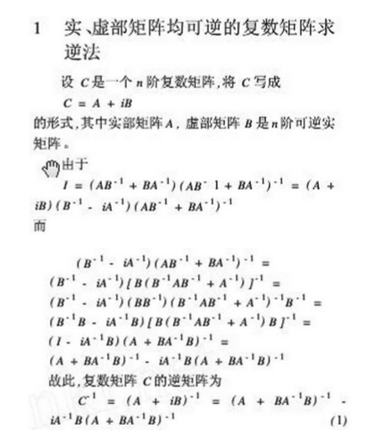
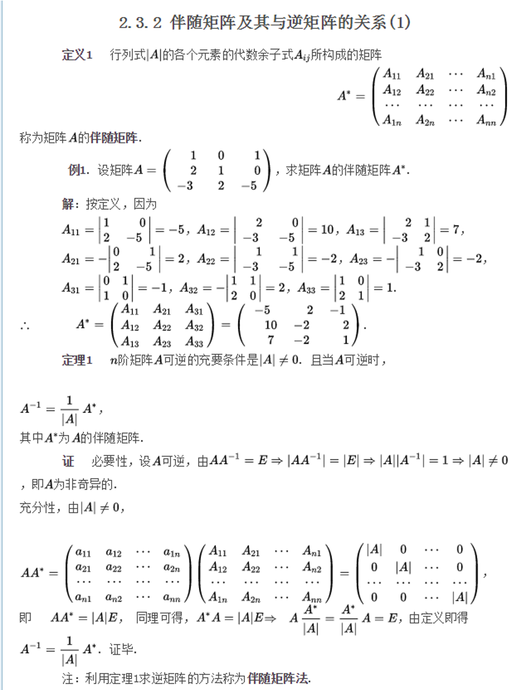

1-4阶矩阵求逆代码

```cpp
#include"CommonFunc.h"  
doubleDeterminant_Matrix123(double **p, int n);
doubleCofactor_Matrix(double **p, int m, int n, int k);
double**InverseMatix( double **IN_Matrix,int row);
 
double**InverseMatix( double **IN_Matrix,int row)
{
int i,j;
doubledeterm=0;        //定义矩阵的行列式
double** InverseMatrix=new double *[row];
for (j=0; j<row;j++)                                //求逆矩阵
InverseMatrix[j]= new double [row];
//求整个矩阵的行列式
if (3 >= row)       determ=Determinant_Matrix123(IN_Matrix,row);
else if (4 == row)   
{
for (int i =0; i < row;i++)//四阶行列式，按照列展开，转化成三阶行列式进行求解
determ += IN_Matrix[0][i] * Cofactor_Matrix( IN_Matrix, 0, i, row);
}
 //求逆矩阵    
if (determ != 0)
{
for (i=0;i<row; i++) 
{
for (j=0; j<row; j++) 
InverseMatrix[j][i]= Cofactor_Matrix(IN_Matrix,i,j,row)/determ;
}
}
return InverseMatrix;
}
 
 
//------------功能：求矩阵 n X n 的行列式,矩阵行数 n-----------------------//
doubleDeterminant_Matrix123(double **p, int n)
{
int i,j,m;         //i–row;j–column
int lop=0;
double result=0;
double mid=1;
   
if (n!=1)
{
lop=(n==2)?1:n;     //控制求和循环次数，若为2阶，则循环1次，否则为n次
 
for(m=0;m<lop;m++)
{
mid=1;
j=m;//顺序求和
for(i=0;i<n;i++)
{
mid *= p[i][j%n];
j++;
}
result+=mid;
}
 
for(m=0;m<lop;m++)
{              
mid=1;
j=n-1-m+n;//逆序相减
for(i=0; i<n; i++)
{
mid=mid * p[i][j%n];
j--;
}
result-=mid;
}
}
else result=**p;
return(result);
}
 
 
//--求k×k矩阵中元素A(m,n)的代数余子式,返回值： k×k矩阵中元素A(mn)的代数余子式-//
doubleCofactor_Matrix(double **p, int m, int n, int k)
{
    int i,j; 
int ii,jj;
    double quo=0;
double result=0;
//初始化
double **CofactorMatrix = new double * [k-1];
for(i=0;i<k;i++)
CofactorMatrix[i]= new double[k-1];
ii=0;
for(i=0;i<k;i++)
{
 if (i!=m)
 {
 jj=0;
 for(j=0;j<k;j++)
 { 
 if (j!=n)
 {
 CofactorMatrix[ii][jj]=p[i][j];
// cout<<CofactorMatrix[ii][jj]<<"  ";
 jj++;
 }
 }
 ii++;
//  cout<<endl;
 }
}
    quo = (m + n) %2==0 ? 1.0:-1.0;
    result = quo *Determinant_Matrix123(CofactorMatrix,k-1);
    return(result);
}
```
