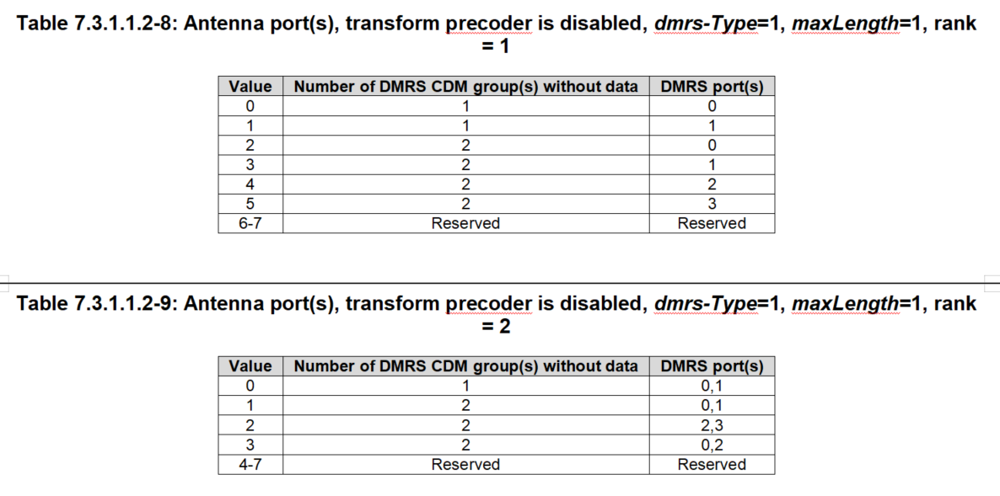

## CDM Group 

Number of CDM Groups: Specifies the number of DM-RS CDM groups without data parameter. Valid values are 1,2,3 – depending on the number of transmit antenna ports and DMRS Config Type.

The following configuration parameters specific to the DMRS portion of the Downlink Signal.

DMRS Power Mode: Specifies whether the configured DMRS Power is honored or calculated from CDM Groups for reference signal generation.

DMRS Power: This parameter is used to set the DMRS power in dB relative to the PDSCH data power. The recommended DMRS Power depends on the chosen Number of DM-RS CDM Groups without data:

| Number of CDM Groups | DMRS Config Type 1 | DMRS Config Type 2 |
| -------------------- | ------------------ | ------------------ |
| 1                    | 0 dB               | 0 dB               |
| 2                    | 3 dB               | 3 dB               |
| 3                    | -                  | 4.77 dB            |

[https://www.ni.com/docs/zh-CN/bundle/rfmx-waveform-creator/page/pdsch-configuration.html](https://www.ni.com/docs/zh-CN/bundle/rfmx-waveform-creator/page/pdsch-configuration.html)
