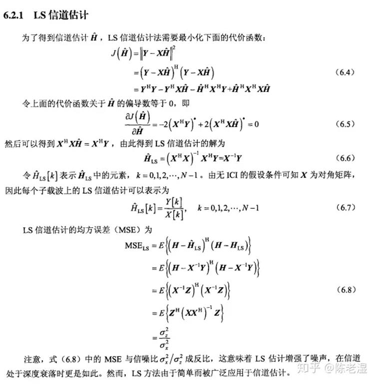

## Fadding


## frequency offset


CP based frequency offset

[fft - Carrier frequency offset (CFO) estimation using cyclic prefix - Signal Processing Stack Exchange](https://dsp.stackexchange.com/questions/13956/carrier-frequency-offset-cfo-estimation-using-cyclic-prefix)


## Channel Est


信道均衡算法

一般线性检测信道均衡方法有两种

* 破零均衡算法
* 最小均方误差算法


以下MIMO信道均衡算法都基于以下假设：

1. 天线间隔至少半波长；
2. Rayleigh Fading channel；
3. 在接收端有完美的信道估计来进行信道均衡；


·  2 X 3 MIMO系统的BER性能优于 2 X 2 MIMO系统；

·  MMSE算法误码性能优于ZF，因为MMSE考虑了噪声的影响；

·  在高信噪比条件下，ZF和MMSE性能趋近于一致，是因为噪声影响随信噪比的增加而降低


### LS  CE




### MMSE信道估计


MMSE 信道估计算法有效地抑制了噪声干扰，性能优于 LS 信道估计算法，但需求解矩阵的逆，复杂度较高，硬件难以实现。

[https://zhuanlan.zhihu.com/p/378335622](https://zhuanlan.zhihu.com/p/378335622)


### MMSE and Powe Delay


## Smooth Channel Estimation


[https://www.youtube.com/watch?v=6h2I5bF6LVc&amp;ab_channel=SundeepRangan](https://www.youtube.com/watch?v=6h2I5bF6LVc&ab_channel=SundeepRangan)

**DFT Smooth**

[Communication Technology | ShareTechnote](https://www.sharetechnote.com/html/Communication_ChannelEstimation.html)

When you apply the post processing
algorithm, the algorithm needs to be applied to each of these groups
separately. So for simplicity, I rearranged the array of H matrix into multiple
of independent arrays (4 arrays in this case) as shown below.


For each of these arrays, I will do
the same processing as illustrated below. (Each chipset maker may apply apply a
little bit different method, but overall idea would be similar). In the method
illustrated below, the data (the array of channel coefficient in each frequency
points) is applied with IFFT, meaning the dta is converted into a time domain
resulting in an array of time domain data labeled as (2). Actually this is a
impulse response of the specific channel path. And then we apply a specific filtering
(or windowing) to this time domain data. In this example, replace the data from
a certain point with zero and creating the result labeled as (3). You may apply
a more sophisticated filter or windowing instead of this kind of simple
zeroing. And then, by converting the filtered channel impulse data back to
frequency domain, I get the filtered channel coefficient and I use that value
as 'Estimated channel coefficient' in the processing of decoding other recieved
signal (i.e, decoding non-reference data).


By doing the same process to all the
four array, you get the four arrays of 'Estimated Channel Coefficient Array'.
From these four arrays, you can reconstructed the array of estimated channel
matrix as follows.


ChannelEstimation in Matlab for LTE

[Channel Estimation - MATLAB &amp; Simulink
(mathworks.com)](https://www.mathworks.com/help/lte/ug/channel-estimation.html)


## interp


对于导频位置处的CSI 的估计常采用LS 或LMMSE 算法进行，然后对导频处

的信道信息进行相应处理得到数据位置处的信道状态信息。其中处理方法主要分

为以下三大类：

（1）基于多项式的插值方法，如一阶线性插值、高斯插值、三次样条插值等，此方法的实现过程相对简单，但缺点在于其适用的场景有限，仅能在较理想的信道情况下有较好的性能。而且，在三次样条插值的基础之上再增加多项式的阶数已经不再能带来性能的提升。

（2）基于DFT 的信道滤波方法，如时域滤波、变换域滤波、加窗的变换域滤波等，此方法的原理是通过滤波降低信道噪声对传输的影响，其缺点是有一个前提条件，信道的延时必须是信号采样周期的整数倍，如不满足此条件将导致频谱能量的泄露，进而产生混叠误差。而且，加窗处理在提高估计性能的同时也会牺牲掉一定的带宽。

（3）基于离散余弦变换（Discrete CosineTransform , DCT）的插值方法，这是一种以实数为变换核的运算，因为实数运算比复数运算简单，所以该方法与以复数为变换核的DFT 运算相比计算复杂度降低。并且，DCT 插值方法能量更加集中，能有效地抑制DFT 方法中的频谱能量泄露问题。


DFT插值


## Power delay profile (PDP)


[深入理解功耗延时积(PDP), 能量延时积(EDP) - 知乎 (zhihu.com)](https://zhuanlan.zhihu.com/p/561629440)

[Power Delay Profile - GaussianWaves](https://www.gaussianwaves.com/2014/07/power-delay-profile/)

## 时域插值和降噪


 时域降噪算法

参考文献： LTE下行系统信道估计与均衡技术的研究与实现-陈金鹏.pdf


多普勒频移和冲激响应

仿真条件如下，符号数为100，子载波数为128，采样频率2MHz，调制方式为QPSK。下图分别为归一化多普勒频率0.01 和0.2 时信道冲激响应在一个OFDM符号内的变化情况。


QAM 判決

16/64QAM


```cpp
int QAM16_Bit[16][4] = {{ 0, 0, 0, 0 },{ 0, 0, 0, 1 },{ 0, 0, 1, 0 },{ 0, 0, 1, 1 },{ 0, 1, 0, 0 },{ 0, 1, 0, 1 },{ 0, 1, 1, 0 },{ 0, 1, 1, 1 },{ 1, 0, 0, 0 },{ 1, 0, 0, 1 },{ 1, 0, 1, 0 },{ 1, 0, 1, 1 },{ 1, 1, 0, 0 },{ 1, 1, 0, 1 },{ 1, 1, 1, 0 },{ 1, 1, 1, 1 }};
int QAM64_Map[64][2]={3,3;  3,1; 1,3;  1,1;  3,5; 3,7;  1,5;  1,7; 5,3;  5,1;  7,3; 7,1;  5,5;  5,7; 7,5;  7,7;3,-3; 3,-1; 1,-3;1,-1; 3,-5; 3,-7; 1,-5; 1,-7; 5,-3; 5,-1; 7,-3; 7,-1; 5,-5; 5,-7; 7,-5; 7,-7;-3,3; -3,1; -1,3;-1,1;-3,5; -3,7; -1,5; -1,7; -5,3; -5,1; -7,3; -7,1; -5,5; -5,7; -7,5; -7,7;-3,-3; -3,-1; -1,-3;-1,-1;-3,-5; -3,-7; -1,-5; -1,-7; -5,-3; -5,-1; -7,-3; -7,-1; -5,-5; -5,-7;-7,-5; -7,-7;}
```


## 空间复用预编码（Precoding）


参考资料：

[http://www.doc88.com/p-0671498324214.html](http://www.doc88.com/p-0671498324214.html)

[http://www.doc88.com/p-7975488041933.html](http://www.doc88.com/p-7975488041933.html)
