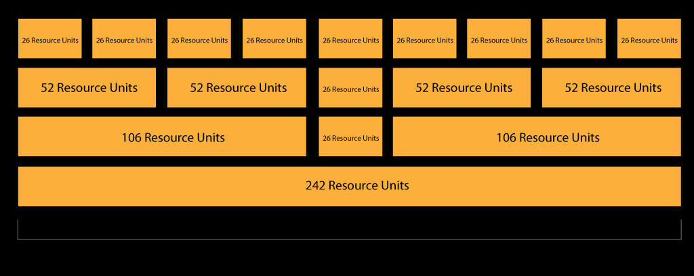
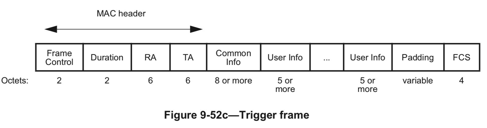

## introduction

[802.11有多个子标准，如802.11a/b/g/n/ac/ax/be等，每个子标准使用不同的物理层技术，如FHSS、DSSS、OFDM和MIMO等](https://www.bing.com/ck/a?!&&p=ab90d26e2a2ba9c7JmltdHM9MTcxODE1MDQwMCZpZ3VpZD0xNmI1OGM2OS03ZjFjLTY5OWItMWE2OC05ODQ0N2VjZTY4YzYmaW5zaWQ9NTc1NQ&ptn=3&ver=2&hsh=3&fclid=16b58c69-7f1c-699b-1a68-98447ece68c6&psq=802.11%e6%9c%89%e5%93%aa%e4%ba%9b%e5%8d%8f%e8%ae%ae&u=a1aHR0cHM6Ly9zdXBwb3J0Lmh1YXdlaS5jb20vZW50ZXJwcmlzZS96aC9kb2MvRURPQzEwMDAxMTMzMTQvYmQ5NTU3YWQ&ntb=1)[3](https://www.bing.com/ck/a?!&&p=384c20c70d65e8abJmltdHM9MTcxODE1MDQwMCZpZ3VpZD0xNmI1OGM2OS03ZjFjLTY5OWItMWE2OC05ODQ0N2VjZTY4YzYmaW5zaWQ9NTc1Ng&ptn=3&ver=2&hsh=3&fclid=16b58c69-7f1c-699b-1a68-98447ece68c6&psq=802.11%e6%9c%89%e5%93%aa%e4%ba%9b%e5%8d%8f%e8%ae%ae&u=a1aHR0cHM6Ly9zdXBwb3J0Lmh1YXdlaS5jb20vZW50ZXJwcmlzZS96aC9kb2MvRURPQzEwMDAxMTMzMTQvYmQ5NTU3YWQ&ntb=1)[2](https://www.bing.com/ck/a?!&&p=55db694531864049JmltdHM9MTcxODE1MDQwMCZpZ3VpZD0xNmI1OGM2OS03ZjFjLTY5OWItMWE2OC05ODQ0N2VjZTY4YzYmaW5zaWQ9NTc1Nw&ptn=3&ver=2&hsh=3&fclid=16b58c69-7f1c-699b-1a68-98447ece68c6&psq=802.11%e6%9c%89%e5%93%aa%e4%ba%9b%e5%8d%8f%e8%ae%ae&u=a1aHR0cHM6Ly9zdXBwb3J0Lmh1YXdlaS5jb20vZW50ZXJwcmlzZS96aC9kb2MvRURPQzExMDAwMzM5NzYvMzU4MjUyMTQ&ntb=1)。[802.11的演进带来了数据传输速率的提升](https://www.bing.com/ck/a?!&&p=10b74497828f6804JmltdHM9MTcxODE1MDQwMCZpZ3VpZD0xNmI1OGM2OS03ZjFjLTY5OWItMWE2OC05ODQ0N2VjZTY4YzYmaW5zaWQ9NTc1OA&ptn=3&ver=2&hsh=3&fclid=16b58c69-7f1c-699b-1a68-98447ece68c6&psq=802.11%e6%9c%89%e5%93%aa%e4%ba%9b%e5%8d%8f%e8%ae%ae&u=a1aHR0cHM6Ly9zdXBwb3J0Lmh1YXdlaS5jb20vZW50ZXJwcmlzZS96aC9kb2MvRURPQzEwMDAxMTMzMTQvYmQ5NTU3YWQ&ntb=1)[3](https://www.bing.com/ck/a?!&&p=6a44c1decd722827JmltdHM9MTcxODE1MDQwMCZpZ3VpZD0xNmI1OGM2OS03ZjFjLTY5OWItMWE2OC05ODQ0N2VjZTY4YzYmaW5zaWQ9NTc1OQ&ptn=3&ver=2&hsh=3&fclid=16b58c69-7f1c-699b-1a68-98447ece68c6&psq=802.11%e6%9c%89%e5%93%aa%e4%ba%9b%e5%8d%8f%e8%ae%ae&u=a1aHR0cHM6Ly9zdXBwb3J0Lmh1YXdlaS5jb20vZW50ZXJwcmlzZS96aC9kb2MvRURPQzEwMDAxMTMzMTQvYmQ5NTU3YWQ&ntb=1)。

### 80211 a frame format


### 80211 n


### mix


### 80211 ac

<p align="center">

</p>
### 80211 ax


[Wi-Fi 6 (802.11ax) Design Tips: How to Overcome the Biggest RF Challenges - Qorvo](https://www.qorvo.com/design-hub/blog/designing-for-80211ax-wifi-common-challenges-and-tips-to-overcome-them)


[What is 802.11ax (Wi-Fi 6)? | Extreme Networks](https://www.extremenetworks.com/resources/faq/what-is-80211ax)

[Introduction to 802.11ax High-Efficiency Wireless - NI](https://www.ni.com/en/solutions/semiconductor/wireless-connectivity-test/introduction-to-802-11ax-high-efficiency-wireless.html)


SU and MU


Let us understand 802.11ax frame. Its structure is similar to 802.11n and 802.11ac. It consists of preamble, header and data. The figure-1 depicts both single user and multi user frame structures. Let us understand various WLAN 802.11ax frame fields.

➨It starts with the preamble. The first part of the preamble consists of legacy (non-HE) training fields, and second part consists of HE preamble fields. The legacy portion of the preamble contains L-STF (Legacy i.e. non-HT short training field), L-LTF (legacy long training field) and L-SIG (legacy signal field). This legacy part is decoded by legacy devices. It is included for backward compatibility and coexistence with the legacy wifi devices. RL-SIG field is used as repeated legacy (non-HT) Signal field. The HE preamble can be decoded by 802.11ax devices only.

➨HE preamble contains HE-STF and HE-LTF patterns.

➨The HE header usually consists of HE SIG-A and HE SIG-B fields. HE SIG-A contains information about packet to follow both in downlink and uplink, MCS rate, modulation, BSS color, BW, spatial stream, remaining time in transmit opportunity etc. HE SIG-B is included only for multi-user packets.

➨HE-Data field carries PSDU(s).

➨Max. packet extension modes of duration either 8 µs or 16 µs are used at the end of the 802.11ax frame.

### all used structure


### Matlab

[
    802.11ax (Wi-Fi 6) - MATLAB&amp; Simulink (mathworks.com)](https://www.mathworks.com/help/wlan/802.11ax-reception.html?s_tid=CRUX_lftnav)


### OFDMA

802.11ax standard further assigns specific sets of subcarriers to individual users. That is, it divides the existing 802.11 channels (20, 40, 80 and 160 MHz wide) into smaller subchannels with a predefined number of subcarriers. The 802.11ax standard calls the smallest subchannel a resource unit (RU), with a minimum size of 26 subcarriers.

一个RU 最小是26 tone，20MHz 分成9 RU， 9*26=234 < 256；


***Figure 7*** illustrates how an 802.11ax system may multiplex the channel using different RU sizes. Note that the smallest division of the channel accommodates up to nine users for every 20 MHz of bandwidth.^2^

## subcarrier Size

With OFDMA in 802.11ax, the size of the subcarriers has been divided by 4. Going from 312.5KHz wide with OFDM to 78.125KHz wide.

The symbol duration has been increased by 4 times in the meantime. Going from 3.2 microseconds with OFDM to 12.8 microseconds.


### Advantages of having more subcarriers


1. Allow OFDMA to extend to small sub-channels. Each sub-channel requires at least one (usually two) pilot subcarriers, and with a 2 MHz minimum sub-channel size, a smaller subcarrier spacing loses a much smaller percentage of the overall bandwidth to pilots.
2. The number of guard and null subcarriers across a channel can be reduced as a percentage of the number of usable subcarriers, again increasing the effective data rate in a given channel. The figures above show a ~10% increase in usable subcarriers compared to 802.11ac, after allowing for the 4x factor. Example: OFDM: 64 subcarriers, 12 GuardNull subcarriers = 18.75%, OFDMA: 256 subcarriers. 22 GuardNull subcarriers = 8.5%.
3. The longer OFDM symbol allows for an increase in the cyclic prefix length without sacrificing spectral efficiency, which in turn enables increased immunity to long delay spreads, especially in outdoor conditions. The cyclic prefix can be reduced to a smaller percentage of the symbol time, increasing spectral efficiency even while more robust to multipath conditions. And it reduces the jitter-sensitivity of uplink multi-user modes.

The smallest sub-channel is composed of 26 subcarriers. Type of subcarriers:

* Data subcarriers
* Pilot subcarriers
* DC subcarriers
* Guard subcarriers
* Null subcarriers

  **Pilot**

A 26-tone RU consists of 24 **data subcarriers** and 2  **pilot subcarriers** .

A 52-tone RU consists of 48 data subcarriers and 4 pilot subcarriers.

A 106-tone RU consists of 102 data subcarriers and 4 pilot subcarriers.

A 242-tone RU consists of 234 data subcarriers and 8 pilot subcarriers.

A 484-tone RU consists of 468 data subcarriers and 16 pilot subcarriers.

A 996-tone RU consists of 980 data subcarriers and 16 pilot subcarriers.

**DC (Direct Current)** subcarriers are used for the subcarriers located in the center of the channel. Depending on the channel width and the number of tone used, the number of DC subcarriers can vary (Ex: 3 or 7 for a 20MHz wide channel). Most of the time it will be 7 for the 20MHz and 80MHz wide channels and 5 for the 40MHz wide channels.

A 20MHz wide channels has 11 guard interval: the first 6 and the last 5 of the channel.


[CTS 162: 802.11ax OFDMA Subcarriers (cleartosend.net)](https://www.cleartosend.net/802-11ax-ofdma-subcarriers/)

## GI

### Guard Interval (GI)

Guard Interval (GI) 是指在两个连续符号传输之间插入的一段空闲时间。它的目的是为了防止来自多径效应的干扰，提高信号的传输可靠性。

在 IEEE 802.11 标准中，定义了以下几种 GI 设定：

* 800 ns GI：这是默认的 GI 设定，也是 802.11 a/b/g 标准中唯一支持的 GI 设定。它提供了良好的抗多径效应能力，但会降低数据传输速率。
* 400 ns GI：这是 802.11n 标准中引入的可选 GI 设定。它可以提高数据传输速率，但会降低抗多径效应能力。
* 800 ns GI：这是 802.11ac 标准中默认的 GI 设定。它与 802.11a/b/g 标准中的 800 ns GI 相同。
* 400 ns GI：这是 802.11ac 标准中可选的 GI 设定。它与 802.11n 标准中的 400 ns GI 相同。
* 1600 ns GI：这是 802.11ax 标准中引入的可选 GI 设定。它提供了最强的抗多径效应能力，但也导致了最低的数据传输速率。
* 3200 ns GI：这是 802.11ax 标准中引入的可选 GI 设定。它提供了次强的抗多径效应能力，但数据传输速率高于 1600 ns GI。
* 

在 IEEE 802.11ax 标准中，GI（Guard Interval，保护间隔）的定义和相关内容主要在以下章节中有所描述：

1. 章节 28: High Efficiency (HE) PHY Specification:

* 这是 802.11ax 标准中定义高效物理层（HE PHY）的部分。在这一章节中，对保护间隔（GI）的长度、使用条件、以及对性能的影响有详细的描述。

2. 章节 29: MAC and PHY Mechanisms for HE Operation:

* 这一章节主要介绍了用于高效操作的 MAC 和 PHY 机制。包括 GI 在内的多种技术细节都有覆盖。

In WLAN systems, particularly those based on the IEEE 802.11 standards, the Guard Interval (GI) plays a crucial role in mitigating inter-symbol interference caused by multipath propagation. The GI is applied in both OFDM symbols and various training fields, including the High-Efficiency Long Training Field (HE-LTF) used in 802.11ax (Wi-Fi 6). Let's explore the differences between the GI in standard OFDM symbols and the HE-LTF.

Key Characteristics of HE-LTF:

Guard Interval Durations:

* Standard GI for HE-LTF: 0.8 μs
* Extended GI for HE-LTF: 1.6 μs

Guard Interval (GI) OFDM symbol:

* Standard GI: 0.8 μs
* Short GI: 0.4 μs

### OFDM Symbol Duration

The OFDM symbol duration is determined by the inverse of the subcarrier spacing and the guard interval.

1. Useful Symbol Time (T_u):

* For 802.11a/g/n/ac, T_u = 1 / Subcarrier Spacing = 1 / 312.5 kHz = 3.2 μs.

2. Guard Interval (GI):

* Standard GI: 0.8 μs
* Short GI: 0.4 μs

3. Total Symbol Duration (T_s):

* With standard GI: T_s = T_u + GI = 3.2 μs + 0.8 μs = 4.0 μs.
* With short GI: T_s = T_u + GI = 3.2 μs + 0.4 μs = 3.6 μs.

一个20 MHz的信道，在802.11n/ac有64个子载波组成，每个OFDM子载波是312.5KHz。其中有52个子载波用于承载数据（data subcarriers），4个子载波用作导频（pilot subcarriers），八个子载波用作保护频带（unused subcarriers）。OFDM子载波可以称为OFDM subcarriers或者OFDM tones。


802.11ax 单个子载波带宽（或者说子载波间隔）从312.5KHz细化到78.125KHz, 从而需要更长的OFDM Symbol时间（12.8μs），这是传统OFDM Symbol的四倍时间（传统为3.2μs）。如上图所示，在子载波带宽变成78.125KHz间隔后，一个20MHz信道一共可以包含256个子载波.

在802.11ax的OFDMA中，一共有三种类型的子载波

* **数据子载波** ：这些子载波用于承载数据，其传输速率是在802.11ac的基础上（即在802.11ac的MCS上），引入了两个新的MCS（Modulation and Coding Schemes），包含1024-QAM这种更高的调制阶数。
* **导频子载波** ：导频子载波用于发送者和接收者之间的同步，其不承载调制数据。
* **未使用的子载波** ：这些子载波主要用作保护子载波（Guard Subcarriers）或空子载波（Null Subcarriers），以抵抗来自相邻信道或相邻子信道的干扰（即抵抗ICI）。

### GI in IEEE 802.11 Standards

IEEE 802.11a/g

* Standard GI: 0.8 μs
* Short GI: Not specified for 802.11a/g (these standards use a fixed GI of 0.8 μs).

IEEE 802.11n (802.11n-2009)/ IEEE 802.11ac (802.11ac-2013) / IEEE 802.11ax (Wi-Fi 6)

* Standard GI: 0.8 μs
* Short GI: 0.4 μs

Similar to 802.11n, 802.11ac also allows the use of a short GI to improve data rates, especially beneficial in environments where multipath interference is less significant.

### Locations in the Standards

The specifications for Guard Intervals can typically be found in the PHY (Physical Layer) section of the respective IEEE 802.11 standards documents. These sections detail the parameters for OFDM modulation, including symbol duration, subcarrier spacing, and GI options.

* 802.11n: Section 20.3 (HT PHY specification)
* 802.11ac: Section 22.3 (VHT PHY specification)
* 802.11ax: Section 27.3 (HE PHY specification)

## RU Type -26 Tone

DL和UL上下行传输定义的RU类型包括：RU26，RU52，RU106，RU242，RU484，RU996，RU2X996。对于20MHz、40MHz、80MHz、160MHz、80+80MHz的HE PPDU，最大RU数如表27-6所示。


*Table* shows the number of users able to get frequency-multiplexed access when the 802.11ax AP and STAs coordinate for MU-OFDMA operation.xz


使用[OFDMA](https://so.csdn.net/so/search?q=OFDMA&spm=1001.2101.3001.7020)传输的HE MU PPDU可以混合携带RU26，RU52，RU106，RU242，RU484，RU996。

num RU==1的时候， 表示用于 HE_SU PPDU;

num RU>1的时候， 表示用于 HE_MU PPDU;

什么是 HE_TB PPDU？？



## RU Pilot

一个RU26由24个data子载波和2个pilot子载波组成。RU26的pilot位置定义参见协议27.3.2.4。RU26的位置是固定的，如表27-7、表27-8、表27-9所示。


*【注2】RU5是中心26-tone RU*

##### DC and guard subcarriers


##### NULL Subcarrier


RU106由102个data子载波和4个pilot子载波组成。RU106的pilot位置参见协议27.3.2.4。对于使用OFDMA传输的20MHz、40MHz和80MHz HE_MU PPDU或HE_TB PPDU，RU106的位置是固定的，如表27-7、表27-8、表27-9所定义，如图27-5、图27-6、图27-7所示。使用OFDMA传输的160MHz、80+80MHz HE_MU PPDU或HE_TB PPDU的主80MHz和辅80MHz信道的结构，和使用OFDMA发送的80MHz HE_MU PPDU或HE_TB PPDU的结构相同。

RU242由234个data子载波和8个pilot子载波组成。RU242的pilot位置参见协议27.3.2.4。对于20MHz、40MHz和80MHz HE PPDU，RU242的位置是固定的，如表27-7、表27-8、表27-9所定义，如图27-5、图27-6、图27-7所示。160MHz、80+80MHz HE PPDU的主80MHz和辅80MHz信道的结构，和80MHz HE PPDU的结构相同。

RU484由468个data子载波和16个pilot子载波组成。RU484的pilot位置参见协议27.3.2.4。对于40MHz和80MHz HE PPDU，RU484的位置是固定的，如表27-8、表27-9所定义，如图27-6、图27-7所示。160MHz、80+80MHz HE PPDU的主80MHz和辅80MHz信道的结构，和80MHz HE PPDU的结构相同。

RU996由980个data子载波和16个pilot子载波组成。RU996的pilot位置参见协议27.3.2.4。RU996的位置是固定的，分别位于160MHz和80+80MHz HE PPDU半带宽的子载波[-1012:–515, –509:–12]和[12:509, 515:1012]上。

RU2X996由2个RU996组成，160MHz和80+80MHz HE PPDU的两个80MHz信道中各有一个。

携带一个或多个少于RU242的RU的20MHz HE_MU PPDU和HE_TB PPDU有7个DC子载波，位于[–3:3]。
携带RU242的20MHz HE_SU PPDU、HE_MU PPDU和HE_TB PPDU有3个DC子载波，位于[–1:1]。
40MHz HE PPDU有5个DC子载波，位于[–2:2]。
携带一个或多个少于RU996的RU的80MHz HE_MU PPDU和HE_TB PPDU有7个DC子载波，位于[–3:3]。
携带RU996的80MHz HE_SU PPDU、HE_MU PPDU和HE_TB PPDU有5个DC子载波，位于[–2:2]。
80MHz HE PPDU中使用的结构，同样用于160MHz和80+80MHz HE PPDU的主80MHz和辅80MHz信道，DC子载波位于[–11:11]。

non-OFDMA 80MHz HE PPDU的data和pilot子载波索引和RU996是一样的。

对于使用OFDMA传输的20MHz、40MHz和80MHz的HE_MU PPDU或HE_TB PPDU，RU26的位置如图27-5、图27-6、图27-7所示。使用OFDMA传输的160MHz、80+80MHz HE_MU PPDU或HE_TB PPDU的主80MHz和辅80MHz信道的结构，和使用OFDMA发送的80MHz HE_MU PPDU或HE_TB PPDU的结构相同。

RU52由48个data子载波和4个pilot子载波组成。RU52的pilot位置参见协议27.3.2.4。对于使用OFDMA传输的20MHz、40MHz和80MHz HE_MU PPDU或HE_TB PPDU，RU52的位置是固定的，如表27-7、表27-8、表27-9所定义，如图27-5、图27-6和图27-7所示。使用OFDMA传输的160MHz、80+80MHz HE_MU PPDU或HE_TB PPDU的主80MHz和辅80MHz信道的结构，和使用OFDMA发送的80MHz HE_MU PPDU或HE_TB PPDU的结构相同。

20MHz HE PPDU有11个guard子载波：6个低频率子载波[-128:–123]和5个高频率子载波[123:127]，如图27-5所示。
40MHz HE PPDU有23个guard子载波：12个低频率子载波[-256:-245]和11个高频率子载波[245:255]，如图27-6所示。
80MHz HE PPDU有23个guard子载波：12个低频率子载波[-512:–501]和11个最高频率子载波[501:511]，如图27-7所示。

[802.11ax-2021协议学习__$27-HE-PHY__$27.3.2-Subcarrier-and-resource-allocation__1_ppdu支持3种he-ltf类型:1x he-ltf、2x he-ltf和4x he-ltf-CSDN博客](https://blog.csdn.net/weixin_42997255/article/details/132088032?spm=1001.2014.3001.5502)

### Pilot

##### 27.3.2.4 Subcarriers


在HE PPDU的HE调制字段（见27.3.10）内，pilot子载波存在于Data字段中，并且可能存在于HE-LTF字段中（见27.3.11.10）。Data字段OFDM symbols的pilot子信道索引在27.3.12.13中定义。

HE PPDU的HE-LTF字段中使用三种HE-LTF类型之一：1x HE-LTF、2x HE-LTF、4x HE-LTF（见27.3.11.10）。
如果HE PPDU的HE-LTF字段中存在pilot子载波，则对于4x HE-LTF和2x HE-LTF，HE-LTF字段中的pilot子载波位置与Data字段中的pilot子载波位置相同；而对于1x HE-LTF，HE-LTF字段中的pilot子载波位置是Data字段中4的倍数的pilot子载波位置。

##### 27.3.12.13 Pilot position


##### pilot sequence


## SIG Info

The **OFDM SIG Info** summary trace shows the following SIG field information.

* [HE-SIG-A](https://helpfiles.keysight.com/csg/89600B/Webhelp/Subsystems/wlan-mimo/content/trc_ofdm_ht-sig_info.htm#HE-SIG-A) (High Efficiency Signal) - HE-SIG-A for 802.11ax
* [EHT-U-SIG](https://helpfiles.keysight.com/csg/89600B/Webhelp/Subsystems/wlan-mimo/content/trc_ofdm_ht-sig_info.htm#EHT-U-SIG) (Extremely High Throughput Universal Signal) - EHT-U-SIG for 802.11be
* [EHT-SIG](https://helpfiles.keysight.com/csg/89600B/Webhelp/Subsystems/wlan-mimo/content/trc_ofdm_ht-sig_info.htm#EHT-SIG) (Extremely High Throughput Signal) - Common section of EHT-SIG content channel 1 and content channel 2 (When applicable) for 802.11be
* [VHT-SIG](https://helpfiles.keysight.com/csg/89600B/Webhelp/Subsystems/wlan-mimo/content/trc_ofdm_ht-sig_info.htm#VHT-SIG) (Very High Throughput Signal) - [VHT](javascript:void(0))-SIG-A1/VHT-SIG-A2 and VHT-SIG-B for 802.11ac
* [HT-SIG](https://helpfiles.keysight.com/csg/89600B/Webhelp/Subsystems/wlan-mimo/content/trc_ofdm_ht-sig_info.htm#HT-SIG) (High Throughput Signal) - [HT-SIG](javascript:void(0)) for 802.11n
* [L-SIG](https://helpfiles.keysight.com/csg/89600B/Webhelp/Subsystems/wlan-mimo/content/trc_ofdm_ht-sig_info.htm#L-SIG) (Legacy Signal) - [L-SIG]() field information for applicable 802.11n/ac signals
* 

  [OFDM SIG Info (802.11n/ac/ax/be) (keysight.com)](https://helpfiles.keysight.com/csg/89600B/Webhelp/Subsystems/wlan-mimo/content/trc_ofdm_ht-sig_info.htm)

## 27.3.11.8-HE-SIG-B

**27.3.11.8.1 General**
HE-SIG-B字段提供必要的信令，包括OFDMA和DL MU-MIMO资源分配信息，以便允许STA查找要在PPDU的HE modulated字段中使用的对应资源。HE-SIG-B字段的整数字段以无符号二进制格式传输，首先是LSB，其中LSB位于编号最低的位置。

动态分割（Dynamic split）定义为根据每个HE-SIG-B content channel中的Common字段在HE-SIG-B content channel上分割User字段，并且在HE-SIG-A中的HE-SIG-B Compression字段被设置为0时使用。

公平分割（Equitable split）被定义为当HE-SIG-A中的HE-SIG-B Compression字段被设置为1时，所使用的HE-SIG-B content channels上的User字段的分割。

**27.3.11.8.2 HE-SIG-B content channels**
20MHz HE MU PPDU的HE-SIG-B字段包含1个HE-SIG-B content channel。40MHz或更宽的HE MU PPDU的HE-SIG-B字段包含2个HE-SIG-B content channel。

HE-SIG-B content channel格式如图27-26所示，由一个Common字段（如果存在）和一个User Specific字段组成。

如果HE MU PPDU的HE-SIG-A字段中的HE-SIG-B Compression字段是1（指示全带宽MU-MIMO传输），则不存在Common字段，即HE-SIG-B content channel仅由User Specific字段组成。如果HE_MU PPDU的HE-SIG-A字段中的HE-SIG-B Compression字段为0，则Common字段存在于HE-SIG-B content channel中。

HE-SIG-B content channel的Common字段包含RU资源分配相关信息，例如用于PPDU的HE modulated字段中的RU分配、MU-MIMO的RU分配，以及MU-MIMO分配中的用户数量。Common字段的定义参见27.3.11.8.3。

HE-SIG-B content channel中的User Specific字段包含PPDU中的所有用户关于如何解码其有效载荷的信息。如图27-26所示，User Specific由User Block字段构成，这些字段又包含User字段。User Specific字段的定义参见27.3.11.8.4。

HE-SIG-B内容示例参见协议附录Z。

27.3.11.8.3 Common field
如果HE MU PPDU的HE-SIG-A字段中的HE-SIG-B Compression字段为1，则本章节不适用。

Common字段格式参见表27-24。

RU996有2个HE-SIG-B content channel，每个HE-SIG-B content channel有2个连续RU Allocation子字段，分别被标记为第一RU Allocation子字段和第二RU Allocation子字段。RU484有2个HE-SIG-B content channel，每个HE-SIG-B content channel有1个RU Allocation子字段。其他更小的RU仅有1个HE-SIG-B content channel，且其中仅有1个RU Allocation子字段。如果160MHz或80+80MHz PPDU中存在Common字段，则不允许使用RU2×996，并且不能由RU Allocation子字段指示。

Table 27-24 — Common field


[802.11ax-2021协议学习__$27-HE-PHY__$27.3.11-HE-preamble__$27.3.11.8-HE-SIG-B_802.11 ax bcc code-CSDN博客](https://blog.csdn.net/weixin_42997255/article/details/132348522?ops_request_misc=%257B%2522request%255Fid%2522%253A%2522171886771016800182733433%2522%252C%2522scm%2522%253A%252220140713.130102334.pc%255Fblog.%2522%257D&request_id=171886771016800182733433&biz_id=0&utm_medium=distribute.pc_search_result.none-task-blog-2~blog~first_rank_ecpm_v1~rank_v31_ecpm-3-132348522-null-null.nonecase&utm_term=ax&spm=1018.2226.3001.4450)

## 27.5-Parameters-for-HE-MCSs

**27.3.7 Modulation and coding scheme (HE-MCSs)**

HE-MCS是PPDU数据字段中使用的调制（modulation）和编码（coding）的紧凑表示。对于HE SU PPDU和HE ER SU PPDU，携带于HE-SIG-A字段中。对于HE MU PPDU，在HE-SIG-B字段的User Specific字段中按用户携带。对于HE-TB PPDU，携带于请求HE-TB PPDU的Trigger帧的User Info字段中。

全套HE MCS的速率相关参数如表27-55至表27-110（27.5）所示。这些表给出了索引为0至11的HE MCS的速率相关参数；空间流的数量从1到8；RU选项包括RU26、RU52、RU106、RU242、RU484和RU996；带宽选项包括20MHz、40MHz、80MHz、160MHz和80+80MHz。

HE ER SU PPDU仅支持单个RU242或RU106。具有RU242的HE ER SU PPDU应仅使用<HE-MCS，NSS>元组<HE-MCS 0，1>，<HE-MCS 1，1>和<HE-MCS 2，1>进行传输。具有RU106的HE ER SU PPDU应仅使用<HE-MCS，NSS> 元组<HE-MCS 0, 1>传输。20MHz tone plan内的106-tone RU位置被固定为频率更高的位置。

DCM是用于HE PPDU中的HE-SIG-B字段和Data字段的可选调制方案。HE-SIG-A字段中指示了在HE MU PPDU中HE-SIG-B字段是否使用DCM。对于HE-SIG-B字段，DCM仅适用于HE-SIG-B-MCS 0、1、3和4。HE-SIG-A字段中指示了在HE SU PPDU和HE ER SU PPDU的Data字段上是否使用DCM。HE-SIG-B字段中指示了在HE MU PPDU的Data字段中是否使用DCM。对于Data字段，DCM仅适用于HE MCS 0、1、3和4。

pre-HE modulated字段（见图27-23）不在20MHz子信道中传输，在该子信道中，preamble被punctured，如27.3.11.3所述。

**27.3.8 HE-SIG-B modulation and coding schemes (HE-SIG-B-MCSs)**

HE-SIG-B-MCS是用于HE MU PPDU的HE-SIG-B字段的调制（modulation）和编码（coding）的紧凑表示。HE-SIG-B调制编码方案被携带在HE MU PPDU中的HE-SIG-A字段的HE-SIG-B-MCS子字段中，并且索引范围为0到5的HE-SIG-B-MCS。

**27.5 Parameters for HE-MCSs
27.5.1 General**
RU26、RU52、RU106、RU242和non-OFDMA 20MHz，RU484和non-OFDMA 40MHz，RU996和non-OFDMA 80MHz，RU2×996和non-OFDMA 160MHz和80+80MHz（NSS=1至8），的速率相关参数参见27.5.2至27.5.8。支持HE-MCS 8、9、10和11在所有情况下都是可选的。


NDBPS是一个整数，应按如下方式计算NDBPS = [ NCBPS / R ]，其中R是编码率。

**27.5.2 HE-MCSs for 26-tone RU**


## 27.6 Parameters for HE-SIG-B-MCSs

表27-111中定义的HE-SIG-B-MCS用于HE-MU PPDU中的HE-SIG-B字段传输。


## HE PPDU


IEEE® 802.11™1 is a packet-based protocol. Each packet, also called a physical layer protocol data unit (PPDU), contains preamble and data fields. The preamble fields contain the **transmission vector format** information. The data field contains the user payload and higher layer headers, such as medium access control (MAC) fields and cyclic redundancy check (CRC). The transmission vector format and the PPDU structure vary between 802.11 versions. The transmission vector (TXVECTOR) format parameter is classified as:

* HE to specify a high-efficiency (HE) physical layer (PHY) implementation.
* HE refers to fields formatted for association with 802.11ax™ data. Reference [[1]](https://jp.mathworks.com/help/wlan/gs/he-ppdu-structure.html#mw_4317b447-1e16-4c98-9f0a-2c58d21a5bb8_sep_mw_biblio_80211ax-2021) defines and describes the HE PHY layer and PPDU.
* For HE, the **TXVECTOR** parameters, as defined in Table 27-1 of [[1]](https://jp.mathworks.com/help/wlan/gs/he-ppdu-structure.html#mw_4317b447-1e16-4c98-9f0a-2c58d21a5bb8_sep_mw_biblio_80211ax-2021), determine the structure of PPDUs transmitted by an HE station (STA).

| 802.11 Version       | Transmission VectorFormat | Modulation Format       | Bandwidth/MHz        |
| -------------------- | ------------------------- | ----------------------- | -------------------- |
| 802.11b™            | non-HT                    | DSSS/CCK                | 11                   |
| 802.11a™            | non-HT                    | OFDM only               | 5, 10, 20            |
| 802.11j™            | non-HT                    | OFDM only               | 10                   |
| 802.11p™            | non-HT                    | OFDM only               | 5, 10                |
| 802.11g™            | non-HT                    | OFDM                    | 20                   |
| non-HT               | DSSS/CCK                  | 11                      |                      |
| 802.11n™ (Wi-Fi 4)  | HT_MF, Non-HT             | OFDM only               | 20, 40               |
| 802.11ac™ (Wi-Fi 5) | VHT, HT_MF, Non-HT        | OFDM only               | 20, 40, 80, 160      |
| 802.11ah™           | S1G                       | OFDM only               | 1, 2, 4, 8, 16       |
| 802.11ad™           | DMG                       | Single Carrier and OFDM | 2640                 |
| 802.11ax™ (Wi-Fi 6) | HE                        | OFDMA                   | 20, 40, 80, 160      |
| 802.11ba™           | WUR                       | MC-OOK                  | 20, 40, 80           |
| 802.11be™ (Wi-Fi 7) | EHT                       | OFDMA                   | 20, 40, 80, 160, 320 |

[https://jp.mathworks.com/help/wlan/gs/wlan-ppdu-structure.html](https://jp.mathworks.com/help/wlan/gs/wlan-ppdu-structure.html)

For HE, there are four transmission modes:

* HE single-user (HE SU),  单用户PPDU,主要是在单用户场景中使用
* HE extended-range SU (HE ER SU) , HE增程(Extended Range)PPDU,主要针对远离AP的单用户场景中，例如室外场景。由于距离较远，信号较弱，因此HE_EXT_SU只能使用低带宽进行低速传输，以保证传输的可靠性。
* HE multi-user (HE MU),  多用户PPDU,可以同时对一个或者多个用户进行一次或者多次传输。
* HE trigger-based (HE TB).HE触发回应帧(HE Trigger-Based PPDU),为单次传输，主要是为了回应触发帧。该帧格式主要在上行OFDMA或者上行MU-MIMO场景中进行传输。这是由于一般来说MU上行链路对设备的发射功率以及传输能力（发送端EVM、MCS支持，空间流支持等）有着严格的要求，然而802.11对终端的能力要求又比较宽泛，各种高低端设备之间差异比较大，为了兼容高端与低端设备，支持HE_Trig格式的设备需要能够通过该报文来表明自己是属于能够满足高要求的高端设备（Class A device）还是无法满足要求的低端设备（Class B device

The [wlanHESUConfig](https://jp.mathworks.com/help/wlan/ref/wlanhesuconfig.html), [wlanHEMUConfig](https://jp.mathworks.com/help/wlan/ref/wlanhemuconfig.html), and [wlanHETBConfig](https://jp.mathworks.com/help/wlan/ref/wlanhetbconfig.html) objects enable you to create PPDUs and waveforms for all of them.

The field structure for HE PPDUs consists of preamble and data portions. The legacy preamble fields (**L-STF, L-LTF, and L-SIG**) are common to all four HE transmission modes, as well as the **EHT, VHT, HT, and non-HT format preambles.** HE preamble fields include additional format-specific signaling fields. Each format defines a data field for the transmission of user payload data.


The **RL-SIG, HE-SIG-A, HE-STF, HE-LTF, and PE** fields are present in all HE PPDU formats. The **HE-SIG-B** field is present only in the **HE MU PPDU**. For more information, see Section 27.3.4

| PPDU Field Abbreviation |          Description          | dur (us) |
| :---------------------: | :---------------------------: | :------: |
|          L-STF          |  Non-HT ShortTraining field  |    8    |
|          L-LTF          |  Non-HT Long Training field  |    8    |
|          L-SIG          |      Non-HT Signal field      |    4    |
|         RL-SIG         | Repeated Non-HT Signal field |    4    |
|        HE-SIG-A        |       HE Signal A field       |  8 / 4  |
|        HE-SIG-B        |       HE Signal B field       |  4 / 8  |
|         HE-STF         |    HE Short Training field    |  4 / 8  |
|         HE-LTF         |    HE Long Training field    |          |
|         HE-Data         | Data field carrying the PSDUs |          |
|           PE           |    Packet Extension field    |          |

S--short； L--Long

TF-- train field； SIG--Signal Field

[wlanHESUConfig](https://jp.mathworks.com/help/wlan/ref/wlanhesuconfig.html)

```matlab
cfgHE = wlanHESUConfig;
cfgHE.ChannelBandwidth = 'CBW40'
```

```matlab
cfgHE = 
  wlanHESUConfig with properties:

        ChannelBandwidth: 'CBW40'
     NumTransmitAntennas: 1
     NumSpaceTimeStreams: 1
          SpatialMapping: 'Direct'
     PreHESpatialMapping: 0
                    STBC: 0
                     MCS: 0
                     DCM: 0
           ChannelCoding: 'LDPC'
              APEPLength: 100
           GuardInterval: 3.2000
               HELTFType: 4
        UplinkIndication: 0
                BSSColor: 0
            SpatialReuse: 0
            TXOPDuration: 127
             HighDoppler: 0
    NominalPacketPadding: 0
    PostFECPaddingSource: 'mt19937ar with seed'
      PostFECPaddingSeed: 73
```

* **GuardInterval** — Guard interval (cyclic prefix) duration3.2 (default) | 1.6 | 0.8

Guard interval (cyclic prefix) duration for the data field within a packet, in microseconds, specified as 3.2, 1.6, or 0.8.

The possible value of this property depends on the HELTFType property. For 1 × HE-LTF or 2 × HE-LTF, the value cannot be 3.2. For 4 × HE-LTF, the value cannot be 1.6.

* **HELTFType** — HE-LTF compression mode of HE PPDU4 (default) | 2 | 1

HE-LTF compression mode of HE PPDU, specified as 4, 2, or 1. This property indicates the type of HE-LTF, where a value of 4, 2, or 1 corresponds to four times, two times, or one times HE-LTF duration compression mode, respectively. Table 27-1 of [[2]](https://jp.mathworks.com/help/wlan/ref/wlanhesuconfig.html#mw_12ce61d2-4b46-4827-9281-e65b2413e9ba_sep_mw_biblio_80211ax-2021) enumerates the HE-LTF type as:

* 1 × HE-LTF — Duration of 3.2 μs. The guard interval duration must be 0.8 μs or 1.6 μs.
* 2 × HE-LTF — Duration of 6.4 μs. The guard interval duration must be 0.8 μs or 1.6 μs.
* 4 × HE-LTF — Duration of 12.8 μs. The guard interval duration must be 0.8 μs or 3.2 μs.

For more information on the HE-LTF, see section 27.3.11.10 of [[2]](https://jp.mathworks.com/help/wlan/ref/wlanhesuconfig.html#mw_12ce61d2-4b46-4827-9281-e65b2413e9ba_sep_mw_biblio_80211ax-2021).

Aggregated MPDU (A-MPDU) pre-end-of-frame (pre-EOF) padding (APEP) length, in bytes, specified as an integer in the interval [0, 6451631]. Setting this property to 0 specifies transmission of an HE NDP.

#### Data modulation


#### L-SIG Field

The L-SIG field includes the following components:

1. RATE Field:

   * Indicates the data rate used for transmitting the rest of the preamble and the payload.
2. LENGTH Field:

   * Specifies the length of the PPDU in microseconds, indicating how long the transmission will last.
3. Parity Bit:

   * Used for error detection within the L-SIG field.
4. Tail Bits:

   Used to reset the convolutional encoder for the transmission

#### L-STF和L-LTF序列

##### 简介

L-STF（短训练序列）和L-LTF（长训练序列）是IEEE 802.11ac协议中用于进行同步的序列。在此协议中，同步分为两个步骤——粗同步（也称数据包检测）和细同步（符号同步）。其中，粗同步用于判断数据包的到来，细同步用于将数据包的位置精确到bit位。L-STF和L-LTF序列分别用于粗同步和细同步。


如图所示为802.11ac中数据包的结构，L-STF由10个重复的短码元组成，L-LTF由一段符号间隔和2个重复码元构成，如图所示


##### L-STF生成


**L-STF 的定义和作用**

L-STF 是数据包前导码的一部分，用于帮助接收器在一系列重要任务中执行同步和信道估计，包括：

1. 时间同步：确定数据包的开始时间。
2. 频率同步：纠正频率偏移。
3. 信道估计：估计信道特性以便于数据解码。

**L-STF 的结构**

L-STF 通常由 10 个短训练符号（Short Training Symbols）组成，每个符号由 16 个采样点构成，总共 160 个采样点。这些符号以重复的方式传输，具有较高的自相关性，使接收器能够容易地检测到信号的到来并进行同步和频率校正。

L-STF 的特点

* 高峰值自相关性：有利于时间和频率同步。
* 重复结构：有助于频率偏移估计和校正。
* 能量分布均匀：在整个信道中分布均匀，有助于信道估计。

**L-STF 的信号生成**

L-STF 信号是通过对特定的训练序列进行 IFFT（逆快速傅里叶变换）生成的。该训练序列在频域中具有特定的符号和相位分布，以确保在时域中的良好自相关性。

具体的 L-STF 序列

在 IEEE 802.11a 标准中，L-STF 的频域符号可以表示为：

* 26 个子载波，子载波的幅度为 ±1，符号间的相位关系设定为特定的模式。

这些特定的序列在传输时经过 IFFT 转换成时域信号，以便于传输和接收处理。

**总结**

L-STF 是 WLAN 中用于信道估计和同步的关键信号字段，结构简单且功能强大，保证了无线通信链路的可靠性和有效性。在实际应用中，L-STF 的有效使用是实现高效无线通信的基础。

L-STF (Legacy Short Training Field) 的信号生成涉及将特定的频域序列通过 IFFT (逆快速傅里叶变换) 转换为时域信号。以下是生成 L-STF 信号的详细步骤：

频域序列定义

在 IEEE 802.11a 标准中，L-STF 的频域序列由 52 个子载波组成，其中包含 48 个数据子载波和 4 个导频子载波。频域序列的定义如下：、

* 子载波索引范围：-26 到 +26（不包括 0，即中心直流子载波被跳过）
* 子载波幅度：±1
* 序列相位：特定模式
* 频域序列符号可以表示为：
* 

```
S[k]={0,0,1,1,−1,−1,1,1,−1,1,−1,1,1,1,−1,−1,−1,1,−1,1,−1,0,−1,1,−1,−1,0,−1,1,−1,1,1,−1,1,1,1,1,1,−1,1,−1,0,−1,1,−1,1,1,1,1,−1,−1,1,−1,1,−1,0,0}
```

```matlab
%   LSTF = lstfSequence returns the sequence used for 20 MHz L-STF as
%   per equation 20-8 in IEEE Std 802.11-2012 pg. 1695.
%   L-STF (IEEE Std:802.11-2012, pg 1695)
lstf = 1/sqrt(2)*[0; 0; 1+1i; 0; ...
0; 0;-1-1i; 0; ...
0; 0; 1+1i; 0; ...
0; 0;-1-1i; 0; ...
0; 0;-1-1i; 0; ...
0; 0; 1+1i; 0; ...
0; 0;    0; 0; ...
0; 0;-1-1i; 0; ...
0; 0;-1-1i; 0; ...
0; 0; 1+1i; 0; ...
0; 0; 1+1i; 0; ...
0; 0; 1+1i; 0; ...
0; 0; 1+1i; 0; 0];
```

**IFFT 转换**

将上述频域序列进行 IFFT 转换，以得到时域序列。典型的 IFFT 大小为 64 点（因子 N=64），频域序列需要适当地插入零填充，使得序列总长度达到 64 点。

x[n]=IFFT(S[k])

其中  x[n] 是生成的时域信号。

以下是具体生成 L-STF 信号的步骤：

1. 构建频域序列：构建符合上述定义的频域序列，并插入零填充以使其长度为 64。
2. 进行 IFFT：对频域序列进行 64 点 IFFT 转换，得到时域序列。
3. 重复时域序列：将时域序列重复 10 次，得到完整的 L-STF 信号。

Matlab 代码

```matlab
cfgVHT = wlanVHTConfig('ChannelBandwidth','CBW40');
y = wlanLSTF(cfgVHT);
size(y)
plot(abs(y))
xlabel('Samples')
ylabel('Amplitude')
```

**ABS PLOT**


##### L-STF 和 L-LTF的同步

实现同步有多种方法——自相关算法，互相关算法，最大似然机制等等。这里介绍利用自相关算法实现粗同步和利用互相关算法实现细同步。

**粗同步**

粗同步是对接收到的序列进行自相关。由于包头内含有多个重复的S序列，可以想象，即使是失真后，序列之间的相似度仍然比一般序列要高，根据这一特点，我们取两个长16的窗口，延序列滑动，对窗口内的数据进行自相关，如果得到的结果能在一段时间内维持在一个临界值以上（该临界值通过经验得出），则可以认为找到了包头，即确认了数据包的到来。但此时得到的位置可能是在序列中的任意位置，我们接下来要通过细同步来确定OFDM符号的起始点。

    

**细同步**

细同步的思想跟粗同步类似，只不过细同步是将接收到的序列与本地L-LTF序列进行互相关，找到互相关的结果最大的位置，显然，只有当窗口起点在L-LTF序列的起点时，得到的互相关的结果最大。由于L-LTF序列长度已知，就可以得到OFDM符号开始的位置。

#### HE-LTF and GI duration Type


The HE-LTF is designed for robust channel estimation, allowing the receiver to accurately estimate the channel characteristics, which is crucial for effective demodulation and decoding of the subsequent data symbols.

#### LDPC Tone Mapper


```cpp
const int HELTF20M_x1_RuSC40MHz 1x HE-LTF  
const int HELTF40M_x1_RuSC
```

#### PSDU Length calculation


```matlab
function params = heRateDependentParameters(ruSize,mcs,NSS,DCM)
function params = heRateDependentParameters(ruSize,mcs,NSS,DCM)
```

NI Channel Estimation Type

<p align="center">

</p>


你可以看到信道估计也使用了 LTF，为什么 要额外增加一个选项即 L-LTF Enabled功能呢？

首先，LTFs 不包括 L-LTF。 LTFs 是指 EHT-LTF , HE-LTF , VHT-LTF,HT-LTF ，所以，可以把 LTFs 看成 x-LTF；协议标准仅定义了如何使用“LTF”的信道估计，但是没有规定L-LTF；当你要启用 L-LTF 进行信道估计时，您可以在 EVM 上获得很好的改进结果，但它超出了协议的要求。

802.11be 的帧结构如下所示：


## TRIGGER FRAME-802.11AX

Allocates resources for and solicits one or more HE TB PPDU transmissions.



Here is the structure of the common info field:


Here are some of the interesting sub-fields:

* **UL Length:** it indicates the length of the expected response frame (filter = wlan.trigger.he.ul_length)
* **UL BW (Up Link Bandwidth):** it indicates the bandwidth of the transmission (filter = wlan.trigger.he.ul_bw)

  * 0 means 20MHz
  * 1 means 40MHz
  * 2 means 80MHz
  * 3 means 80+80MHz or 160MHz
* **GI and LTF Type:** it indicates which guard interval and long training field will be used for the transmission (` filter = wlan.trigger.he.gi_and_ltf_type` )

  * 0 means 1x HE-LFT + 1.6us GI will be used
  * 1 means 2x HE-LFT + 1.6us GI will be used
  * 3 means 4x HE-LFT + 3.2us GI will be used
* **AP TX Power:** when the AP sends the trigger frame, it will provide the Tx Power used to transmit the frame (`filter = wlan.trigger.he.ap_tx_power`）


**USER INFO FIELD**

For the AP to solicit an HE TB PPDU, it will transmit a PPDU including a trigger frame(s). Within the trigger frame is the AID12 subfield which may contain the client in which it is addressed to or for UL OFDMA-based random access.

AP must follow EDCA procedure 10.22 (HCF), contend for txop. Device in the solicitation, or trigger frame, will respond to AP’s trigger frame. Device responds with its HE TB PPDU.

The Trigger frame from AP contains duration, RU allocation, target RSSI, and MCS for the device’s HE TB PPDU.

In UL, there is a trigger frame which indicates RU allocation, duration, target RSSI, and MCS.


The User Info field provides details on each client devices participating in the same upcoming OFDMA transmission.


Here are some of the interesting sub-fields:

* Association ID: indicates the association ID of the addressed STA (`filter =wlan.trigger.he.user_info.aid`). the AID12 subfield – contains 12 LSBs of the AID of the client that it is intended to.The AID12 subfield, if within the range of 1 – 2007, then will indicate the RU used by the HE TB PPDU of a client identified in AID12.
* RU Allocation: indicates the size and location of the ressource unit allocated for the addressed STA (`filter = wlan.trigger.he.ru_allocation`)
* UL MCS: indicates which MCS is expected the STA to use (`filter = wlan.trigger.he.mcs`)
* SS Allocation: indicates the number of spatial streams to be used by the addressed STA. You will have to minus 1 to the number. (`filter = wlan.trigger.he.ru_number_of_spatial_stream`)
* Target RSSI: indicates the the expected RSSI of the PPDU to be sent on the RU (`filter = wlan.trigger.he.target_rssi`)

Here is an example of a common field:


In this example, we can see that 2x STA will be sharing the 20MHz channel in 2x 106-tones Ressource Units.

Both client devices are expected to be using MCS 11, 1 spatial streams. And their PPDUs is expected to be received with a RSSI of -30dBm.


**RU Allocation**

The RU Allocation consists of 8 bits that indicates the size of RUs and their placement in the frequency domain. It follows the mapping presented in Table 28-24. There can be up to 9 simultaneous devices.


after the RU allocation field,  multiple User field is followed which specify station-specific details such as Station ID, number of spatial streams to be used and MCS to be used.


[The 802.11ax Trigger Frame – SemFio Networks](https://semfionetworks.com/blog/the-80211ax-trigger-frame/)

[802.11ax-2021协议学习__$9-Frame-Format__$9.3.1.22-Trigger-frame-format_he-tb测试-CSDN博客](https://blog.csdn.net/weixin_42997255/article/details/127441527?spm=1001.2014.3001.5502)

## MCS Table

802.11AC MCS TABLE


802.11AX MCS TABLE (OFDM)

This table only presents the data rates for 802.11ax communications when OFDM is used:


802.11ax MCS Table (OFDMA)

This table only presents the data rates for 802.11ax communications when OFDMA is used:


the math behind it

First we need to understand how the MCS data rates are calculated prior 802.11ax. I am only going to focus on 802.11n (HT) and 802.11ac (VHT) here. Here is the formula we can use to calculate which data rate is used for both 802.11n and 802.11ac:


Let’s now details each of these variables and which values they can have when HE (802.11ax) is used. The first table details the parameters used when OFDMA is not used. The second table details the parameters when OFDMA and resource units are used.


<p style='text-align: center;'> HE OFDM Parameters </p>


<p style='text-align: center;'> HE OFDMA Parameters </p>

Due to the addition of a new modulation technique (QAM-1024), 2 new MCS indexes are now available with 802.11ax:

* Index 10: when the 1024-QAM modulation is used with a coding of 3/4
* Index 11: when the 1024-QAM modulation is used with a coding of 5/6

[MCS Table (Updated with 802.11ax Data Rates) – SemFio Networks](https://semfionetworks.com/blog/mcs-table-updated-with-80211ax-data-rates/)

[802.11 OFDM Data Rates – The Math Behind The Numbers – dot11 exposed](https://dot11.exposed/2018/11/29/802-11-ofdm-data-rates-the-math-behind-the-numbers/)

[802.11ax Series (cleartosend.net)](https://www.cleartosend.net/802-11ax-series/)
