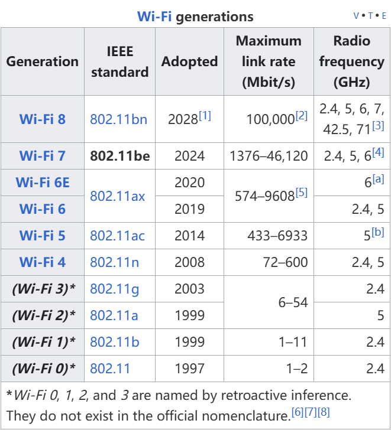

## **WIFI generations**

**IEEE 802.11be** , dubbed  *Extremely High Throughput (EHT)* , is the latest of the [IEEE](https://en.wikipedia.org/wiki/Institute_of_Electrical_and_Electronics_Engineers "Institute of Electrical and Electronics Engineers") [802.11](https://en.wikipedia.org/wiki/IEEE_802.11 "IEEE 802.11") standard, ^[[9]](https://en.wikipedia.org/wiki/IEEE_802.11be#cite_note-11)^ ^[[10]](https://en.wikipedia.org/wiki/IEEE_802.11be#cite_note-12)^ which is designated  **Wi-Fi 7** . ^[[11]](https://en.wikipedia.org/wiki/IEEE_802.11be#cite_note-cnet-wifi7-13)^  ^[[12]](https://en.wikipedia.org/wiki/IEEE_802.11be#cite_note-ieee-wifi7-14)^ ^[[13]](https://en.wikipedia.org/wiki/IEEE_802.11be#cite_note-15)^ It has built upon [802.11ax](https://en.wikipedia.org/wiki/IEEE_802.11ax "IEEE 802.11ax"), focusing on [WLAN](https://en.wikipedia.org/wiki/Wireless_LAN "Wireless LAN") indoor and outdoor operation with stationary and pedestrian speeds in the 2.4, 5, and 6 GHz frequency bands.^[[14]](https://en.wikipedia.org/wiki/IEEE_802.11be#cite_note-16)^
