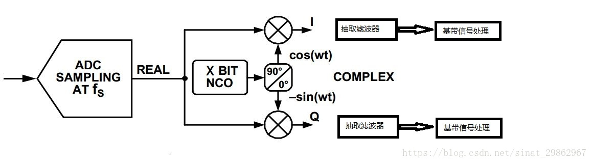
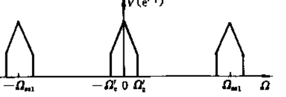

## DUC and DDC


## 数字上变频 digital up conversion （DUC）


上变频器的工作过程可以分为以下几个步骤：

混频器输入：将基带信号和射频信号作为混频器的输入。基带信号通常是来自数字信号处理器（DSP）或模拟信号源的低频信号，射频信号通常是来自射频信号源的高频信号。

频率转换：混频器通过非线性元件将基带信号和射频信号进行乘积运算，从而将基带信号的频率转换到射频信号中。这个过程中，混频器的非线性特性会引入一些非线性失真，需要通过滤波器等方法进行补偿和校正。

输出信号：经过频率转换后，混频器将高频信号作为输出。这个输出信号可以进一步经过滤波器、放大器等电路进行处理，以满足系统的要求。

上变频器有多种实现方法，常见的有以下几种：

直接上变频法（Direct Upconversion）：直接上变频法将基带信号和射频信号直接输入混频器进行频率转换。这种方法简单直接，但由于混频器的非线性特性，容易引入非线性失真。

两步上变频法（Two-Step Upconversion）：两步上变频法将基带信号先经过低频上变频器进行一次频率转换，得到中频信号，然后再经过高频上变频器进行第二次频率转换。这种方法可以降低混频器的非线性失真，提高系统性能。

低中高三步上变频法（Low-Intermediate-High Upconversion）：低中高三步上变频法将基带信号先经过低频上变频器进行一次频率转换，得到中频信号，然后再经过中频上变频器进行第二次频率转换，最后经过高频上变频器进行第三次频率转换。这种方法可以进一步降低混频器的非线性失真，提高系统性能。

[上变频器及上变频方法是什么？-知识工厂-射频芯片现货-参数-价格-报价-兆亿微波商城 (rfz1.com)](https://www.rfz1.com/m/news_view.aspx?TypeId=28&Id=7188&Fid=t2:28:2&typefid=28)


```matlab
%% 清空一切
clc;clear all;close all;

%% 信号参数设置
FS = 1500;
TS = 1/FS;
N  = 4096;
f  = 300;
t  = (0:N-1)*TS;


N_X2  = N*2;
FS_2  = FS/2;
FS_X2 = FS*2;
t_x2 = (0:N_X2-1)*TS;

SIG_AMP = 100;
COEF_WIDTH = 16;

%%
SIM_SEL = 2;

%% 生成IQ信号
sig_i = cos(2*pi*f*t);
sig_q = sin(2*pi*f*t);
figure;
subplot(211);
freq = (0:N-1)/N*FS;
plot(freq,20*log10(abs(fft(sig_i + 1i*sig_q))));
title('IQ信号频谱图(ffthift之前)');
subplot(212);
freq = (0:N-1)/N*FS-FS/2;
plot(freq,20*log10(abs(fftshift(fft(sig_i + 1i*sig_q)))));
title('IQ信号频谱图(ffthift之后)');

%% 设计半带滤波器(一半系数为0,便于节省硬件资源)
load filter_coef.mat;  
h = floor(2^(COEF_WIDTH-1)*0.9*filter_coef);
% fvtool(h);

% ===============================================================
% 
% ===============================================================
if SIM_SEL == 2
    % part_1 2倍插值
    sig_i_m2 = zeros(1,N_X2);
    sig_q_m2 = zeros(1,N_X2);
    sig_i_m2(1,1:2:end) = sig_i;
    sig_q_m2(1,1:2:end) = sig_q;
    figure;
    subplot(211);
    freq = (0:N_X2-1)/N_X2*FS_X2;
    plot(freq,20*log10(abs(fft(sig_i_m2+1i*sig_q_m2))));
    title('插值 后的频谱图(ffthift之前)');
    subplot(212);
    freq = (0:N_X2-1)/N_X2*FS_X2-FS;
    plot(freq,20*log10(abs(fftshift(fft(sig_i_m2+1i*sig_q_m2)))));
    title('插值 后的频谱图(ffthift之后)');
  
    % part_2 低通滤波  
    sig_i_lpf = conv(h,sig_i_m2);
    sig_i_lpf = sig_i_lpf(1,1:N_X2);
    sig_q_lpf = conv(h,sig_q_m2);
    sig_q_lpf = sig_q_lpf(1,1:N_X2);
    figure;
    subplot(211);
    freq = (0:N_X2-1)/N_X2*FS_X2;
    plot(freq,20*log10(abs(fft(sig_i_lpf+1i*sig_q_lpf))));
    title('插值-滤波 后的频谱图(ffthift之前)');
    subplot(212);
    freq = (0:N_X2-1)/N_X2*FS_X2-FS;
    plot(freq,20*log10(abs(fftshift(fft(sig_i_lpf+1i*sig_q_lpf)))));
    title('插值-滤波 后的频谱图(ffthift之前)');
  
     % part_3 使用0.25*FS_X2进行混频
    NCO_i     = cos(2*pi*FS_2*t_x2);
    NCO_q     = -sin(2*pi*FS_2*t_x2);
    sig_i_mif = sig_i_lpf.*NCO_i;
    sig_q_mif = sig_q_lpf.*NCO_q;
 
    figure;
    subplot(211);
    freq = (0:N_X2-1)/N_X2*FS_X2;
    plot(freq,20*log10(abs(fft(sig_i_mif+1i*sig_q_mif))));
    title('混频 后的频谱图(ffthift之前)');
    subplot(212);
    freq = (0:N_X2-1)/N_X2*FS_X2-FS;
    plot(freq,20*log10(abs(fftshift(fft(sig_i_mif+1i*sig_q_mif)))));
    title('混频 后的频谱图(ffthift之后)');
end

% 原文链接：https://blog.csdn.net/linbian1168/article/details/105420849
```

## 数字下变频 direct digital controller （DDC）

#### 简单示例


基本原理



Digital Down Converters ，DDC的主要目的是经过数字混频将AD采集的中频（IF）数字信号频谱下变频到基带信号，然后完成抽取滤波恢复原始信号，数字下变频时采用数字信号技术来实现下变频的，它包含数字滤波、正交变换、采样、抽取等算法。主要的电路模块由四部分组成：数字控制振荡器（NCO） 、混频器（mixer） 、采样抽取、滤波器（filter）。

DDC是将中频信号与数字控制振荡器产生的载波信号进行混频 ,再经过低通滤波器得到基带信号 ,实现了下变频功能.

数字下变频的基本原理同模拟下变频一样, 就是把输入信号与本地振荡信号相乘, 将射频信号通过混频, 搬移到中频段, 再进行 ADC采样。
DDC的核心是将中频 A /D 采样信号与 DDC中的数字控制振荡器 (NCO )产生的本地数字中频载波信号进行混频 ,将中频信号下变频到基带。

混频数学公式：

$ cosαcosβ= \frac{cos（α+β)+cos（α-β）}{2} $

#### FIR并行滤波

在下图中，由于滤波器的位置已经放在抽取之后了（这意味着无法获得因为抽取而导致的数据率下降的优势），而直接实现结构和多相滤波结构滤波器阶数并没有发生变化，因此两种设计方式的资源消耗量是一样的。
不过，考虑到多相滤波结构能够将一个大的滤波器分解成多个小的滤波器，比较适合模块复用。


`一般多相滤波用在多速率转换的场合，能够减小数据率。对于下采样而言，一般是先抽取再滤波；对于上采样而言，一般是先滤波后插值。`

# 超外差


 Red parts are those that handle the incoming radio frequency (RF) signal;

purple are parts that operate at the intermediate frequency (IF), while

blue parts operate at the modulation (audio) frequency. The dotted line indicates that the local oscillator and RF filter must be tuned in tandem.


# 重采滤波


作者：AK23

链接：[https://www.zhihu.com/question/23474073/answer/139260429](https://www.zhihu.com/question/23474073/answer/139260429)

来源：知乎

著作权归作者所有。商业转载请联系作者获得授权，非商业转载请注明出处。

首先抛出结论：先滤波，后抽取。

原理很简单，上面已经有知友回答了，一句话就能概括，如果抽取时不先做滤波，就会导致信号混叠。

这时，我们会多问一句：

1.如果不滤波，为什么混叠？

好，书上告诉我们，抽取后的信号频谱将以新的采样率fy为周期做频谱延拓。

2.为什么降采样，信号频谱会延拓？

这貌似才是问题的根结，原因其实也很好解释。先跟着我一起大声念三遍《信号与系统》老师一再强调的话“时域离散的意味频域是周期的；频域是离散的意味时域是周期的！”是不是觉得很熟悉？翻翻书，这是很基本的一个概念，如果你说我没听过啊，那就赶紧把信号的书从头看一遍。

这一点没有障碍后，就可以进一步解释啦。我们尽量不写枯燥的公式，一切看图说话：

首先，假设你要处理的信号，它长这样：


假设它在频域上，长这样：


你想处理这段信号，当然先需要通过AD采样，于是AD转换为数字信号，它从时域上看就变成了这样了：


根据“**时域是离散的意味着频域是周期的**”，这里的周期指的就是采样频率，就是上面那个图里面T1的倒数。现在信号在频域上可就不是原来那个样子了，而是变成这个样子：


.

对AD采完的离散信号，我们进行抽取处理，完全可以理解成对一段已经离散的信号，再进行一次“离散处理”：

  

也就是说，原本周期性的频域信号，将继续“周期”一把，于是又发生了变化：

   

这是什么鬼？这就是所谓的混叠啊！所以赶紧的，在抽取前赶紧滤波，滤的只剩下一个“三角形”当然就不会混成这个鬼样子了。

这就是问题的答案。

当然也有一些聪明的小伙伴也会问，如果这个三角形的底足够窄（带宽足够小），抽的没那么狠，是不是就不会叠成这么难看了。理论上说，的确存在这种不滤波也不会混叠的情况。

但是现实中，频域上除了三角形，也会在没有三角形的地方会有一些乱七八糟的谐波啊、噪声啊什么的，所以机智的信号处理工程师们就会非常谨慎的不管什么咋地，先滤波再说！

   

滤波了之后，三角形被削成了竹笋，这时候再抽一把，就没那么凌乱:

 

上面解释了为什么先抽取后滤波够通俗易懂。

一言以蔽之，都怪大学信号老师的那句话。

3. 接下来，我来猜测一下为什么题主会有这个疑问？

通过跟很多做多速率处理的年轻工程师交流，我发现很多小伙伴在自己实现这样的降采样处理都会先学习别人的实现方法，看到某段代码里面发现真实的数据处理，工程师们在将信号的离散数值通过滤波器，并不是一个个计算，然后计算完再去抽取的，甚至没有抽取这个过程。

因此看不到先滤后抽，而是隔了几个采样点才启动一次FIR滤波器的卷积运算，会让很多初次接触的同学觉得这不是先抽再滤吗？

其实这是因为工程师们发现为了满足这些科学理论，需要先计算滤波，再把一些不要的点扔了，浪费了很多次运算，实在太傻，于是聪明的他们想到了如何提高运算效率。

他们的想法就是如

[@Efengh](//www.zhihu.com/people/1d4d25e07f74ebee46067f6729384d6a)

 所说的，根据Nobel恒等式（恒等式就不写了，为了大家读的不枯燥，我的答案里面一般不会出现公式，当然我不会告诉你真实原因是因为在知乎写公式太麻烦），完全可以多相处理，每隔若干个点计算一次。

要注意的是，那些没启动计算的点并不能扔了，因为它们在其他启动点的滤波中也参与了计算，所以一般会用一个缓存将这些数据存起来。

再往下就是比较细的方法选择了，什么半带滤波、CIC滤波等等不一而足，这儿就不一一讨论了。

在信号处理中，不管遇到什么问题，多往深层次思考，就能把当初学的基础知识串起来了，怎么也要对得起你大学考通信原理、信号系统之前那几个不眠之夜啊，你们说是不是？

再留个思考题，抽取后的信号幅度，在时域是否会有损失，在频域呢？

采样率转换的基本思想是抽取和内插，从信号角度看音频重采样就是滤波。滤波函数的窗口大小以及插值函数一旦被确定,其重采样的性能也就确定了。抽取可能引起频谱混叠，而内插会产生镜频分量。通常在抽取前先加抗混叠滤波器,在内插后加抗镜频滤波器，在语音识别里所需语音信号采样率由ASR(automatic speech recognition)声学模型输入特征决定的。

### 重采样

Signal Processing Toolbox™ 提供了多个函数用于以较高或较低采样率对信号进行重采样。

| 操作                      | 函数     |
| ------------------------- | -------- |
| 应用带重采样的 FIR 滤波器 | upfirdn  |
| 三次样条插值              | spline   |
| 抽取                      | decimate |
| 插值                      | interp   |
| 其他一维插值              | interp1  |
| 以新采样率重采样          | resample |

多速率滤波器组的实现

该upfirdn函数通过整数比 P/Q 改变信号的采样率。它计算执行以下任务的三个系统级联的结果：

按整数因子上采样（零插入）p

通过 FIR 滤波器进行滤波h

按整数因子下采样q

    

例如，要将信号的采样率从 44.1 kHz 更改为 48 kHz，我们首先找到最小的整数转换比p/q。

```matlab
d = gcd(48000,44100);
p = 48000/d；
q = 44100/d；
y = upfirdn(x,h,p,q)
```

在此示例中，p = 160和 q =  147。然后通过键入完成采样率转换

这种级联操作是使用多相滤波技术以有效的方式实现的，它是多速率滤波的核心概念。请注意，重采样结果的质量取决于 FIR 滤波器的质量 h。

滤波器组可以通过upfirdn允许滤波器h为矩阵（每列一个 FIR 滤波器）来实现。信号矢量独立地通过每个 FIR 滤波器，产生输出信号矩阵。

执行多速率滤波（使用固定滤波器）的其他函数包括resample、interp和decimate。

## 重采样、上采样、下采样

1. 基本概念

重采样分为上采样和下采样，区分的依据是重新采样时新采样率与原先采样率的大小的比较。

上采样和下采样都是针对信号最高频率而言。

上采样：采样频率高于信号最高频率的２倍，又称为插值/内插/过采样；

上采样率 = 采样率 / 比特速率

下采样：采样频率低于信号最高频率的２倍，又称为抽取/欠采样。

重采样的方法：主要是最近邻法、双线性内插法以及三次卷积内插法。

通常在发射机侧进行上采样，在接收机侧进行下采样。

***①发射机端为什么要进行上采样？***

过采样的数字信号处理起来对LPF的要求较低，如果不进行过采样，滤波的时候则需要滤波器很陡峭，对滤波器的要求会很严格。

一句话，过采样是为了简便LPF的设计。

***② 接收机端为什么要进行下采样？***

在接收端数字下变频后，信号的采样率仍然很高，数据量大。因此在保证Niquest采样定理的前提下，对高采样率的信号进行抽取，可以降低采样频率，减少运算量。

一句话，下采样是为了减少运算量。

关于上采样/下采样，最经典的问题即为：

请简述信号时域插0做4倍上采样的详细过程，并描述其中涉及到的频谱变化。

**2、上采样**

在进行均衡【接收机侧的操作】操作之前，往往要先上采样，从而保证信号的采样频率与滤波器的采样频率保持一致，否则当信号通过滤波器之后，会频谱显示不完整。

并且，当信号的采样频率和滤波器的采样频率一致时，采样频率越高，滤波效果越好。

根据Niquest采样定理，对于基带信号只能进行过采样；对于带通信号，既可以过采样，又可以欠采样。

**3、重采样的MatLab实现**

3.1 使用'zero stuffing'和'low pass filter'实现内插/上采样
