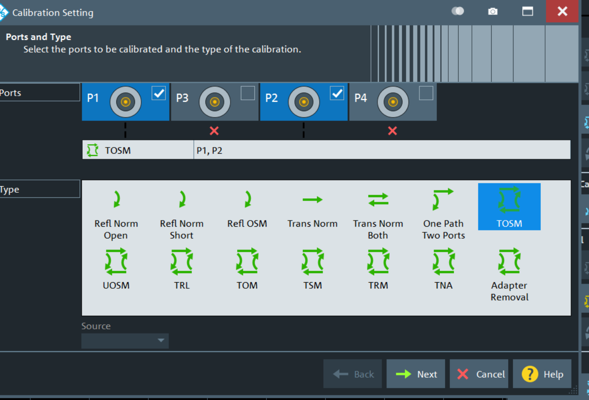
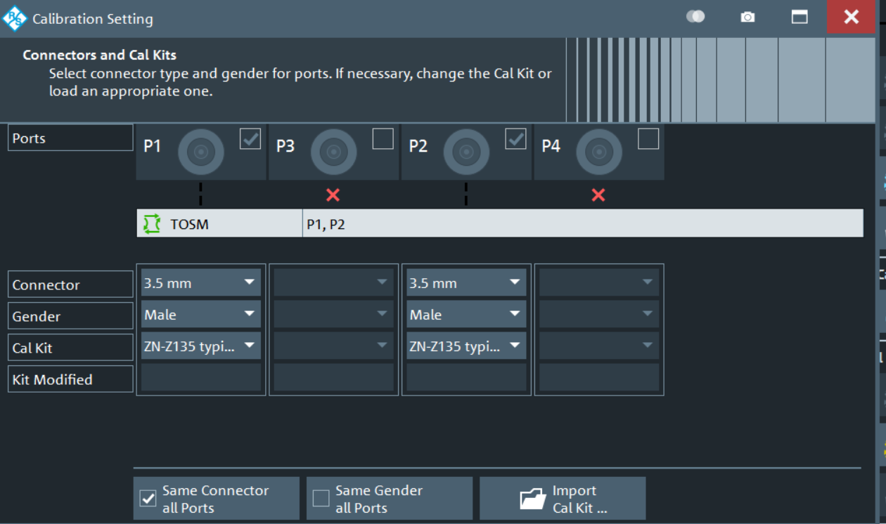

## SVN

出现在rename一个目录时，再提交时一直报错 **Aborting commit: remains in conflict**

使用右键菜单 svn - resolve 即可解决。用cleanup之类的都没用的，删了重新下载都不行

操作时记得备份已修改的文件或目录。

    

svn resolved: 移除工作副本的目录或文件的“冲突”状态。

```
用法: resolved PATH…

注意: 本子命令不会依语法来解决冲突或是移除冲突标记；它只是移除冲突的相关文件，然后让 PATH 可以再次提交。

```

### Relocating a Subversion Working Copy URL

If your Subversion url has changed or you need to switch from using http to https, you can use the "svn switch --relocate" command to change your local working copy. This will help avoid doing a fresh checkout.

Make sure you are in the root directory of the repository. Here is an example of changing from HTTP to HTTPS:

```
svn switch --relocate http://account.svn.beanstalkapp.com/repo https://account.svn.beanstalkapp.com/repo
```

## Mathematica

[Mathematica 14.0破解版下载附安装教程_都都软件站 (dudues.com)](https://www.dudues.com/6313.html)

[Mathematica 14.0_免费高速下载|百度网盘-分享无限制 (baidu.com)](https://pan.baidu.com/s/1ILnU8243qDDlhhw7Y0kdhg?pwd=2024#list/path=%2Fsharelink1100640734561-909307838645240%2FMathematica%2014.0&parentPath=%2Fsharelink1100640734561-909307838645240)

[https://pan.baidu.com/s/1ILnU8243qDDlhhw7Y0kdhg?pwd=2024](https://pan.baidu.com/s/1ILnU8243qDDlhhw7Y0kdhg?pwd=2024)

提取码：2024

first change on home mate13

<<<<<<< HEAD

## WSL install

[How to Install WSL on Non-System Disks: Step-by-Step Guide (linkedin.com)](https://www.linkedin.com/pulse/how-install-wsl-non-system-disks-step-by-step-guide-ambu-vijayan)

2）安装成功后，按照提示重启电脑。启动 Ubuntu 按照提示，创建账户与密码即可。

3）启动wsl肯能遇到错误以及解决办法

如果出现 0x800701bc 错误，是版本匹配问题，需要更新wsl内核至最新版本。


如下地址下载 并安装

https://wslstorestorage.blob.core.windows.net/wslblob/wsl_update_x64.msi

如果出现 0x80370102 错误，是因为Windows的虚拟化功能未开启。
以管理员身份运行PowerShell 输入如下命令

Enable-WindowsOptionalFeature -Online -FeatureName VirtualMachinePlatform

原文链接：https://blog.csdn.net/gaochaoran/article/details/124568920

```
unix unser name: smstuni, passport aligned with win
```

# WSL  使用

用cmd/powershell 打开，

> wsl -l 目前安装的系统
>
> wsl --list --online 表示网络上可以安装的版本；

# windows 文件夹 共享

[Windows 11 文件夹共享指南：轻松分享文件和资料 - 系统极客 (sysgeek.cn)](https://www.sysgeek.cn/sharing-folders-windows-11/#:~:text=1%20%E4%BD%BF%E7%94%A8%20Windows%20%2B%20E%20%E5%BF%AB%E6%8D%B7%E9%94%AE%E6%89%93%E5%BC%80%E6%96%87%E4%BB%B6%E8%B5%84%E6%BA%90%E7%AE%A1%E7%90%86%E5%99%A8%E3%80%82,2%20%E5%9C%A8%E5%B7%A6%E4%BE%A7%E5%AF%BC%E8%88%AA%E6%A0%8F%E4%B8%AD%EF%BC%8C%E7%82%B9%E5%87%BB%E3%80%8C%E7%BD%91%E7%BB%9C%E3%80%8D%EF%BC%88%E6%9C%AC%E6%9C%BA%E9%9C%80%E8%A6%81%E5%90%AF%E7%94%A8%E7%BD%91%E7%BB%9C%E5%8F%91%E7%8E%B0%EF%BC%89%E3%80%82%20%E4%BB%8E%E5%88%97%E8%A1%A8%E4%B8%AD%E5%8F%8C%E5%87%BB%E5%85%B1%E4%BA%AB%E8%AE%BE%E5%A4%87%EF%BC%8C%E5%B0%B1%E5%8F%AF%E4%BB%A5%E6%89%93%E5%BC%80%E5%B9%B6%E6%B5%8F%E8%A7%88%E5%85%B1%E4%BA%AB%E7%9A%84%E6%96%87%E4%BB%B6%E5%A4%B9%E3%80%82%20%E9%80%9A%E8%BF%87%E3%80%8C%E7%BD%91%E7%BB%9C%E3%80%8D%E9%80%89%E9%A1%B9%E5%8F%91%E7%8E%B0%E5%B9%B6%E8%AE%BF%E9%97%AE%E5%85%B1%E4%BA%AB%E8%AE%BE%E5%A4%87%203%20%E5%A6%82%E6%9E%9C%E9%9C%80%E8%A6%81%E8%BA%AB%E4%BB%BD%E9%AA%8C%E8%AF%81%EF%BC%8C%E8%AF%B7%E8%BE%93%E5%85%A5%E7%9B%B8%E5%BA%94%E7%9A%84%E7%94%A8%E6%88%B7%E5%90%8D%E5%92%8C%E5%AF%86%E7%A0%81%EF%BC%8C%E7%84%B6%E5%90%8E%E8%AE%BF%E9%97%AE%E5%85%B1%E4%BA%AB%E6%96%87%E4%BB%B6%E5%A4%B9%E4%B8%AD%E7%9A%84%E6%96%87%E4%BB%B6%E3%80%82)

# Wi-1000X 配对

>>>>>>> cb5346b1b684a12f89987bb8e958918fcade722a
>>>>>>> 索尼WI-1000X耳机连接蓝牙的明确确保耳机进入配对模式，并在蓝牙设备上搜索并连接"WI-1000X"即可。
>>>>>>> 以下是详细的连接步骤：
>>>>>>> 一、打开耳机并进入配对模式
>>>>>>>
>>>>>>
>>>>>
>>>>
>>>
>>

1. 确保耳机已经充电并且有足够的电量。
2. 按住耳机上的**电源按钮**，直到听到提示音，并且指示灯开始闪烁蓝色和红色，这表示耳机已进入配对模式。
   二、在蓝牙设备上搜索并连接耳机
3. 打开您的蓝牙设备（如手机、电脑等）的蓝牙功能。
4. 在设备的蓝牙设置菜单中，搜索可用的蓝牙设备。
5. 在搜索到的设备列表中，找到名为"WI-1000X"的设备，然后点击进行连接。
6. 如果需要输入配对码，请输入"0000"或查看耳机说明书中的配对码信息。

# vector network analyzer

Cal--> start cal (Manual)--> TOSM



select Cal kit



# git 使用

git 文件状态


### git rebase

drop the rebase  `git rebase --skip`

https://docs.pingcode.com/ask/59888.html

https://alvincat.github.io/2018/2018-05-20-%E6%90%AD%E5%BB%BAGit%E6%9C%AC%E5%9C%B0%E6%9C%8D%E5%8A%A1%E7%9A%84%E6%96%B9%E6%B3%95.html


[Install Bonobo Git Server (Private Git Server) on Windows x86/x64 - Peerasak Pigeon Chatsermsak - Medium](https://pi6eon.medium.com/install-bonobo-git-server-private-git-server-on-windows-x86-x64-cfe5b55fea6d)
