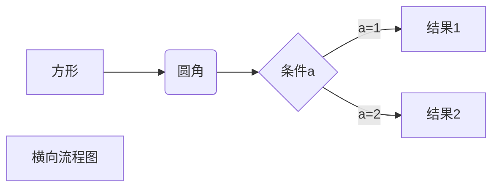
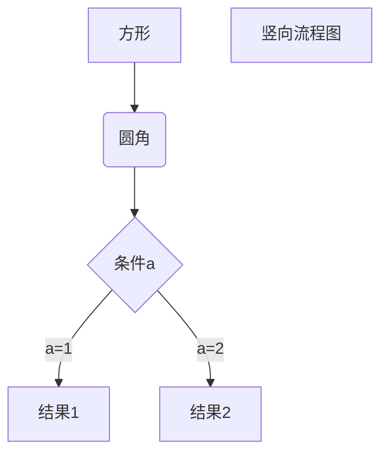
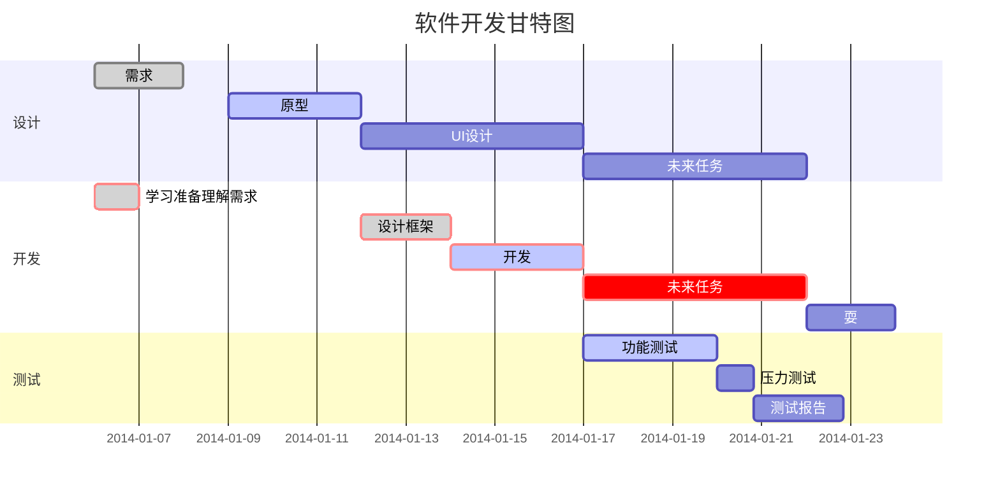
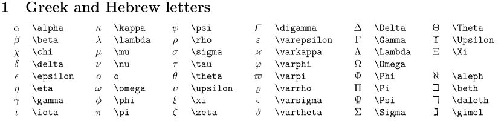
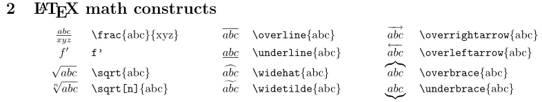
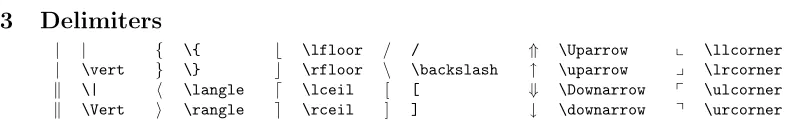
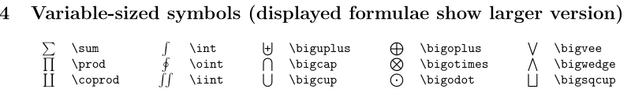
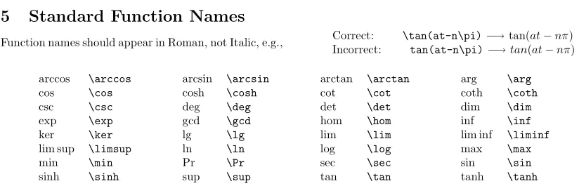
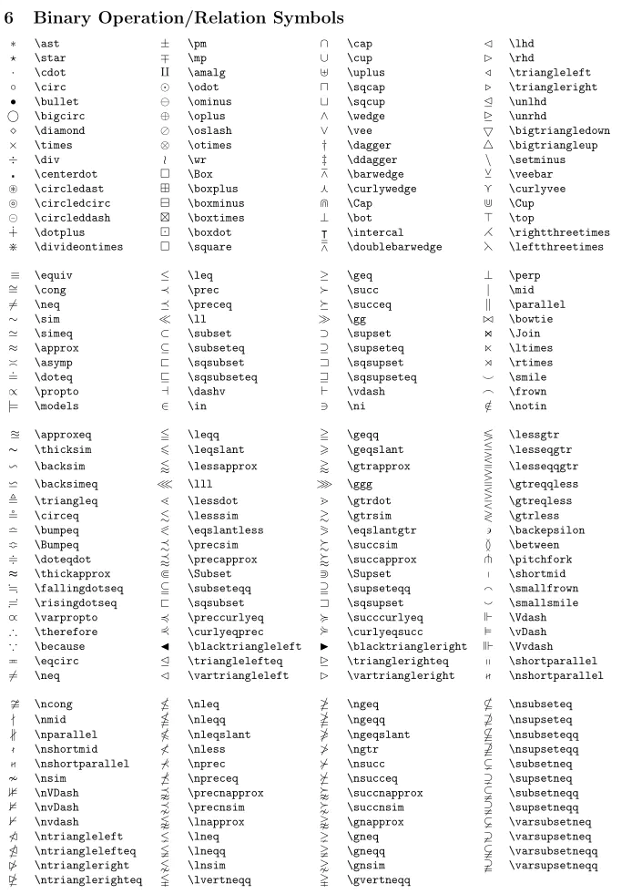
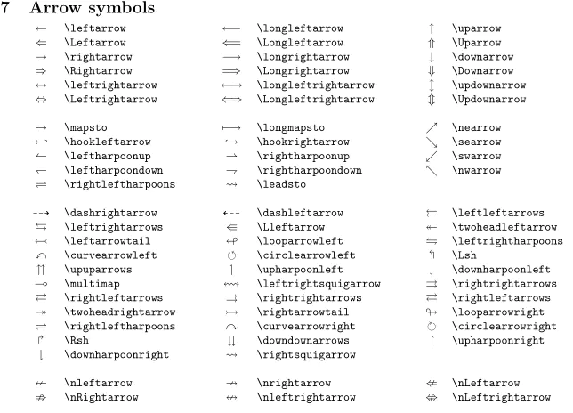

# markdonwn Example

## chapter one

### chapter 1.1

#### chapter 1.1.12

- 1.1
- 1.2

  - 1.1.1 like
  - 1.1.1.1 tap
- [] 2.1
- [] 2.2

*斜体文本*
_斜体文本_
**粗体文本**
__粗体文本__
***粗斜体文本***
___粗斜体文本___

Markdown 段落没有特殊的格式，直接编写文字就好，**段落的换行是使用两个以上空格加上回车。**

空格换行

段落换行

行二

### 2  表格

| 表头   | 表头   |
| ------ | ------ |
| 单元格 | 单元格 |
| 单元格 | 单元格 |

| 左对齐 | 右对齐 | 居中对齐 |
| :----- | -----: | :------: |
| 单元格 | 单元格 |  单元格  |
| 单元格 | 单元格 |  单元格  |

-: 设置内容和标题栏居右对齐。
:- 设置内容和标题栏居左对齐。
:-: 设置内容和标题栏居中对齐。

### 分隔线

你可以在一行中用三个以上的星号、减号、底线来建立一个分隔线，行内不能有其他东西。你也可以在星号或是减号中间插入空格。下面每种写法都可以建立分隔线：

---

---

---

---

---

### 删除线

如果段落上的文字要添加删除线，只需要在文字的两端加上两个波浪线 ~~ 即可，实例如下：

RUNOOB.COM
GOOGLE.COM
~~BAIDU.COM~~

### 脚注

脚注是对文本的补充说明。

Markdown 脚注的格式如下:

[^要注明的文本]
以下实例演示了脚注的用法：

创建脚注格式类似这样 [^runb] 。

### 下划线

下划线可以通过 HTML 的 `<u>` 标签来实现：`</u>`

### 区块

> 最外层
>
>> 第一层嵌套
>>
>>> 第二层嵌套
>>>
>>

### 链接

这是一个链接 [菜鸟教程](https://www.runoob.com)

### 图片


### 高级技巧

[高级技巧]https://www.runoob.com/markdown/md-advance.html）

https://markdown.com.cn/basic-syntax/code.html

### 代码

```C++
enum class MeasItemEnum
{
	OBW = 0b000000000001,
	ACLR = 0b000000000010,
	EVM = 0b000000000100,
	EVMAndObw = OBW|EVM
};

int32_t main() {
	LOG_FILE_CLEAR();
	const int folderMax = 6;
	configInfo sfigInfo[folderMax];
	//sfigInfo[0] = { 100,1,1,"Ni", MeasItemEnum::EVMAndObw };
	sfigInfo[1] = { -1,1,1,"Ni", MeasItemEnum::ACLR };
	sfigInfo[2] = { 20,1,1,"Sgr", MeasItemEnum::ACLR };
	sfigInfo[3] = { -1,1,1,"Ni", MeasItemEnum::EVMAndObw };
	sfigInfo[4] = { -1,1,1,"Ni", MeasItemEnum::EVMAndObw };
	sfigInfo[5] = { 1,1,1,"NiCarrOff", MeasItemEnum::EVMAndObw };
}
```

```python

#!/usr/bin/env python3
print("Hello, World!");

```

### 缩进式插入多行代码

    注意：
    缩进式插入前方必须有空行；
    缩进 4 个空格或是 1 个制表符；
    一个代码区块会一直持续到没有缩进的那一行（或是文件结尾）。

    #include  <stdio.h>`     int main(void)`
    {
        printf("Hello world\n");
    }

### 公式

$$
\begin{Bmatrix}
   a & b \\
   c & d
\end{Bmatrix}
$$

$$
\begin{CD}
   A @>a>> B \\
@VbVV @AAcA \\
   C @= D
\end{CD}
$$

### 流程图

```mermaid
graph TB
```







### 公式









$\alpha$
$\beta$
$\chi$
$\Delta$
$\Gamma$
$\Theta$

$ \Theta $

$$
\alpha \tag1
$$

$$


$$

$$
\frac{abc}{xyz}  \tag 2
$$

$ |$

$$
\| \tag3
$$

$$


$$

$$
\left|\begin{matrix} 
a & b & c \\ 
d & e & f \\ 
g & h & i 
\end{matrix} \right| \tag4
$$

$$


$$

$$


$$

$$
\bigcap\bigcup\bigoplus\bigotimes\sum\int\oint\iint \tag5
$$

[使用Markdown语法编写数学公式（详细版）_markdown写公式-CSDN博客](https://blog.csdn.net/wzk4869/article/details/126863936)

[Cmd Markdown 公式指导手册 - 作业部落 Cmd Markdown 编辑阅读器 (zybuluo.com)](https://www.zybuluo.com/codeep/note/163962#cmd-markdown-%E5%85%AC%E5%BC%8F%E6%8C%87%E5%AF%BC%E6%89%8B%E5%86%8C)
